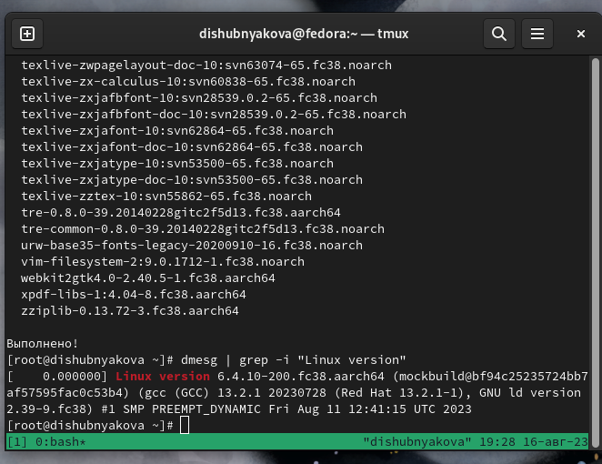
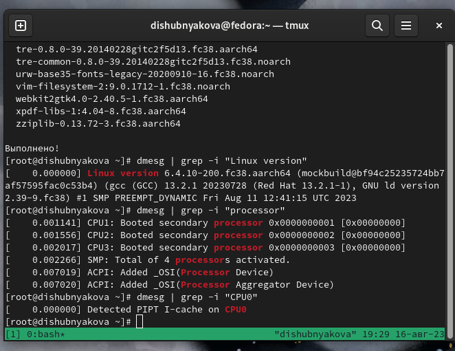
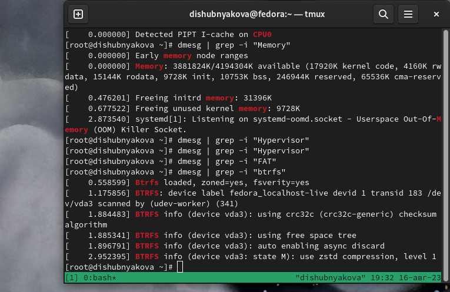

---
## Front matter
lang: ru-RU
title: Лабораторная работа №1
author: |
	Шубнякова Дарья, НКАбд-03-22

## Formatting
toc: false
slide_level: 2
theme: metropolis
header-includes: 
 - \metroset{progressbar=frametitle,sectionpage=progressbar,numbering=fraction}
 - '\makeatletter'
 - '\beamer@ignorenonframefalse'
 - '\makeatother'
aspectratio: 43
section-titles: true
---

## Содержание

1. Цель
2. Основные задачи
3. Процесс выполнения
4. Вывод
5. Список литературы

## Цель

Целью данной работы является приобретение практических навыков установки операционной системы на виртуальную машину, настройки минимально необходимых для дальнейшей работы сервисов.

## Основные задачи

1) Создать виртуальную машину
2) Установить операционную систему
3) Проделать все необходимые настройки

## Процесс выполнения

1. Учетная запись пользователя содержит следующие данные:
Имя и название хоста.
Версия ядра Linux (Linux version).
Частота процессора (Detected Mhz processor).
Модель процессора (CPU0).
Объём доступной оперативной памяти (Memory available).
Тип обнаруженного гипервизора (Hypervisor detected).
Тип файловой системы корневого раздела.
Последовательность монтирования файловых систем.

## Процесс выполнения

2. Используем команду dmesg | grep -i "", чтобы найти необходимую нам информацию по каждому из пунктов

{width=70% }

## Процесс выполнения

3.  {width=70% }

## Процесс выполнения

{width=70%}

## Процесс выполнения

5. **Полезные команды:**
man -- получение справки по команде
cd -- перемещение по файловой системе
cat -- просмотр содержимого каталога
du -- узнать объем каталога
mkdir -- создание
rm -- удаление
chmod --изменение прав доступа
стрелки вверх или вниз -- просмотр истории

## Вывод

1. Создали виртуальную машину в программе UTM
2. Установили дистрибутив Fedora, который подходит к архитектурe MacBook с чипом M1
3. Проделали все необходимые настройки для дальнейшей работы

## Список литературы

1.
Dash P. Getting started with oracle vm virtualbox. Packt Publishing Ltd, 2013. 86 p.
2.
Colvin H. Virtualbox: An ultimate guide book on virtualization with virtualbox. CreateSpace Independent Publishing Platform, 2015. 70 p.
3.
van Vugt S. Red hat rhcsa/rhce 7 cert guide : Red hat enterprise linux 7 (ex200 and ex300). Pearson IT Certification, 2016. 1008 p.
4.
Робачевский А., Немнюгин С., Стесик О. Операционная система unix. 2-е изд. Санкт-Петербург: БХВ-Петербург, 2010. 656 p.
5.
Немет Э. et al. Unix и Linux: руководство системного администратора. 4-е изд. Вильямс, 2014. 1312 p.
6.
Колисниченко Д.Н. Самоучитель системного администратора Linux. СПб.: БХВ-Петербург, 2011. 544 p.
7.
Robbins A. Bash pocket reference. O’Reilly Media, 2016. 156 p.

## {.standout}

Спасибо за внимание!

