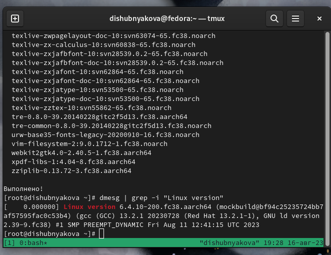
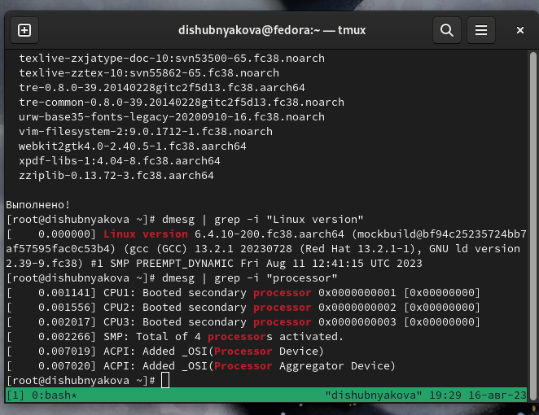
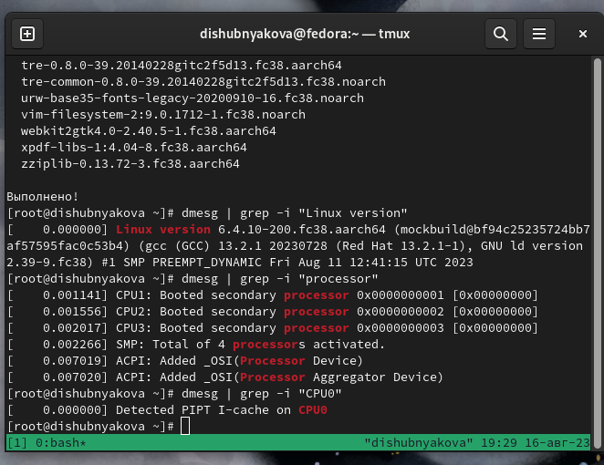
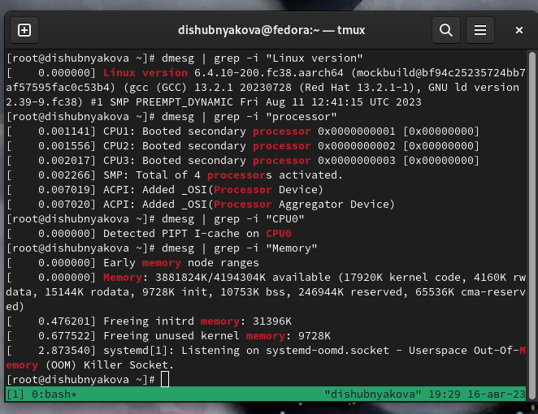
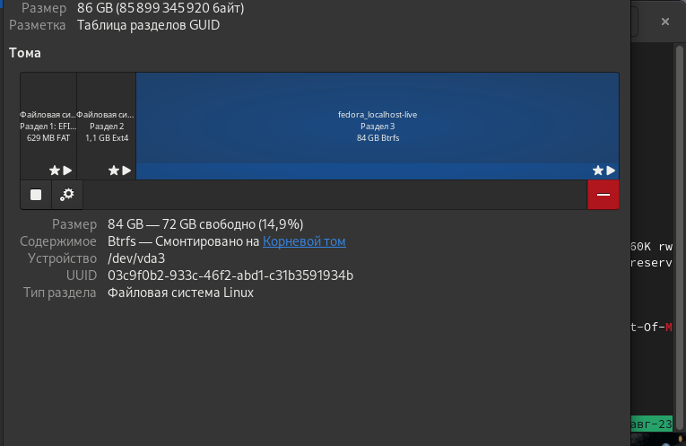
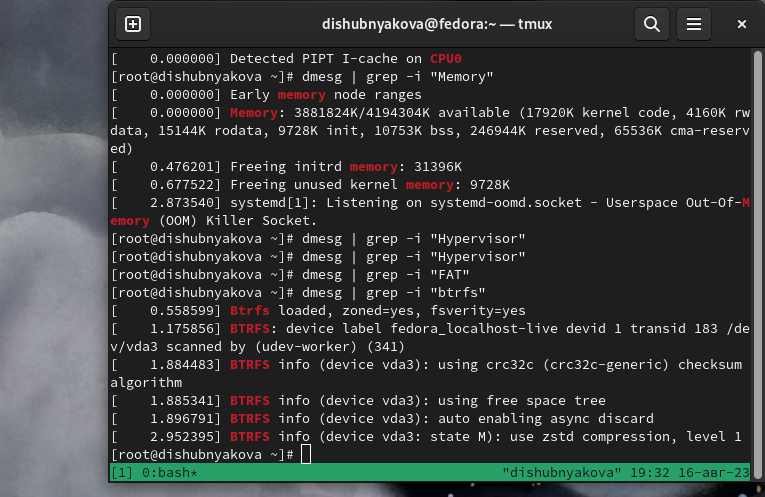
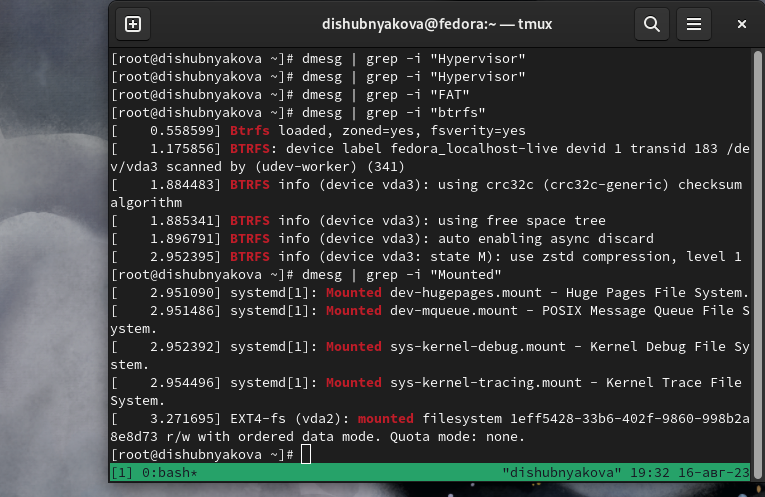

---
## Front matter
title: "Лабораторная работа №1"
subtitle: "НКАбд-03-22"
author: "Шубнякова Дарья"

## Generic otions
lang: ru-RU
toc-title: "Содержание"

## Bibliography
bibliography: bib/cite.bib
csl: pandoc/csl/gost-r-7-0-5-2008-numeric.csl

## Pdf output format
toc: true # Table of contents
toc-depth: 2
lof: true # List of figures
lot: true # List of tables
fontsize: 12pt
linestretch: 1.5
papersize: a4
documentclass: scrreprt
## I18n polyglossia
polyglossia-lang:
  name: russian
  options:
	- spelling=modern
	- babelshorthands=true
polyglossia-otherlangs:
  name: english
## I18n babel
babel-lang: russian
babel-otherlangs: english
## Fonts
mainfont: PT Serif
romanfont: PT Serif
sansfont: PT Sans
monofont: PT Mono
mainfontoptions: Ligatures=TeX
romanfontoptions: Ligatures=TeX
sansfontoptions: Ligatures=TeX,Scale=MatchLowercase
monofontoptions: Scale=MatchLowercase,Scale=0.9
## Biblatex
biblatex: true
biblio-style: "gost-numeric"
biblatexoptions:
  - parentracker=true
  - backend=biber
  - hyperref=auto
  - language=auto
  - autolang=other*
  - citestyle=gost-numeric
## Pandoc-crossref LaTeX customization
figureTitle: "Рис."
tableTitle: "Таблица"
listingTitle: "Листинг"
lofTitle: "Список иллюстраций"
lotTitle: "Список таблиц"
lolTitle: "Листинги"
## Misc options
indent: true
header-includes:
  - \usepackage{indentfirst}
  - \usepackage{float} # keep figures where there are in the text
  - \floatplacement{figure}{H} # keep figures where there are in the text
---

# Цель работы

Целью данной работы является приобретение практических навыков установки операционной системы на виртуальную машину, настройки минимально необходимых для дальнейшей работы сервисов.

# Задание

1) Создать виртуальную машину
2) Установить операционную систему
3) Проделать все необходимые настройки

# Теоретическое введение

Запуск приложения для установки системы
Загрузите LiveCD.
Появится интерфейс начальной конфигурации.
Нажмите Enter для создания конфигурации по умолчанию.
Нажмите Enter, чтобы выбрать в качестве модификатора клавишу Win (она же клавиша Super).
В файле конфигурации эта клавиша будет обозначена как $Mod.
Нажмите комбинацию Win+Enter для запуска терминала.
В терминале запустите liveinst.
Для перехода к раскладке окон с табами нажмите Win+w.

Установка системы на диск
Выберите язык интерфейса и перейдите к настройкам установки операционной системы.
При необходимости скорректируйте часовой пояс, раскладку клавиатуры (рекомендуется в качестве языка по умолчанию указать английский язык).
Место установки ОС оставьте без изменения.
Установите имя и пароль для пользователя root.
Установите имя и пароль для Вашего пользователя.
Задайте сетевое имя Вашего компьютера.
После завершения установки операционной системы корректно перезапустите виртуальную машину.
В VirtualBox оптический диск должен отключиться автоматически, но если это не произошло, то необходимо отключить носитель информации с образом.

После установки
Обновляем все пакеты
Повышаем комфорт работы
Ставим автоматические обновления и отключаем SELinux
Настраиваем клавиатуру
Устанавливаем имя пользователя и хоста
Установка программного обеспечения для создания документации: pandoc, texlive

# Выполнение лабораторной работы

Используем команду dmesg | grep -i "", чтобы найти необходимую нам информацию по каждому из пунктов (рис. @fig:001).

{#fig:001 width=70%}

(рис. @fig:002)

{#fig:002 width=70%}

(рис. @fig:003)

{#fig:003 width=70%}

(рис. @fig:004)

{#fig:004 width=70%}

(рис. @fig:005)

{#fig:005 width=70%}

(рис. @fig:006)

{#fig:006 width=70%}

(рис. @fig:007)

{#fig:007 width=70%}

# Выводы

Устанавливать Linux -- непросто.

1) Учетная запись пользователя содержит следующие данные:
Имя и название хоста.
Версия ядра Linux (Linux version).
Частота процессора (Detected Mhz processor).
Модель процессора (CPU0).
Объём доступной оперативной памяти (Memory available).
Тип обнаруженного гипервизора (Hypervisor detected).
Тип файловой системы корневого раздела.
Последовательность монтирования файловых систем.

2) man -- получение справки по команде
cd -- перемещение по файловой системе
cat -- просмотр содержимого каталога
du -- узнать объем каталога
mkdir -- создание
rm -- удаление
chmod --изменение прав доступа
стрелки вверх или вниз -- просмотр истории

3) Файловая система связывает носитель информации (хранилище) с прикладным программным обеспечением, организуя доступ к конкретным файлам при помощи функционала взаимодействия программ API. Программа, при обращении к файлу, располагает данными только о его имени, размере и атрибутах. Всю остальную информацию, касающуюся типа носителя, на котором записан файл, и структуры хранения данных, она получает от драйвера файловой системы.
В случае с Windows все выглядит достаточно просто: NTFS на всех дисковых разделах и FAT32 (или NTFS) на флешках. Если установлен NAS (сервер для хранения данных на файловом уровне), и в нем используется какая-то другая файловая система, то практически никто не обращает на это внимания. К нему просто подключаются по сети и качают файлы.

4) Команда findmnt -- файловые системы, подмонтированные в ОС

5) Команды ps, kill, killall -- удаление зависших процессов

# Список литературы{.unnumbered}

1.
Dash P. Getting started with oracle vm virtualbox. Packt Publishing Ltd, 2013. 86 p.
2.
Colvin H. Virtualbox: An ultimate guide book on virtualization with virtualbox. CreateSpace Independent Publishing Platform, 2015. 70 p.
3.
van Vugt S. Red hat rhcsa/rhce 7 cert guide : Red hat enterprise linux 7 (ex200 and ex300). Pearson IT Certification, 2016. 1008 p.
4.
Робачевский А., Немнюгин С., Стесик О. Операционная система unix. 2-е изд. Санкт-Петербург: БХВ-Петербург, 2010. 656 p.
5.
Немет Э. et al. Unix и Linux: руководство системного администратора. 4-е изд. Вильямс, 2014. 1312 p.
6.
Колисниченко Д.Н. Самоучитель системного администратора Linux. СПб.: БХВ-Петербург, 2011. 544 p.
7.
Robbins A. Bash pocket reference. O’Reilly Media, 2016. 156 p.

::: {#refs}
:::
