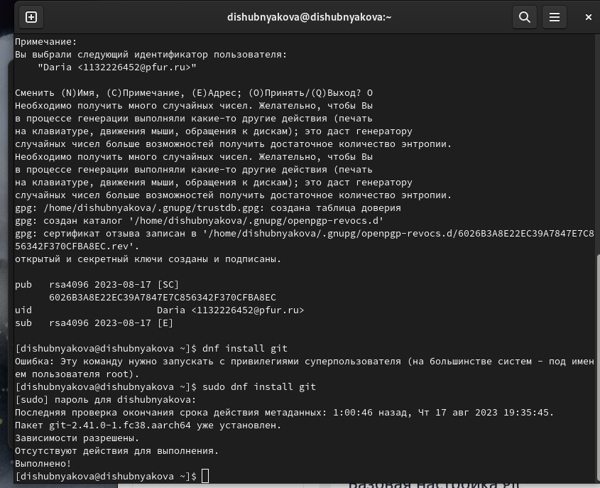
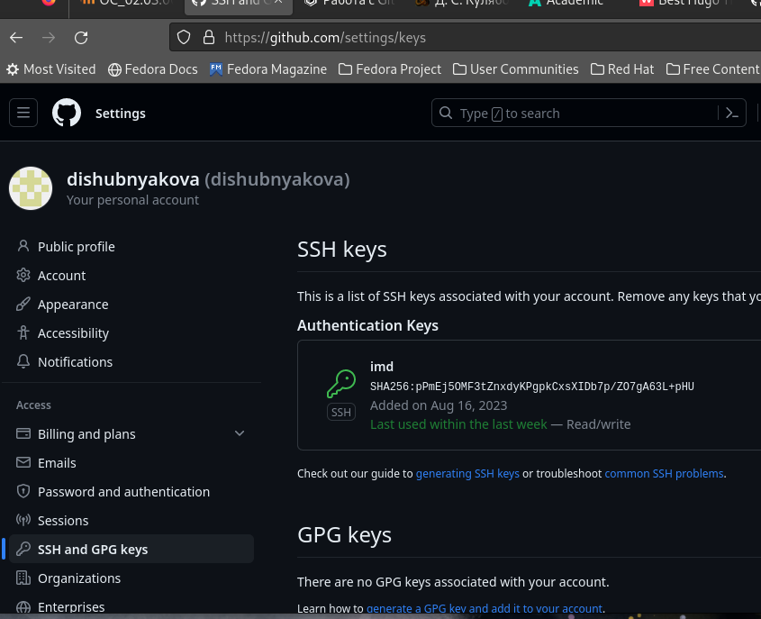
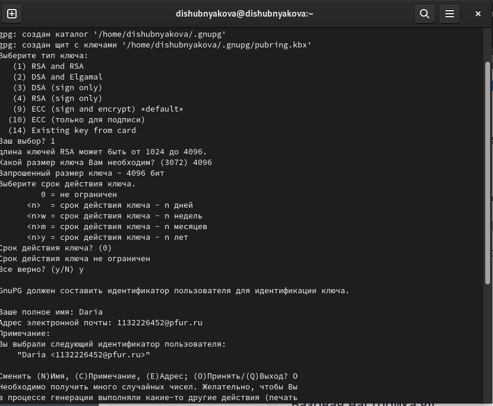
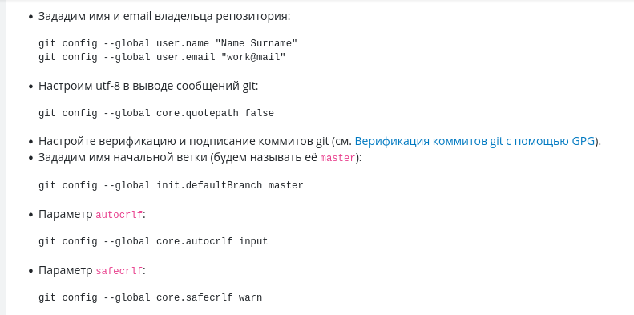
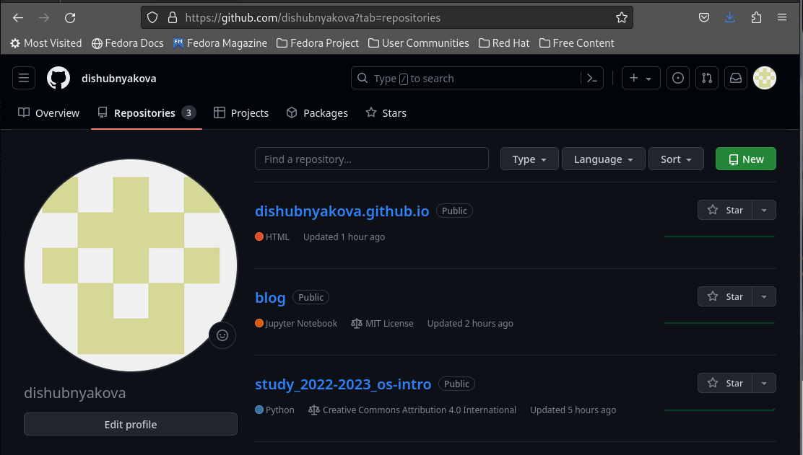
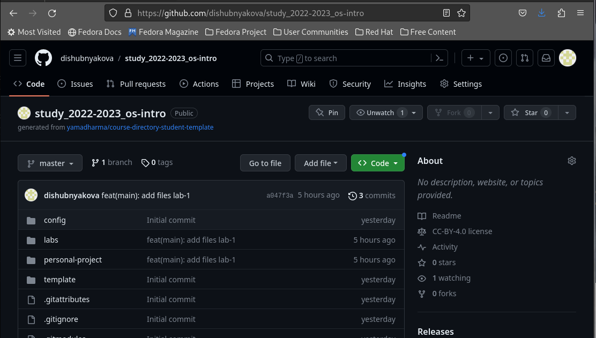

---
## Front matter
title: "Лабораторная работа №2"
subtitle: "НКАбд-03-22"
author: "Шубнякова Дарья Игоревна"

## Generic otions
lang: ru-RU
toc-title: "Содержание"

## Bibliography
bibliography: bib/cite.bib
csl: pandoc/csl/gost-r-7-0-5-2008-numeric.csl

## Pdf output format
toc: true # Table of contents
toc-depth: 2
lof: true # List of figures
lot: true # List of tables
fontsize: 12pt
linestretch: 1.5
papersize: a4
documentclass: scrreprt
## I18n polyglossia
polyglossia-lang:
  name: russian
  options:
	- spelling=modern
	- babelshorthands=true
polyglossia-otherlangs:
  name: english
## I18n babel
babel-lang: russian
babel-otherlangs: english
## Fonts
mainfont: PT Serif
romanfont: PT Serif
sansfont: PT Sans
monofont: PT Mono
mainfontoptions: Ligatures=TeX
romanfontoptions: Ligatures=TeX
sansfontoptions: Ligatures=TeX,Scale=MatchLowercase
monofontoptions: Scale=MatchLowercase,Scale=0.9
## Biblatex
biblatex: true
biblio-style: "gost-numeric"
biblatexoptions:
  - parentracker=true
  - backend=biber
  - hyperref=auto
  - language=auto
  - autolang=other*
  - citestyle=gost-numeric
## Pandoc-crossref LaTeX customization
figureTitle: "Рис."
tableTitle: "Таблица"
listingTitle: "Листинг"
lofTitle: "Список иллюстраций"
lotTitle: "Список таблиц"
lolTitle: "Листинги"
## Misc options
indent: true
header-includes:
  - \usepackage{indentfirst}
  - \usepackage{float} # keep figures where there are in the text
  - \floatplacement{figure}{H} # keep figures where there are in the text
---

# Цель работы

    Изучить идеологию и применение средств контроля версий.
    Освоить умения по работе с git.

# Задание

    Создать базовую конфигурацию для работы с git.
    Создать ключ SSH.
    Создать ключ PGP.
    Настроить подписи git.
    Зарегистрироваться на Github.
    Создать локальный каталог для выполнения заданий по предмету.

# Теоретическое введение

Системы контроля версий (Version Control System, VCS) применяются при работе нескольких человек над одним проектом. Обычно основное дерево проекта хранится в локальном или удалённом репозитории, к которому настроен доступ для участников проекта. При внесении изменений в содержание проекта система контроля версий позволяет их фиксировать, совмещать изменения, произведённые разными участниками проекта, производить откат к любой более ранней версии проекта, если это требуется.

В классических системах контроля версий используется централизованная модель, предполагающая наличие единого репозитория для хранения файлов. Выполнение большинства функций по управлению версиями осуществляется специальным сервером. Участник проекта (пользователь) перед началом работы посредством определённых команд получает нужную ему версию файлов. После внесения изменений, пользователь размещает новую версию в хранилище. При этом предыдущие версии не удаляются из центрального хранилища и к ним можно вернуться в любой момент. Сервер может сохранять не полную версию изменённых файлов, а производить так называемую дельта-компрессию — сохранять только изменения между последовательными версиями, что позволяет уменьшить объём хранимых данных.

Системы контроля версий поддерживают возможность отслеживания и разрешения конфликтов, которые могут возникнуть при работе нескольких человек над одним файлом. Можно объединить (слить) изменения, сделанные разными участниками (автоматически или вручную), вручную выбрать нужную версию, отменить изменения вовсе или заблокировать файлы для изменения. В зависимости от настроек блокировка не позволяет другим пользователям получить рабочую копию или препятствует изменению рабочей копии файла средствами файловой системы ОС, обеспечивая таким образом, привилегированный доступ только одному пользователю, работающему с файлом.

Системы контроля версий также могут обеспечивать дополнительные, более гибкие функциональные возможности. Например, они могут поддерживать работу с несколькими версиями одного файла, сохраняя общую историю изменений до точки ветвления версий и собственные истории изменений каждой ветви. Кроме того, обычно доступна информация о том, кто из участников, когда и какие изменения вносил. Обычно такого рода информация хранится в журнале изменений, доступ к которому можно ограничить.

В отличие от классических, в распределённых системах контроля версий центральный репозиторий не является обязательным.

Среди классических VCS наиболее известны CVS, Subversion, а среди распределённых — Git, Bazaar, Mercurial. Принципы их работы схожи, отличаются они в основном синтаксисом используемых в работе команд.

Примеры использования git

    Система контроля версий Git представляет собой набор программ командной строки. Доступ к ним можно получить из терминала посредством ввода команды git с различными опциями.
    Благодаря тому, что Git является распределённой системой контроля версий, резервную копию локального хранилища можно сделать простым копированием или архивацией.

# Выполнение лабораторной работы

Как можно увидеть на скриншоте, мною уже проведена базовая настройка git в предыдущем семестре(рис. @fig:001).

{#fig:001 width=70%}

Ключ так же уже был мною создан(рис. @fig:002).

{#fig:002 width=70%}

Создаем ключ GPG с помощью команды gpg --full-generate-key(рис. @fig:003).

{#fig:003 width=70%}

Настройка подписей git (проведена)(рис. @fig:004).

{#fig:004 width=70%}

Уже созданный мною аккаунт(рис. @fig:005).

{#fig:005 width=70%}

Созданный при выполнении первой лабораторной работы каталог(рис. @fig:006).

{#fig:006 width=70%}

# Выводы

Мы проделали большую часть работы на курсе "Архитектура компьютеров", благодаря чему выполнение данной работы не заняло у нас слишком много времени.

1) VCS -- система контроля версий. Хранит записи об о всех записях. Является резервным хранилищем. Можно работать совместно.
2) Репозиторий -- это хранилище (сама VCS). Коммит -- сохранение изменений в репозитории. Из коммитов состоит история. Рабочая копия -- копия проекта, связанная с репозиторием.
3) Централизованные VCS (Subversion; CVS; TFS; VAULT; AccuRev):
• Одно основное хранилище всего проекта
• Каждый пользователь копирует себе необходимые ему файлы из этого ре-
позитория, изменяет и, затем, добавляет свои изменения обратно 
Децентрализованные VCS (Git; Mercurial; Bazaar):
• У каждого пользователя свой вариант (возможно не один) репозитория
• Присутствует возможность добавлять и забирать изменения из любого
репозитория . В классических системах контроля версий используется цен- трализованная модель, предполагающая наличие единого репозитория для хранения файлов. Выполнение большинства функций по управлению вер- сиями осуществляется специальным сервером. В отличие от классических, в распределённых системах контроля версий центральный репозиторий не является обязательным.
4) Сначала создаем и подключаем удаленный репозиторий. Затем по мере изменения проекта отправлять эти изменения на сервер.
5) Участник проекта (пользователь) перед началом работы посредством опре- делённых команд получает нужную ему версию файлов. После внесения изменений, пользователь размещает новую версию в хранилище. При этом предыдущие версии не удаляются из центрального хранилища и к ним можно вернуться в любой момент.
6) Первая—хранить информацию о всех изменениях в вашем коде, начиная с самой первой строчки, а вторая — обеспечение удобства командной работы над кодом.
7) Перечислим наиболее часто используемые команды git.

    Создание основного дерева репозитория:

    git init

    Получение обновлений (изменений) текущего дерева из центрального репозитория:

    git pull

    Отправка всех произведённых изменений локального дерева в центральный репозиторий:

    git push

    Просмотр списка изменённых файлов в текущей директории:

    git status

    Просмотр текущих изменений:

    git diff

    Сохранение текущих изменений:

        добавить все изменённые и/или созданные файлы и/или каталоги:

        git add .

        добавить конкретные изменённые и/или созданные файлы и/или каталоги:

        git add имена_файлов

        удалить файл и/или каталог из индекса репозитория (при этом файл и/или каталог остаётся в локальной директории):

        git rm имена_файлов

    Сохранение добавленных изменений:

        сохранить все добавленные изменения и все изменённые файлы:

        git commit -am 'Описание коммита'

        сохранить добавленные изменения с внесением комментария через встроенный редактор:

        git commit

        создание новой ветки, базирующейся на текущей:

        git checkout -b имя_ветки

        переключение на некоторую ветку:

        git checkout имя_ветки

            (при переключении на ветку, которой ещё нет в локальном репозитории, она будет создана и связана с удалённой)

        отправка изменений конкретной ветки в центральный репозиторий:

        git push origin имя_ветки

        слияние ветки с текущим деревом:

        git merge --no-ff имя_ветки

    Удаление ветки:

        удаление локальной уже слитой с основным деревом ветки:

        git branch -d имя_ветки

        принудительное удаление локальной ветки:

        git branch -D имя_ветки

        удаление ветки с центрального репозитория:

        git push origin :имя_ветки
8) git push –all (push origin master/любой branch)
9) Ветвление («ветка», branch) — один из параллельных участков истории в одном хранилище, исходящих из одной версии (точки ветвления). Обычно есть главная ветка (master), или ствол (trunk). Между ветками, то есть их концами, возможно слияние. Используются для разработки новых функций.
10) Во время работы над проектом так или иначе могут создаваться файлы, которые не требуется добавлять в последствии в репозиторий. Например, временные файлы, создаваемые редакторами, или объектные файлы, создаваемые компиляторами. Можно прописать шаблоны игнорируемых при добавлении в репозиторий типов файлов в файл .gitignore с помощью сервисов.

# Список литературы{.unnumbered}

1.
Dash P. Getting started with oracle vm virtualbox. Packt Publishing Ltd, 2013. 86 p.
2.
Colvin H. Virtualbox: An ultimate guide book on virtualization with virtualbox. CreateSpace Independent Publishing Platform, 2015. 70 p.
3.
van Vugt S. Red hat rhcsa/rhce 7 cert guide : Red hat enterprise linux 7 (ex200 and ex300). Pearson IT Certification, 2016. 1008 p.
4.
Робачевский А., Немнюгин С., Стесик О. Операционная система unix. 2-е изд. Санкт-Петербург: БХВ-Петербург, 2010. 656 p.
5.
Немет Э. et al. Unix и Linux: руководство системного администратора. 4-е изд. Вильямс, 2014. 1312 p.
6.
Колисниченко Д.Н. Самоучитель системного администратора Linux. СПб.: БХВ-Петербург, 2011. 544 p.
7.
Robbins A. Bash pocket reference. O’Reilly Media, 2016. 156 p.

::: {#refs}
:::
