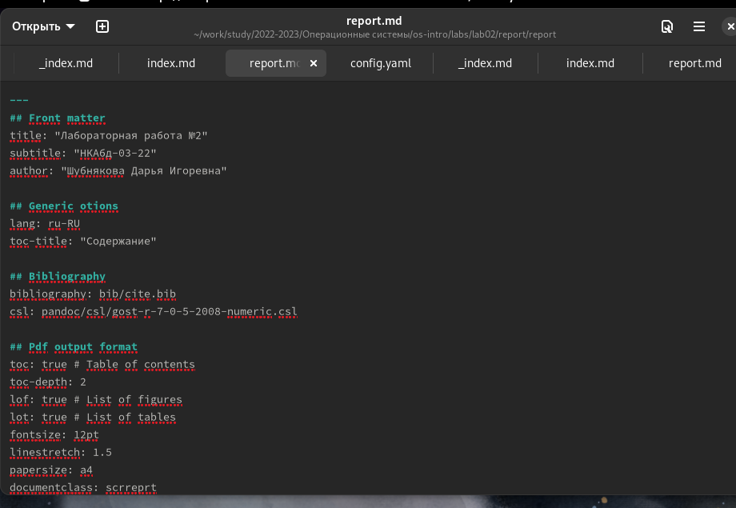
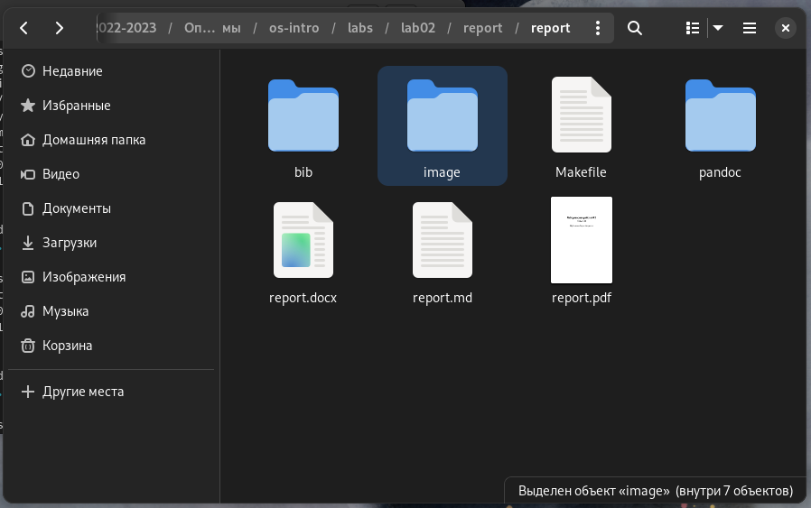

---
## Front matter
title: "Лабораторная работа №3"
subtitle: "НКАбд-03-22"
author: "Шубнякова Дарья"

## Generic otions
lang: ru-RU
toc-title: "Содержание"

## Bibliography
bibliography: bib/cite.bib
csl: pandoc/csl/gost-r-7-0-5-2008-numeric.csl

## Pdf output format
toc: true # Table of contents
toc-depth: 2
lof: true # List of figures
lot: true # List of tables
fontsize: 12pt
linestretch: 1.5
papersize: a4
documentclass: scrreprt
## I18n polyglossia
polyglossia-lang:
  name: russian
  options:
	- spelling=modern
	- babelshorthands=true
polyglossia-otherlangs:
  name: english
## I18n babel
babel-lang: russian
babel-otherlangs: english
## Fonts
mainfont: PT Serif
romanfont: PT Serif
sansfont: PT Sans
monofont: PT Mono
mainfontoptions: Ligatures=TeX
romanfontoptions: Ligatures=TeX
sansfontoptions: Ligatures=TeX,Scale=MatchLowercase
monofontoptions: Scale=MatchLowercase,Scale=0.9
## Biblatex
biblatex: true
biblio-style: "gost-numeric"
biblatexoptions:
  - parentracker=true
  - backend=biber
  - hyperref=auto
  - language=auto
  - autolang=other*
  - citestyle=gost-numeric
## Pandoc-crossref LaTeX customization
figureTitle: "Рис."
tableTitle: "Таблица"
listingTitle: "Листинг"
lofTitle: "Список иллюстраций"
lotTitle: "Список таблиц"
lolTitle: "Листинги"
## Misc options
indent: true
header-includes:
  - \usepackage{indentfirst}
  - \usepackage{float} # keep figures where there are in the text
  - \floatplacement{figure}{H} # keep figures where there are in the text
---

# Цель работы

Научиться оформлять отчёты с помощью легковесного языка разметки Markdown.

# Задание

- Сделать отчёт по предыдущей лабораторной работе в формате Markdown.
- В качестве отчёта просьба предоставить отчёты в 3 форматах: pdf, docx и md (в архиве,
поскольку он должен содержать скриншоты, Makefile и т.д.)

# Теоретическое введение

Markdown — язык текстовой разметки, созданный писателем и блогером Джоном Грубером. Он предназначен для создания красиво оформленных текстов в обычных файлах формата TXT. Вам не нужны громоздкие процессоры вроде Word или Pages, чтобы создавать документы с жирным или курсивным начертанием, цитатами, ссылками и даже таблицами. Достаточно запомнить простые правила Markdown, и можно писать хоть в «Блокноте». Хотя специализированные Markdown-редакторы, конечно, намного удобнее.
Чтобы создать заголовок, используем знак #. **Полужирное** написание -- слово выделяется двумя звездочками **. *Курсивное* написание -- слово выделяется одной звездочкой *. Три звездочки для полужирного и курсивного написания. Блок цитирования начинается со знака >. Маркированный список: перед каждым элементом ставим либо -, либо *. Чтобы сделать список в списке добавляем отступ для элементов вложенного списка. Пронумерованный список оформляется цифрой с точкой.

Структура отчёта
Согласно ГОСТ 7.32-2001, любая научно-исследовательская работа должна обязательно
содержать следующие элементы:
– титульный лист;
– реферат;
– введение;
– основную часть;
– заключение.
Также ГОСТ рекомендует включить в работу и такие элементы:
– список исполнителей;
– содержание;
– нормативные ссылки;
– определения;
– обозначения и сокращения;
– список использованных источников;
– приложения.
Если вы проводите сложную работу, выполняемую в несколько этапов, то вам может
понадобиться включить в работу часть или все элементы второго списка.

# Выполнение лабораторной работы

Мною уже был составлен отчет в формате Markdown в ходе выполнения второй лабораторной работы.

{width=70%}

А также с помощью файлов pandoc и команды make я сконвертировала их в pdf и docx, после чего отправила в свой репозиторий на github.

{width=70%}

# Выводы

В ходе проведенной лабораторной работы мы познакомились с языком разметки Markdown. А также воспользовались Pandoc для конвертации нашей работы в форматы pdf и docx.

# Список литературы{.unnumbered}

1.
Dash P. Getting started with oracle vm virtualbox. Packt Publishing Ltd, 2013. 86 p.
2.
Colvin H. Virtualbox: An ultimate guide book on virtualization with virtualbox. CreateSpace Independent Publishing Platform, 2015. 70 p.
3.
van Vugt S. Red hat rhcsa/rhce 7 cert guide : Red hat enterprise linux 7 (ex200 and ex300). Pearson IT Certification, 2016. 1008 p.
4.
Робачевский А., Немнюгин С., Стесик О. Операционная система unix. 2-е изд. Санкт-Петербург: БХВ-Петербург, 2010. 656 p.
5.
Немет Э. et al. Unix и Linux: руководство системного администратора. 4-е изд. Вильямс, 2014. 1312 p.
6.
Колисниченко Д.Н. Самоучитель системного администратора Linux. СПб.: БХВ-Петербург, 2011. 544 p.
7.
Robbins A. Bash pocket reference. O’Reilly Media, 2016. 156 p.

::: {#refs}
:::
