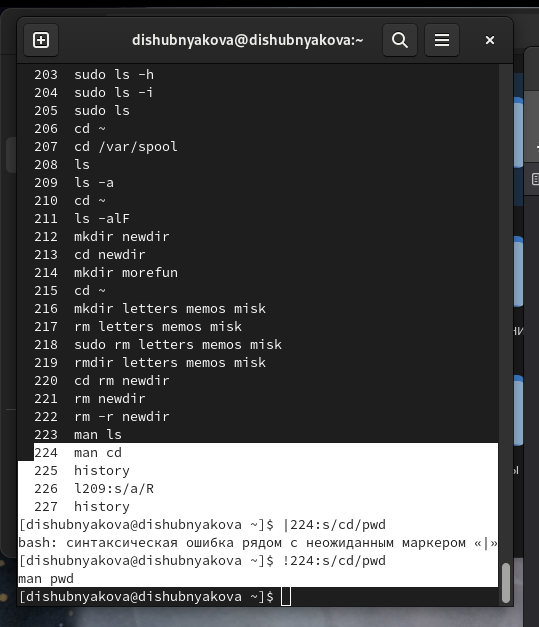

---
## Front matter
title: "Лабораторная работа №4"
subtitle: "НКАбд-03-22"
author: "Шубнякова Дарья"

## Generic otions
lang: ru-RU
toc-title: "Содержание"

## Bibliography
bibliography: bib/cite.bib
csl: pandoc/csl/gost-r-7-0-5-2008-numeric.csl

## Pdf output format
toc: true # Table of contents
toc-depth: 2
lof: true # List of figures
lot: true # List of tables
fontsize: 12pt
linestretch: 1.5
papersize: a4
documentclass: scrreprt
## I18n polyglossia
polyglossia-lang:
  name: russian
  options:
	- spelling=modern
	- babelshorthands=true
polyglossia-otherlangs:
  name: english
## I18n babel
babel-lang: russian
babel-otherlangs: english
## Fonts
mainfont: PT Serif
romanfont: PT Serif
sansfont: PT Sans
monofont: PT Mono
mainfontoptions: Ligatures=TeX
romanfontoptions: Ligatures=TeX
sansfontoptions: Ligatures=TeX,Scale=MatchLowercase
monofontoptions: Scale=MatchLowercase,Scale=0.9
## Biblatex
biblatex: true
biblio-style: "gost-numeric"
biblatexoptions:
  - parentracker=true
  - backend=biber
  - hyperref=auto
  - language=auto
  - autolang=other*
  - citestyle=gost-numeric
## Pandoc-crossref LaTeX customization
figureTitle: "Рис."
tableTitle: "Таблица"
listingTitle: "Листинг"
lofTitle: "Список иллюстраций"
lotTitle: "Список таблиц"
lolTitle: "Листинги"
## Misc options
indent: true
header-includes:
  - \usepackage{indentfirst}
  - \usepackage{float} # keep figures where there are in the text
  - \floatplacement{figure}{H} # keep figures where there are in the text
---

# Цель работы

Приобретение практических навыков взаимодействия пользователя с системой по-
средством командной строки.

# Задание

1. Определите полное имя вашего домашнего каталога. Далее относительно этого ката-
лога будут выполняться последующие упражнения.
2. Выполните следующие действия:
        2.1. Перейдите в каталог /tmp.
        2.2. Выведите на экран содержимое каталога /tmp. Для этого используйте команду ls
с различными опциями. Поясните разницу в выводимой на экран информации.
        2.3. Определите, есть ли в каталоге /var/spool подкаталог с именем cron?
        2.4. Перейдите в Ваш домашний каталог и выведите на экран его содержимое. Определите, кто является владельцем файлов и подкаталогов?
3. Выполните следующие действия:
        3.1. В домашнем каталоге создайте новый каталог с именем newdir.
        3.2. В каталоге ~/newdir создайте новый каталог с именем morefun.
        3.3. В домашнем каталоге создайте одной командой три новых каталога с именами
letters, memos, misk. Затем удалите эти каталоги одной командой.
        3.4. Попробуйте удалить ранее созданный каталог ~/newdir командой rm. Проверьте,
был ли каталог удалён.
        3.5. Удалите каталог ~/newdir/morefun из домашнего каталога. Проверьте, был ли
каталог удалён.
4. С помощью команды man определите, какую опцию команды ls нужно использо-
вать для просмотра содержимое не только указанного каталога, но и подкаталогов,
входящих в него.
5. С помощью команды man определите набор опций команды ls, позволяющий отсорти-
ровать по времени последнего изменения выводимый список содержимого каталога
с развёрнутым описанием файлов.
6. Используйте команду man для просмотра описания следующих команд: cd, pwd, mkdir,
rmdir, rm. Поясните основные опции этих команд.
7. Используя информацию, полученную при помощи команды history, выполните мо-
дификацию и исполнение нескольких команд из буфера команд.

# Теоретическое введение

История ОС UNIX началась в 1969 году в одном из подразделений AT&T Bell Laboratories, когда на "малоиспользуемой" машине DEC PDP-7 Кен Томпсон (Ken Thompson), Деннис Ричи (Dennis Ritchie) и другие (прежде занимавшиеся созданием ОС Multics) начали работу над операционной системой, названной ими первоначально Unics (UNiplexed Information and Computing System). В течение первых 10 лет развитие UNIX происходило, в основном, в Bell Labs. Соответствующие начальные версии назывались "Version n" (Vn) и предназначались для ЭВМ DEC PDP-11 (16-битовая) и VAX (32-битовая).

Версии Vn разрабатывались группой Computer Research Group (CRG) в Bell Labs. Поддержкой занималась другая группа, Unix System Group (USG). Разработкой также занималась группа Programmer's WorkBench (PWB), привнесшая систему управления исходным кодом sccs, именованные каналы и ряд других идей. В 1983 году эти группы были объединены в одну, Unix System Development Lab.

# Выполнение лабораторной работы

С помощью команды pwd узнаем полное имя домашнего каталога.

{width=70%}

Переходим в каталог /tmp с помощью команды pwd.

{width=70%}

С помощью команды ls -a выводятся все файлы, включая скрытые.

{width=70%}

С помощью команды ls -R рекурсивно выводятся все файлы каталога и подкаталогов этой папки.

{width=70%}

С помощью команды ls -i можно вывести уникальный номер файла в файловой системе.

{width=70%}

С помощью команды ls узнаем, что в var/spool нет каталога cron.

{width=70%}

Переходим в домашний каталог и с помощью команды ls -alF определяем, кто является владельцем файлов и подкаталогов.

{width=70%}

Создаем папку newdir с помощью команды mkdir в домашнем каталоге.

{width=70%}

Создаем в папке newdir подкаталог morefun.

{width=70%}

Создаем одной командой каталоги letters, memos, misk.

{width=70%}

С помощью команды rmdir удаляем эти созданные пустые каталоги.

{width=70%}

С помощью команды rm невозможно удалить непустой каталог newdir.

{width=70%}

С помощью команды rm -r newdir каталог с подкаталогом внутри удален.

{width=70%}

Команду ls -R нужно использовать для просмотра содержимое не только указанного каталога, но и подкаталогов, входящих в него.

{width=70%}

Команда ls -t сортирует выводимый список по времени изменения.

{width=70%}

С помощью команды history и специальной конструкции !<номер_команды>:s/<что_меняем>/<на_что_меняем> модифицируем одну из предыдущих команд.

{width=70%}

С помощью команды history и конструкции  !<номер_команды> можно повторить выполнение какой-либо команды. В моем случае я хотела повторить команду перехода в папку newdir, но мы помним. что удаляли ее и поэтому переход в этот каталог больше не осуществляется.

{width=70%}

# Выводы

Научились взаимодействовать с командной строкой в системе Unix. Изучили базовые команды и их основные опции.
1. Командная строка (консоль или Терминал) – это специальная программа, которая позволяет управлять компьютером путем ввода текстовых команд с клавиатуры.
2. Команда pwd определяет абсолютный путь текущего каталога.
3. При помощи команды ls -F.
4. С помощью команды ls -a.
5. Команда rm используется для удаления файлов и/или каталогов. Чтобы удалить каталог, содержащий файлы, нужно использовать опцию r. Без указания этой опции команда не будет выполняться. Если каталог пуст, то можно воспользоваться командой rmdir. Если удаляемый каталог содержит файлы, то команда не будет выполнена — нужно использовать rm - r имя_каталога.
6. С помощью команды history.
7. Можно модифицировать команду из выведенного на экран списка при помощи следующей конструкции: !<номер_команды>:s/<что_меняем>/<на_что_меняем>.
8. Если требуется выполнить последовательно несколько команд, записанный в одной строке, то для этого используется символ точка с запятой. (cd; ls).
9.  Если в заданном контексте встречаются специальные символы (типа «.», «/», «*» и т.д.), надо перед ними поставить символ экранирования \ (обратный слэш).
10. Чтобы вывести на экран подробную информацию о файлах и каталогах, необходимо использовать опцию l. При этом о каждом файле и каталоге будет выведена следующая информация: – тип файла, – право доступа, – число ссылок, – владелец, – размер, – дата последней ревизии, – имя файла или каталога.
11. Относительный путь — это ссылка, указывающая на другие страницы вашего сайта относительно веб-страницы, на которой эта ссылка уже находится.
12. С помощью команды man.
13. Клавиша Tab.

# Список литературы{.unnumbered}

1.
Dash P. Getting started with oracle vm virtualbox. Packt Publishing Ltd, 2013. 86 p.
2.
Colvin H. Virtualbox: An ultimate guide book on virtualization with virtualbox. CreateSpace Independent Publishing Platform, 2015. 70 p.
3.
van Vugt S. Red hat rhcsa/rhce 7 cert guide : Red hat enterprise linux 7 (ex200 and ex300). Pearson IT Certification, 2016. 1008 p.
4.
Робачевский А., Немнюгин С., Стесик О. Операционная система unix. 2-е изд. Санкт-Петербург: БХВ-Петербург, 2010. 656 p.
5.
Немет Э. et al. Unix и Linux: руководство системного администратора. 4-е изд. Вильямс, 2014. 1312 p.
6.
Колисниченко Д.Н. Самоучитель системного администратора Linux. СПб.: БХВ-Петербург, 2011. 544 p.
7.
Robbins A. Bash pocket reference. O’Reilly Media, 2016. 156 p.

::: {#refs}
:::
