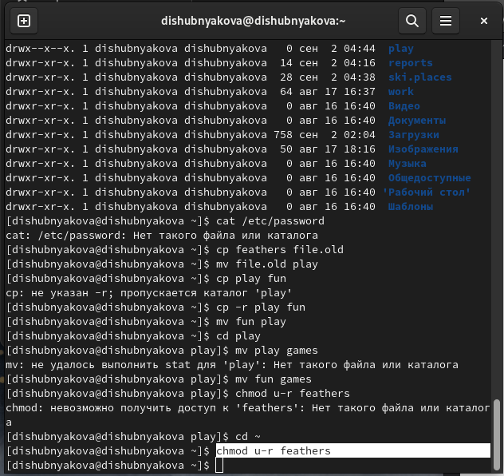

---
## Front matter
lang: ru-RU
title: Лабораторная работа №5
author: |
	Шубнякова Дарья, НКАбд-03-22

## Formatting
toc: false
slide_level: 2
theme: metropolis
header-includes: 
 - \metroset{progressbar=frametitle,sectionpage=progressbar,numbering=fraction}
 - '\makeatletter'
 - '\beamer@ignorenonframefalse'
 - '\makeatother'
aspectratio: 43
section-titles: true
---

## Содержание

1. Цель
2. Теоретическое введение
3. Основные задачи
4. Процесс выполнения
5. Вывод
6. Список литературы

## Цель

Ознакомление с файловой системой Linux, её структурой, именами и содержанием
каталогов. Приобретение практических навыков по применению команд для работы
с файлами и каталогами, по управлению процессами (и работами), по проверке использования диска и обслуживанию файловой системы.

## Теоретическое введение

Файловая система Linux — древовидная (tree-shared) сложная структура, начинающаяся с корня. Она состоит из каталогов (директорий - directory), подкаталогов (subdirectory). Каждый файл и файловая система взаимосвязаны между собой. Эта структура соответствует типичной схеме, предложенной FHS — стандарт, поддерживаемый System Linux Foundation.

## Основные задачи

1. Выполните все примеры, приведённые в первой части описания лабораторной работы.
2. Выполните следующие действия, зафиксировав в отчёте по лабораторной работе
используемые при этом команды и результаты их выполнения:
        2.1. Скопируйте файл /usr/include/sys/io.h в домашний каталог и назовите его equipment. Если файла io.h нет, то используйте любой другой файл в каталоге /usr/include/sys/ вместо него.
        2.2. В домашнем каталоге создайте директорию ~/ski.plases.
        2.3. Переместите файл equipment в каталог ~/ski.plases.
        2.4. Переименуйте файл ~/ski.plases/equipment в ~/ski.plases/equiplist.
        2.5. Создайте в домашнем каталоге файл abc1 и скопируйте его в каталог ~/ski.plases, назовите его equiplist2.
        2.6. Создайте каталог с именем equipment в каталоге ~/ski.plases.
        2.7. Переместите файлы ~/ski.plases/equiplist и equiplist2 в каталог ~/ski.plases/equipment.
        2.8. Создайте и переместите каталог ~/newdir в каталог ~/ski.plases и назовите его plans.

## Основные задачи

3. Определите опции команды chmod, необходимые для того, чтобы присвоить перечис-
ленным ниже файлам выделенные права доступа, считая, что в начале таких прав
нет:
        3.1. drwxr--r-- ... australia
        3.2. drwx--x--x ... play
        3.3. -r-xr--r-- ... my_os
        3.4. -rw-rw-r-- ... feathers
При необходимости создайте нужные файлы.

## Основные задачи

4. Проделайте приведённые ниже упражнения, записывая в отчёт по лабораторной
работе используемые при этом команды:
        4.1. Просмотрите содержимое файла /etc/password.
        4.2. Скопируйте файл ~/feathers в файл ~/file.old.
        4.3. Переместите файл ~/file.old в каталог ~/play.
        4.4. Скопируйте каталог ~/play в каталог ~/fun.
        4.5. Переместите каталог ~/fun в каталог ~/play и назовите его games.
        4.6. Лишите владельца файла ~/feathers права на чтение.
        4.7. Что произойдёт, если вы попытаетесь просмотреть файл ~/feathers командой cat?
        4.8. Что произойдёт, если вы попытаетесь скопировать файл ~/feathers?
        4.9. Дайте владельцу файла ~/feathers право на чтение.
        4.10. Лишите владельца каталога ~/play права на выполнение.
        4.11. Перейдите в каталог ~/play. Что произошло?
        4.12. Дайте владельцу каталога ~/play право на выполнение.
5. Прочитайте man по командам mount, fsck, mkfs, kill и кратко их охарактеризуйте, приведя примеры.

## Процесс выполнения

1. Сначала выполняем все примеры из лабораторной работы. Вот последний из них. Требуется лишить владельца файла ~/may права на выполнение:

{width=80%}

## Процесс выполнения

2. Выполнили все предыдущие действия. Создаем каталог с именем equipment в каталоге ~/ski.plases.Перемещаем файлы ~/ski.plases/equiplist и equiplist2 в каталог ~/ski.plases/equipment.Создаем и перемещаем каталог ~/newdir в каталог ~/ski.plases и назовите
его plans.

{width=80%}

## Процесс выполнения

3.  С помощью команды chmod и таблицы меняем права доступа на нужные.

{width=80%}

## Процесс выполнения

4. В четвертом задании мы разбираемся с правами доступа. Лишаем владельца файла ~/feathers права на чтение.

{width=80%}

## Процесс выполнения

5. Если мы попробуем просмотреть файл, то увидим, что в доступе отказано.

{width=80%}

## Вывод

Изучили команды для работы с файлами и каталогами.

## Список литературы

1.
Dash P. Getting started with oracle vm virtualbox. Packt Publishing Ltd, 2013. 86 p.
2.
Colvin H. Virtualbox: An ultimate guide book on virtualization with virtualbox. CreateSpace Independent Publishing Platform, 2015. 70 p.
3.
van Vugt S. Red hat rhcsa/rhce 7 cert guide : Red hat enterprise linux 7 (ex200 and ex300). Pearson IT Certification, 2016. 1008 p.
4.
Робачевский А., Немнюгин С., Стесик О. Операционная система unix. 2-е изд. Санкт-Петербург: БХВ-Петербург, 2010. 656 p.
5.
Немет Э. et al. Unix и Linux: руководство системного администратора. 4-е изд. Вильямс, 2014. 1312 p.
6.
Колисниченко Д.Н. Самоучитель системного администратора Linux. СПб.: БХВ-Петербург, 2011. 544 p.
7.
Robbins A. Bash pocket reference. O’Reilly Media, 2016. 156 p.

## {.standout}

Спасибо за внимание!

