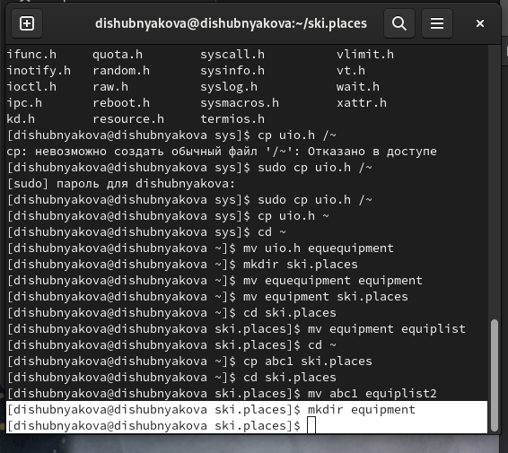
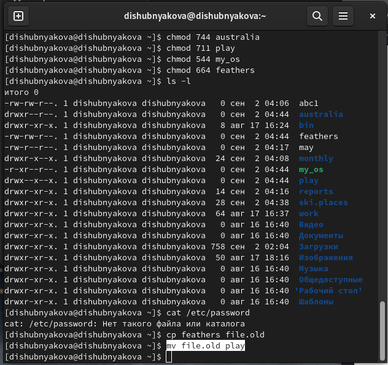

---
## Front matter
title: "Лабораторная работа №5"
subtitle: "НКАбд-03-22"
author: "Шубнякова Дарья"

## Generic otions
lang: ru-RU
toc-title: "Содержание"

## Bibliography
bibliography: bib/cite.bib
csl: pandoc/csl/gost-r-7-0-5-2008-numeric.csl

## Pdf output format
toc: true # Table of contents
toc-depth: 2
lof: true # List of figures
lot: true # List of tables
fontsize: 12pt
linestretch: 1.5
papersize: a4
documentclass: scrreprt
## I18n polyglossia
polyglossia-lang:
  name: russian
  options:
	- spelling=modern
	- babelshorthands=true
polyglossia-otherlangs:
  name: english
## I18n babel
babel-lang: russian
babel-otherlangs: english
## Fonts
mainfont: PT Serif
romanfont: PT Serif
sansfont: PT Sans
monofont: PT Mono
mainfontoptions: Ligatures=TeX
romanfontoptions: Ligatures=TeX
sansfontoptions: Ligatures=TeX,Scale=MatchLowercase
monofontoptions: Scale=MatchLowercase,Scale=0.9
## Biblatex
biblatex: true
biblio-style: "gost-numeric"
biblatexoptions:
  - parentracker=true
  - backend=biber
  - hyperref=auto
  - language=auto
  - autolang=other*
  - citestyle=gost-numeric
## Pandoc-crossref LaTeX customization
figureTitle: "Рис."
tableTitle: "Таблица"
listingTitle: "Листинг"
lofTitle: "Список иллюстраций"
lotTitle: "Список таблиц"
lolTitle: "Листинги"
## Misc options
indent: true
header-includes:
  - \usepackage{indentfirst}
  - \usepackage{float} # keep figures where there are in the text
  - \floatplacement{figure}{H} # keep figures where there are in the text
---

# Цель работы

Ознакомление с файловой системой Linux, её структурой, именами и содержанием
каталогов. Приобретение практических навыков по применению команд для работы
с файлами и каталогами, по управлению процессами (и работами), по проверке использования диска и обслуживанию файловой системы.

# Задание

1. Выполните все примеры, приведённые в первой части описания лабораторной работы.
2. Выполните следующие действия, зафиксировав в отчёте по лабораторной работе
используемые при этом команды и результаты их выполнения:
        2.1. Скопируйте файл /usr/include/sys/io.h в домашний каталог и назовите его equipment. Если файла io.h нет, то используйте любой другой файл в каталоге /usr/include/sys/ вместо него.
        2.2. В домашнем каталоге создайте директорию ~/ski.plases.
        2.3. Переместите файл equipment в каталог ~/ski.plases.
        2.4. Переименуйте файл ~/ski.plases/equipment в ~/ski.plases/equiplist.
        2.5. Создайте в домашнем каталоге файл abc1 и скопируйте его в каталог ~/ski.plases, назовите его equiplist2.
        2.6. Создайте каталог с именем equipment в каталоге ~/ski.plases.
        2.7. Переместите файлы ~/ski.plases/equiplist и equiplist2 в каталог ~/ski.plases/equipment.
        2.8. Создайте и переместите каталог ~/newdir в каталог ~/ski.plases и назовите его plans.
3. Определите опции команды chmod, необходимые для того, чтобы присвоить перечис-
ленным ниже файлам выделенные права доступа, считая, что в начале таких прав
нет:
        3.1. drwxr--r-- ... australia
        3.2. drwx--x--x ... play
        3.3. -r-xr--r-- ... my_os
        3.4. -rw-rw-r-- ... feathers
При необходимости создайте нужные файлы.
4. Проделайте приведённые ниже упражнения, записывая в отчёт по лабораторной
работе используемые при этом команды:
        4.1. Просмотрите содержимое файла /etc/password.
        4.2. Скопируйте файл ~/feathers в файл ~/file.old.
        4.3. Переместите файл ~/file.old в каталог ~/play.
        4.4. Скопируйте каталог ~/play в каталог ~/fun.
        4.5. Переместите каталог ~/fun в каталог ~/play и назовите его games.
        4.6. Лишите владельца файла ~/feathers права на чтение.
        4.7. Что произойдёт, если вы попытаетесь просмотреть файл ~/feathers командой cat?
        4.8. Что произойдёт, если вы попытаетесь скопировать файл ~/feathers?
        4.9. Дайте владельцу файла ~/feathers право на чтение.
        4.10. Лишите владельца каталога ~/play права на выполнение.
        4.11. Перейдите в каталог ~/play. Что произошло?
        4.12. Дайте владельцу каталога ~/play право на выполнение.
5. Прочитайте man по командам mount, fsck, mkfs, kill и кратко их охарактеризуйте, приведя примеры.

# Выполнение лабораторной работы

Копирование файла в текущем каталоге. Скопировать файл ~/abc1 в файл april
и в файл may:

{width=80%}

Копирование нескольких файлов в каталог. Скопировать файлы april и may в каталог
monthly:

{width=80%}

Копирование файлов в произвольном каталоге. Скопировать файл monthly/may в файл
с именем june:

{width=80%}

Копирование каталогов в текущем каталоге. Скопировать каталог monthly в каталог
monthly.00:

{width=80%}

Копирование каталогов в произвольном каталоге. Скопировать каталог monthly.00
в каталог /tmp:

{width=80%}

Переименование файлов в текущем каталоге. Изменить название файла april на
july в домашнем каталоге:

{width=80%}

Перемещение файлов в другой каталог. Переместить файл july в каталог monthly.00:

{width=80%}

Переименование каталогов в текущем каталоге. Переименовать каталог monthly.00
в monthly.01:

{width=80%}

Перемещение каталога в другой каталог. Переместить каталог monthly.01в каталог
reports:

{width=80%}

Переименование каталога, не являющегося текущим. Переименовать каталог
reports/monthly.01 в reports/monthly:

{width=80%}

Требуется создать файл ~/may с правом выполнения для владельца:

{width=80%}

Требуется лишить владельца файла ~/may права на выполнение:

{width=80%}

Требуется создать каталог monthly с запретом на чтение для членов группы и всех
остальных пользователей:

{width=80%}

Требуется создать файл ~/abc1 с правом записи для членов группы:

{width=80%}

Скопируем файл /usr/include/sys/io.h в домашний каталог и назовите его
equipment. Если файла io.h нет, то используем любой другой файл в каталоге
/usr/include/sys/ вместо него. Вместо него использую файл uio.h.

{width=80%}

В домашнем каталоге создаем директорию ~/ski.plases.

{width=80%}

Перемещаем файл equipment в каталог ~/ski.plases.

{width=80%}

Переименуем файл ~/ski.plases/equipment в ~/ski.plases/equiplist.

{width=80%}

Создаем в домашнем каталоге файл abc1 и скопируем его в каталог ~/ski.plases, назовите его equiplist2.

{width=80%}

Создаем каталог с именем equipment в каталоге ~/ski.plases.Перемещаем файлы ~/ski.plases/equiplist и equiplist2 в каталог ~/ski.plases/equipment.Создаем и перемещаем каталог ~/newdir в каталог ~/ski.plases и назовите
его plans.

{width=80%}

Создаем необходимые каталоги и файлы, с помощью команды ls -l узнаем права доступа.

{width=80%}

С помощью команды chmod и таблицы меняем права доступа на нужные.

{width=80%}

У меня нет файла /etc/password, но это делается с помощью команды cat.

{width=80%}

Скопируем файл ~/feathers в файл ~/file.old.

{width=80%}

Перемещаем файл ~/file.old в каталог ~/play.

{width=80%}

Скопируем каталог ~/play в каталог ~/fun.

{width=80%}

Перемещаем каталог ~/fun в каталог ~/play и назовите его games.

{width=80%}

Лишаем владельца файла ~/feathers права на чтение.

{width=80%}

Если мы попробуем просмотреть файл, то увидим, что в доступе отказано.

{width=80%}

Скопировать файл также невозможно.

{width=80%}

Даем владельцу файла ~/feathers право на чтение.

{width=80%}

Лишаем владельца каталога ~/play права на выполнение.

{width=80%}

Невозможно перейти в каталог.

{width=80%}

Возвращаем владельцу права на выполнение и каталог открывается.

{width=80%}

# Выводы

Изучили команды для работы с файлами и каталогами.
1. Ext2, Ext3, Ext4 или Extended Filesystem - это стандартная файловая система для Linux. Она была разработана еще для Minix. Она самая стабильная из всех существующих, кодовая база изменяется очень редко и эта файловая система содержит больше всего функций. Версия ext2 была разработана уже именно для Linux и получила много улучшений. В 2001 году вышла ext3, которая добавила еще больше стабильности благодаря использованию журналирования. В 2006 была выпущена версия ext4, которая используется во всех дистрибутивах Linux до сегодняшнего дня. В ней было внесено много улучшений, в том числе увеличен максимальный размер раздела до одного экзабайта.

Btrfs или B-Tree File System - это совершенно новая файловая система, которая сосредоточена на отказоустойчивости, легкости администрирования и восстановления данных. Файловая система объединяет в себе очень много новых интересных возможностей, таких как размещение на нескольких разделах, поддержка подтомов, изменение размера не лету, создание мгновенных снимков, а также высокая производительность. Но многими пользователями файловая система Btrfs считается нестабильной. Тем не менее, она уже используется как файловая система по умолчанию в OpenSUSE и SUSE Linux.
2. / — root каталог. Содержит в себе всю иерархию системы;

/bin — здесь находятся двоичные исполняемые файлы. Основные общие команды, хранящиеся отдельно от других программ в системе (прим.: pwd, ls, cat, ps);

/boot — тут расположены файлы, используемые для загрузки системы (образ initrd, ядро vmlinuz);

/dev — в данной директории располагаются файлы устройств (драйверов). С помощью этих файлов можно взаимодействовать с устройствами. К примеру, если это жесткий диск, можно подключить его к файловой системе. В файл принтера же можно написать напрямую и отправить задание на печать;

/etc — в этой директории находятся файлы конфигураций программ. Эти файлы позволяют настраивать системы, сервисы, скрипты системных демонов;

/home — каталог, аналогичный каталогу Users в Windows. Содержит домашние каталоги учетных записей пользователей (кроме root). При создании нового пользователя здесь создается одноименный каталог с аналогичным именем и хранит личные файлы этого пользователя;

/lib — содержит системные библиотеки, с которыми работают программы и модули ядра;

/lost+found — содержит файлы, восстановленные после сбоя работы системы. Система проведет проверку после сбоя и найденные файлы можно будет посмотреть в данном каталоге;

/media — точка монтирования внешних носителей. Например, когда вы вставляете диск в дисковод, он будет автоматически смонтирован в директорию /media/cdrom;

/mnt — точка временного монтирования. Файловые системы подключаемых устройств обычно монтируются в этот каталог для временного использования;

/opt — тут расположены дополнительные (необязательные) приложения. Такие программы обычно не подчиняются принятой иерархии и хранят свои файлы в одном подкаталоге (бинарные, библиотеки, конфигурации);

/proc — содержит файлы, хранящие информацию о запущенных процессах и о состоянии ядра ОС;

/root — директория, которая содержит файлы и личные настройки суперпользователя;

/run — содержит файлы состояния приложений. Например, PID-файлы или UNIX-сокеты;

/sbin — аналогично /bin содержит бинарные файлы. Утилиты нужны для настройки и администрирования системы суперпользователем;

/srv — содержит файлы сервисов, предоставляемых сервером (прим. FTP или Apache HTTP);

/sys — содержит данные непосредственно о системе. Тут можно узнать информацию о ядре, драйверах и устройствах;

/tmp — содержит временные файлы. Данные файлы доступны всем пользователям на чтение и запись. Стоит отметить, что данный каталог очищается при перезагрузке;

/usr — содержит пользовательские приложения и утилиты второго уровня, используемые пользователями, а не системой. Содержимое доступно только для чтения (кроме root). Каталог имеет вторичную иерархию и похож на корневой;

/var — содержит переменные файлы. Имеет подкаталоги, отвечающие за отдельные переменные. Например, логи будут храниться в /var/log, кэш в /var/cache, очереди заданий в /var/spool/ и так далее.
3. Монтирование тома.
4. Отсутствие синхронизации между образом файловой системы в памяти и ее данными на диске в случае аварийного останова может привести к появлению следующих ошибок:

Один блок адресуется несколькими mode (принадлежит нескольким файлам).

Блок помечен как свободный, но в то же время занят (на него ссылается onode).

Блок помечен как занятый, но в то же время свободен (ни один inode на него не ссылается).

Неправильное число ссылок в inode (недостаток или избыток ссылающихся записей в каталогах).

Несовпадение между размером файла и суммарным размером адресуемых inode блоков.

Недопустимые адресуемые блоки (например, расположенные за пределами файловой системы).

"Потерянные" файлы (правильные inode, на которые не ссылаются записи каталогов).

Недопустимые или неразмещенные номера inode в записях каталогов.
5. mkfs - позволяет создать файловую систему Linux.
6. сat - выводит содержимое файла на стандартное устройство вывода.
7. сp – копирует или перемещает директорию, файлы.
8. mv - переименовать или переместить файл или директорию.
9. Права доступа к файлу или каталогу можно изменить, воспользовавшись командой chmod. Сделать это может владелец файла (или каталога) или пользователь с правами администратора.

# Список литературы{.unnumbered}

1.
Dash P. Getting started with oracle vm virtualbox. Packt Publishing Ltd, 2013. 86 p.
2.
Colvin H. Virtualbox: An ultimate guide book on virtualization with virtualbox. CreateSpace Independent Publishing Platform, 2015. 70 p.
3.
van Vugt S. Red hat rhcsa/rhce 7 cert guide : Red hat enterprise linux 7 (ex200 and ex300). Pearson IT Certification, 2016. 1008 p.
4.
Робачевский А., Немнюгин С., Стесик О. Операционная система unix. 2-е изд. Санкт-Петербург: БХВ-Петербург, 2010. 656 p.
5.
Немет Э. et al. Unix и Linux: руководство системного администратора. 4-е изд. Вильямс, 2014. 1312 p.
6.
Колисниченко Д.Н. Самоучитель системного администратора Linux. СПб.: БХВ-Петербург, 2011. 544 p.
7.
Robbins A. Bash pocket reference. O’Reilly Media, 2016. 156 p.

::: {#refs}
:::
