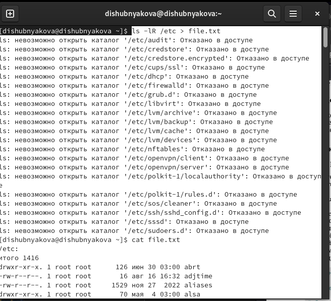
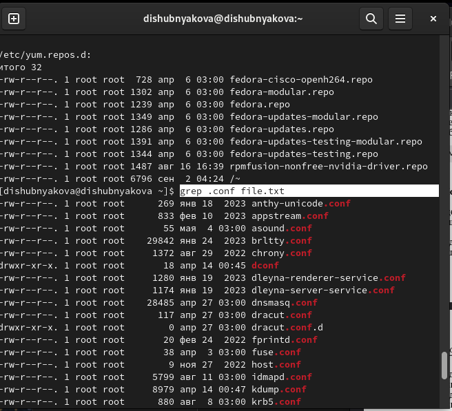
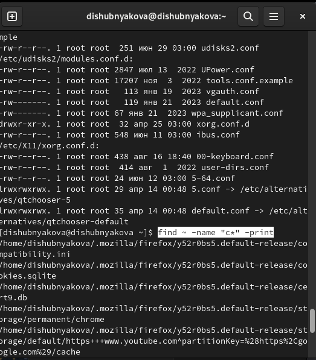
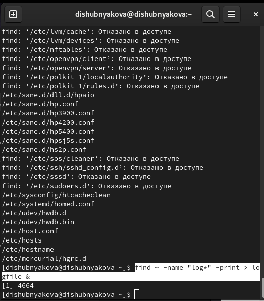
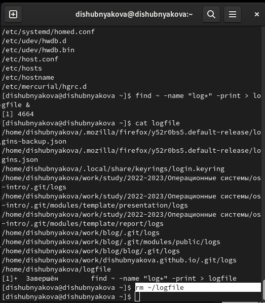
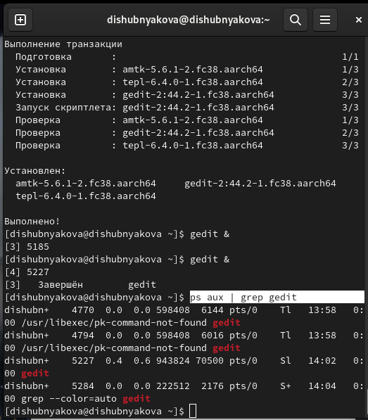
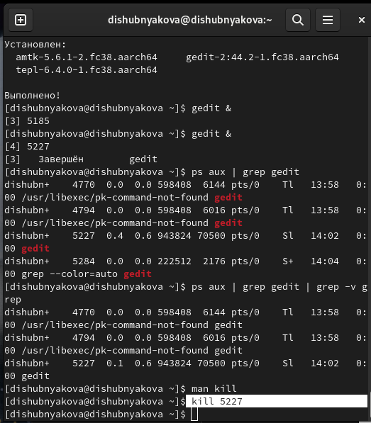
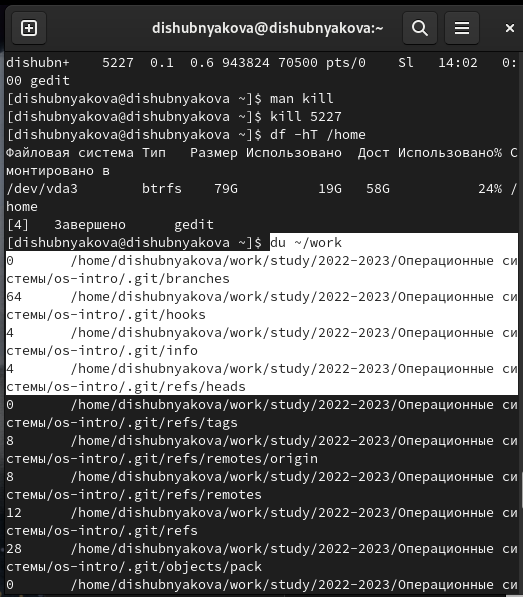
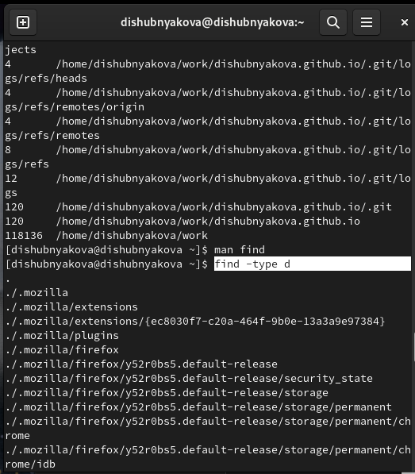

---
## Front matter
lang: ru-RU
title: Лабораторная работа №6
author: |
	Шубнякова Дарья, НКАбд-03-22

## Formatting
toc: false
slide_level: 2
theme: metropolis
header-includes: 
 - \metroset{progressbar=frametitle,sectionpage=progressbar,numbering=fraction}
 - '\makeatletter'
 - '\beamer@ignorenonframefalse'
 - '\makeatother'
aspectratio: 43
section-titles: true
---

## Содержание

1. Цель
2. Теоретическое введение
3. Основные задачи
4. Процесс выполнения
5. Вывод
6. Список литературы

## Цель

Ознакомление с инструментами поиска файлов и фильтрации текстовых данных. Приобретение практических навыков: по управлению процессами (и заданиями), по проверке использования диска и обслуживанию файловых систем.

## Теоретическое введение

В системе по умолчанию открыто три специальных потока: – stdin — стандартный поток ввода (по умолчанию: клавиатура), файловый дескриптор 0; – stdout — стандартный поток вывода (по умолчанию: консоль), файловый дескриптор 1; – stderr — стандартный поток вывод сообщений об ошибках (по умолчанию: консоль), файловый дескриптор 2. Большинство используемых в консоли команд и программ записывают результаты своей работы в стандартный поток вывода stdout. Например, команда ls выводит в стандартный поток вывода (консоль) список файлов в текущей директории. Потоки вывода и ввода можно перенаправлять на другие файлы или устройства. Проще всего это делается с помощью символов >, >>, <, <<.

## Основные задачи

1. Осуществите вход в систему, используя соответствующее имя пользователя.
2. Запишите в файл file.txt названия файлов, содержащихся в каталоге /etc. Допишите в этот же файл названия файлов, содержащихся в вашем домашнем каталоге.
3. Выведите имена всех файлов из file.txt, имеющих расширение .conf, после чего
запишите их в новый текстовой файл conf.txt.
4. Определите, какие файлы в вашем домашнем каталоге имеют имена, начинавшиеся с символа c? Предложите несколько вариантов, как это сделать.

## Основные задачи

5. Выведите на экран (по странично) имена файлов из каталога /etc, начинающиеся с символа h.
6. Запустите в фоновом режиме процесс, который будет записывать в файл ~/logfile файлы, имена которых начинаются с log.
7. Удалите файл ~/logfile.
8. Запустите из консоли в фоновом режиме редактор gedit.

## Основные задачи

9. Определите идентификатор процесса gedit, используя команду ps, конвейер и фильтр grep. Как ещё можно определить идентификатор процесса?
10. Прочтите справку (man) команды kill, после чего используйте её для завершения
процесса gedit.
11. Выполните команды df и du, предварительно получив более подробную информацию
об этих командах, с помощью команды man.
12. Воспользовавшись справкой команды find, выведите имена всех директорий, имеющихся в вашем домашнем каталоге.

## Процесс выполнения

1. Записываем в файл названия файлов из двух необходимых каталогов.

{width=70%}

## Процесс выполнения

2. Выводим имена всех файлов из созданного, которые имеют расширение .conf. 

{width=70%}

## Процесс выполнения

3.  Определяем, какие файлы в домашнем каталоге имеют имена, начинавшиеся
с символа c двумя вариантами.

{width=70%}

## Процесс выполнения

4. Запускаем в фоновом режиме процесс, который будет записывать в файл ~/logfile файлы, имена которых начинаются с log.

{width=70%}

## Процесс выполнения

5. Удаляем файл logfile.

{width=70%}

## Процесс выполнения

6. Определите идентификатор процесса gedit, используя команду ps, конвейер и фильтр
grep двумя способами.

{width=70%}

## Процесс выполнения

7. С помощью команды df -hT получаем информацию  только о /home файловой системе устройства в удобном для чтения формате. Для получения информации об объеме директории, а также всех ее поддиректорий может использоваться команда du без каких-либо параметров.

{width=70%}

## Процесс выполнения

8. {width=70%}

## Процесс выполнения

9. С помощью команды find выводим имена всех директорий из домашнего каталога.

{width=70%}

## Вывод

## Список литературы

1.
Dash P. Getting started with oracle vm virtualbox. Packt Publishing Ltd, 2013. 86 p.
2.
Colvin H. Virtualbox: An ultimate guide book on virtualization with virtualbox. CreateSpace Independent Publishing Platform, 2015. 70 p.
3.
van Vugt S. Red hat rhcsa/rhce 7 cert guide : Red hat enterprise linux 7 (ex200 and ex300). Pearson IT Certification, 2016. 1008 p.
4.
Робачевский А., Немнюгин С., Стесик О. Операционная система unix. 2-е изд. Санкт-Петербург: БХВ-Петербург, 2010. 656 p.
5.
Немет Э. et al. Unix и Linux: руководство системного администратора. 4-е изд. Вильямс, 2014. 1312 p.
6.
Колисниченко Д.Н. Самоучитель системного администратора Linux. СПб.: БХВ-Петербург, 2011. 544 p.
7.
Robbins A. Bash pocket reference. O’Reilly Media, 2016. 156 p.

## {.standout}

Спасибо за внимание!

