---
## Front matter
title: "Лабораторная работа №6"
subtitle: "НКАбд-03-22"
author: "Шубнякова Дарья"

## Generic otions
lang: ru-RU
toc-title: "Содержание"

## Bibliography
bibliography: bib/cite.bib
csl: pandoc/csl/gost-r-7-0-5-2008-numeric.csl

## Pdf output format
toc: true # Table of contents
toc-depth: 2
lof: true # List of figures
lot: true # List of tables
fontsize: 12pt
linestretch: 1.5
papersize: a4
documentclass: scrreprt
## I18n polyglossia
polyglossia-lang:
  name: russian
  options:
	- spelling=modern
	- babelshorthands=true
polyglossia-otherlangs:
  name: english
## I18n babel
babel-lang: russian
babel-otherlangs: english
## Fonts
mainfont: PT Serif
romanfont: PT Serif
sansfont: PT Sans
monofont: PT Mono
mainfontoptions: Ligatures=TeX
romanfontoptions: Ligatures=TeX
sansfontoptions: Ligatures=TeX,Scale=MatchLowercase
monofontoptions: Scale=MatchLowercase,Scale=0.9
## Biblatex
biblatex: true
biblio-style: "gost-numeric"
biblatexoptions:
  - parentracker=true
  - backend=biber
  - hyperref=auto
  - language=auto
  - autolang=other*
  - citestyle=gost-numeric
## Pandoc-crossref LaTeX customization
figureTitle: "Рис."
tableTitle: "Таблица"
listingTitle: "Листинг"
lofTitle: "Список иллюстраций"
lotTitle: "Список таблиц"
lolTitle: "Листинги"
## Misc options
indent: true
header-includes:
  - \usepackage{indentfirst}
  - \usepackage{float} # keep figures where there are in the text
  - \floatplacement{figure}{H} # keep figures where there are in the text
---

# Цель работы

Ознакомление с инструментами поиска файлов и фильтрации текстовых данных.
Приобретение практических навыков: по управлению процессами (и заданиями), по
проверке использования диска и обслуживанию файловых систем.

# Задание

1. Осуществите вход в систему, используя соответствующее имя пользователя.
2. Запишите в файл file.txt названия файлов, содержащихся в каталоге /etc. Допи-
шите в этот же файл названия файлов, содержащихся в вашем домашнем каталоге.
3. Выведите имена всех файлов из file.txt, имеющих расширение .conf, после чего
запишите их в новый текстовой файл conf.txt.
4. Определите, какие файлы в вашем домашнем каталоге имеют имена, начинавшиеся
с символа c? Предложите несколько вариантов, как это сделать.
5. Выведите на экран (по странично) имена файлов из каталога /etc, начинающиеся
с символа h.
6. Запустите в фоновом режиме процесс, который будет записывать в файл ~/logfile
файлы, имена которых начинаются с log.
7. Удалите файл ~/logfile.
8. Запустите из консоли в фоновом режиме редактор gedit.
9. Определите идентификатор процесса gedit, используя команду ps, конвейер и фильтр
grep. Как ещё можно определить идентификатор процесса?
10. Прочтите справку (man) команды kill, после чего используйте её для завершения
процесса gedit.
11. Выполните команды df и du, предварительно получив более подробную информацию
об этих командах, с помощью команды man.
12. Воспользовавшись справкой команды find, выведите имена всех директорий, имею-
щихся в вашем домашнем каталоге.

# Теоретическое введение

В системе по умолчанию открыто три специальных потока:
– stdin — стандартный поток ввода (по умолчанию: клавиатура), файловый дескриптор
0;
– stdout — стандартный поток вывода (по умолчанию: консоль), файловый дескриптор
1;
– stderr — стандартный поток вывод сообщений об ошибках (по умолчанию: консоль),
файловый дескриптор 2.
Большинство используемых в консоли команд и программ записывают результаты
своей работы в стандартный поток вывода stdout. Например, команда ls выводит в стандартный поток вывода (консоль) список файлов в текущей директории. Потоки вывода и ввода можно перенаправлять на другие файлы или устройства. Проще всего это делается с помощью символов >, >>, <, <<. 

Конвейер (pipe) служит для объединения простых команд или утилит в цепочки, в которых результат работы предыдущей команды передаётся последующей. Чаще всего скрипты на Bash используются в качестве автоматизации каких-то рутин-
ных операций в консоли, отсюда иногда возникает необходимость в обработке stdout
одной команды и передача на stdin другой команде, при этом результат выполнения
команды должен обработан.

# Выполнение лабораторной работы

Записываем в файл названия файлов из двух необходимых каталогов.

{width=70%}

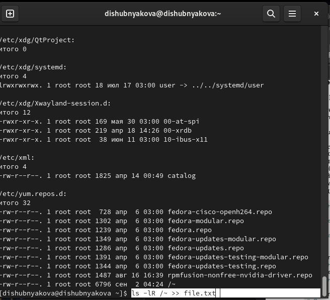{width=70%}

Выводим имена всех файлов из созданного, которые имеют расширение .conf. 

{width=70%}

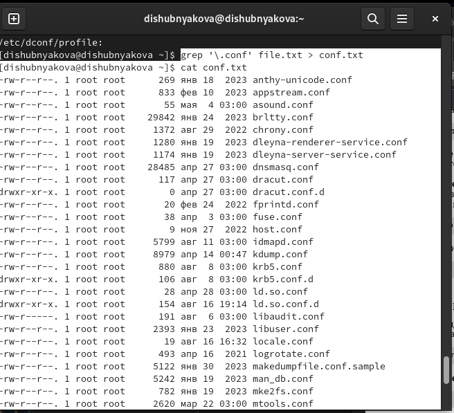{width=70%}

Определяем, какие файлы в домашнем каталоге имеют имена, начинавшиеся
с символа c двумя вариантами.

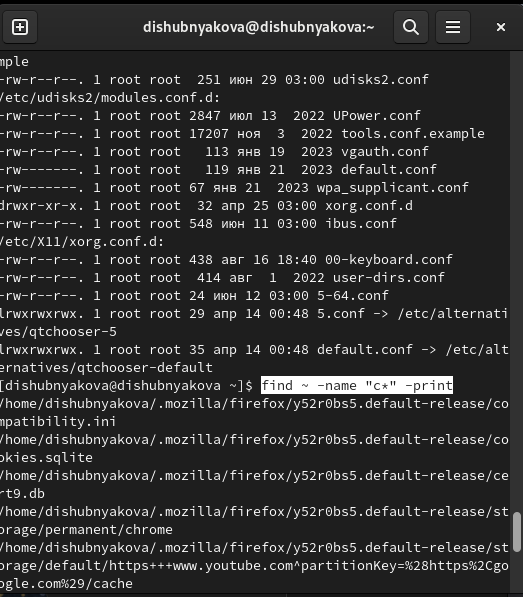{width=70%}

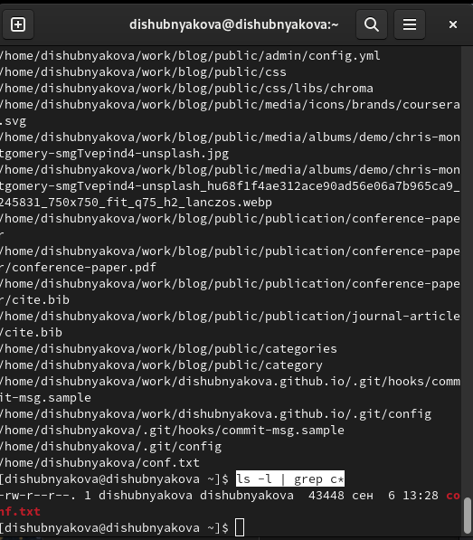{width=70%}

Выводим имен файлов из каталога, которые начинаются с буквы h.

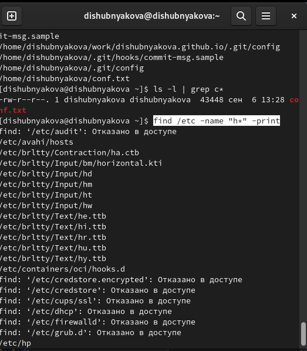{width=70%}

Запускаем в фоновом режиме процесс, который будет записывать в файл ~/logfile
файлы, имена которых начинаются с log.

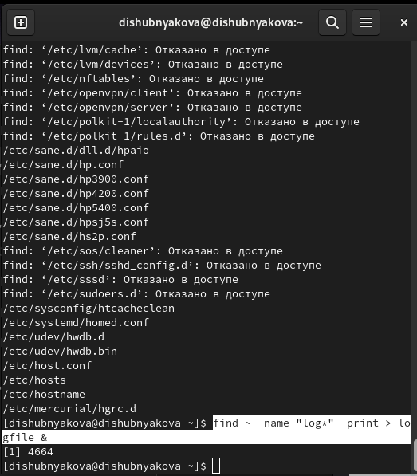{width=70%}

Удаляем файл logfile.

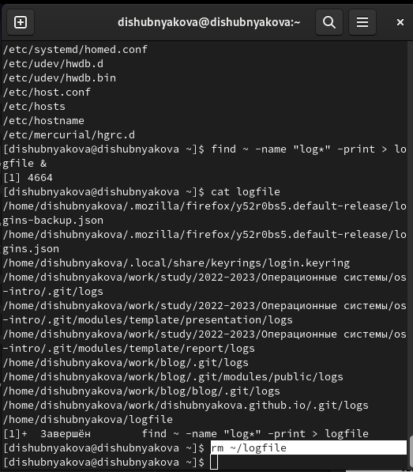{width=70%}

Запускаем в фоновом режиме редактор gedit.

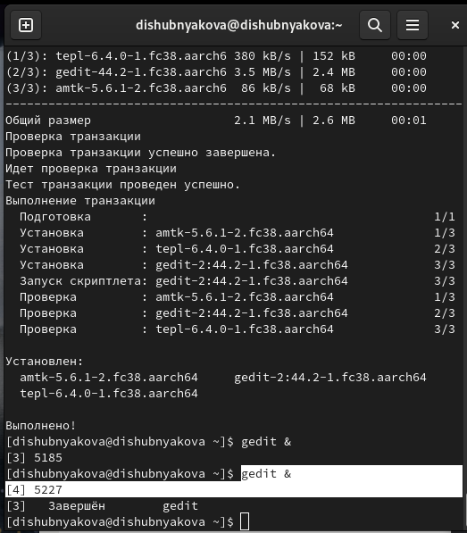{width=70%}

Определите идентификатор процесса gedit, используя команду ps, конвейер и фильтр
grep двумя способами.

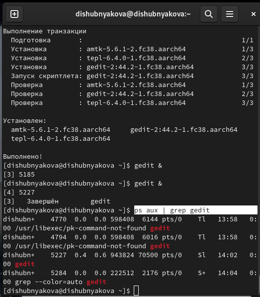{width=70%}

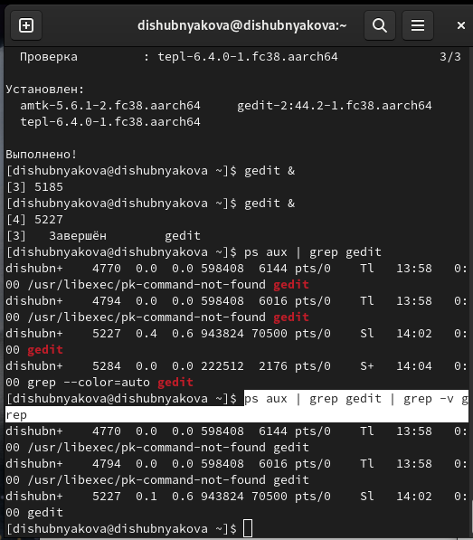{width=70%}

Читаем справку и с помощью команды kill, зная идентификатор процесса, завершаем работу редактора.

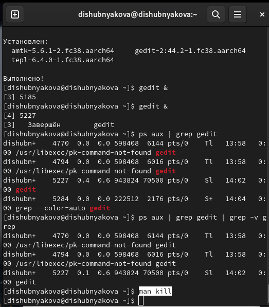{width=70%}

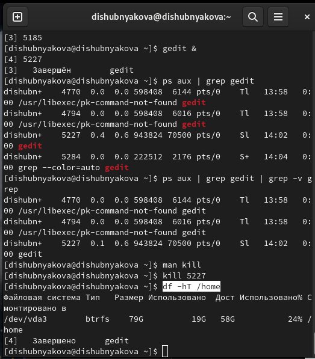{width=70%}

С помощью команды df -hT получаем информацию  только о /home файловой системе устройства в удобном для чтения формате. Для получения информации об объеме директории, а также всех ее поддиректорий может использоваться команда du без каких-либо параметров.

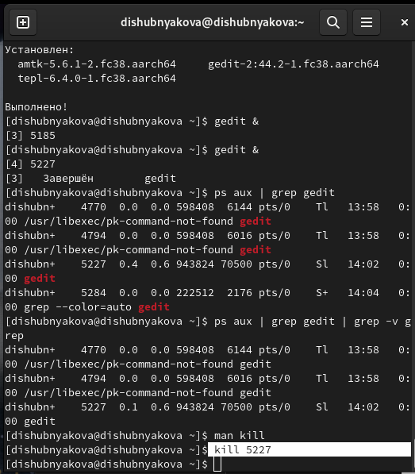{width=70%}

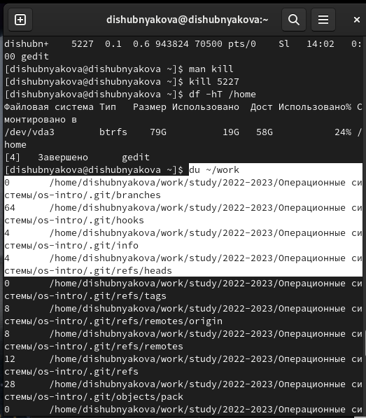{width=70%}

С помощью команды find выводим имена всех директорий из домашнего каталога.

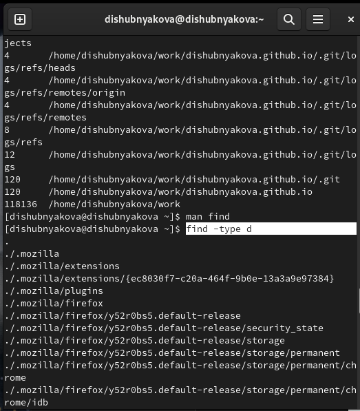{width=70%}

# Выводы

Научились искать информацию о файлах и в них самих, а также удалять процессы и узнавать их идентификаторы. 
1. В системе по умолчанию открыто три специальных потока: – stdin — стандартный поток ввода (по умолчанию: клавиатура), файловый дескриптор 0; – stdout — стандартный поток вывода (по умолчанию: консоль), файловый дескриптор 1; – stderr — стандартный поток вывод сообщений об ошибках (по умолчанию: консоль), файловый дескриптор 2.
2. Этот знак > - перенаправление ввода/вывода, а >> - перенаправление в режиме добавления.
3. Конвейер (pipe) служит для объединения простых команд или утилит в цепочки, в которых результат работы предыдущей команды передаётся последующей.
4. Главное отличие между программой и процессом заключается в том, что программа - это набор инструкций, который позволяет ЦПУ выполнять определенную задачу, в то время как процесс - это исполняемая программа.
5. PPID - (parent process ID) идентификатор родительского процесса. Процесс может порождать и другие процессы. UID, GID - реальные идентификаторы пользователя и его группы, запустившего данный процесс.
6. Запущенные фоном программы называются задачами (jobs). Ими можно управлять с помощью команды jobs, которая выводит список запущенных в данный момент задач.
7. Команда htop похожа на команду top по выполняемой функции: они обе показывают информацию о процессах в реальном времени, выводят данные о потреблении системных ресурсов и позволяют искать, останавливать и управлять процессами.

У обеих команд есть свои преимущества. Например, в программе htop реализован очень удобный поиск по процессам, а также их фильтрация. В команде top это не так удобно — нужно знать кнопку для вывода функции поиска.

Зато в top можно разделять область окна и выводить информацию о процессах в соответствии с разными настройками. В целом top намного более гибкая в настройке отображения процессов.
8. Команда find - это одна из наиболее важных и часто используемых утилит системы Linux. Это команда для поиска файлов и каталогов на основе специальных условий. Ее можно использовать в различных обстоятельствах, например, для поиска файлов по разрешениям, владельцам, группам, типу, размеру и другим подобным критериям.

Утилита find предустановлена по умолчанию во всех Linux дистрибутивах, поэтому вам не нужно будет устанавливать никаких дополнительных пакетов. Это очень важная находка для тех, кто хочет использовать командную строку наиболее эффективно.

Команда find имеет такой синтаксис: find [папка] [параметры] критерий шаблон [действие] Пример: find /etc -name "p*" -print
9. find / -type f -exec grep -H 'текстДляПоиска' {} ;
10. С помощью команды df -h.
11. С помощью команды du -s.
12. С помощью команды kill [номер задачи].

# Список литературы{.unnumbered}

1.
Dash P. Getting started with oracle vm virtualbox. Packt Publishing Ltd, 2013. 86 p.
2.
Colvin H. Virtualbox: An ultimate guide book on virtualization with virtualbox. CreateSpace Independent Publishing Platform, 2015. 70 p.
3.
van Vugt S. Red hat rhcsa/rhce 7 cert guide : Red hat enterprise linux 7 (ex200 and ex300). Pearson IT Certification, 2016. 1008 p.
4.
Робачевский А., Немнюгин С., Стесик О. Операционная система unix. 2-е изд. Санкт-Петербург: БХВ-Петербург, 2010. 656 p.
5.
Немет Э. et al. Unix и Linux: руководство системного администратора. 4-е изд. Вильямс, 2014. 1312 p.
6.
Колисниченко Д.Н. Самоучитель системного администратора Linux. СПб.: БХВ-Петербург, 2011. 544 p.
7.
Robbins A. Bash pocket reference. O’Reilly Media, 2016. 156 p.

::: {#refs}
:::
