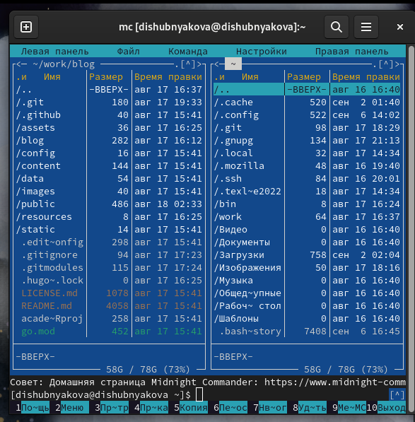
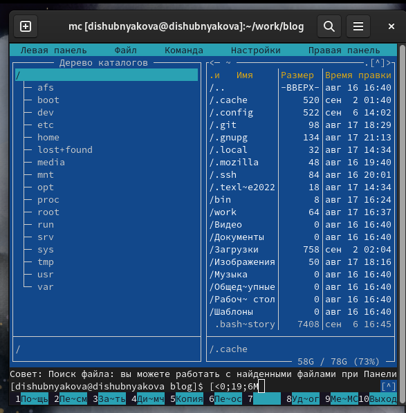
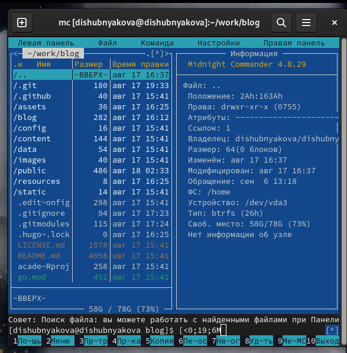
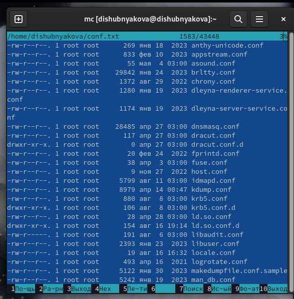
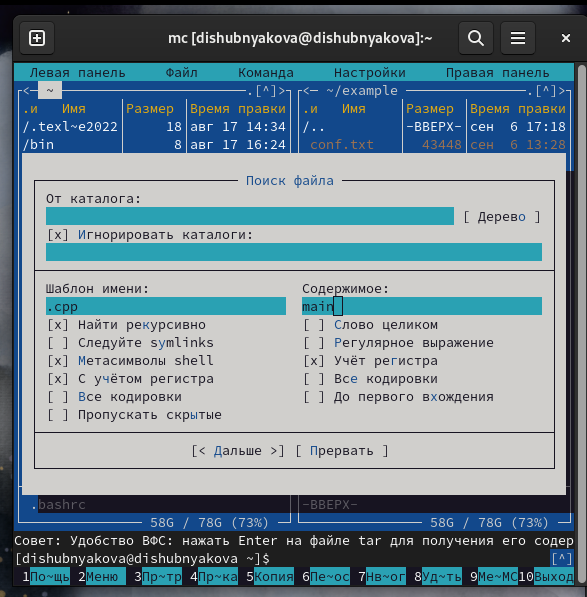
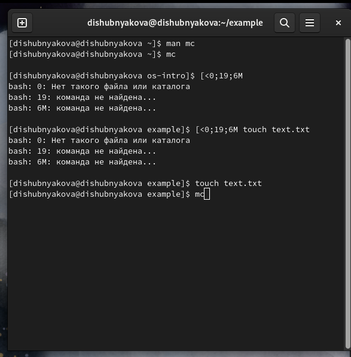
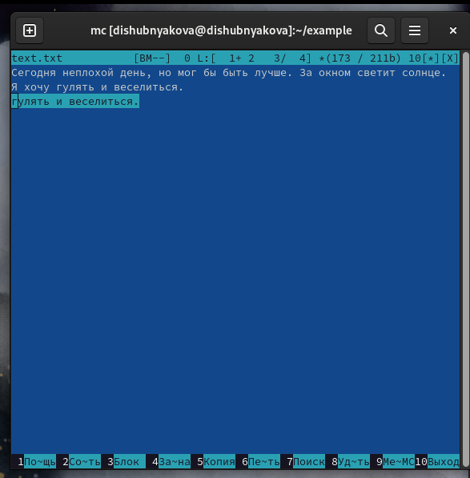
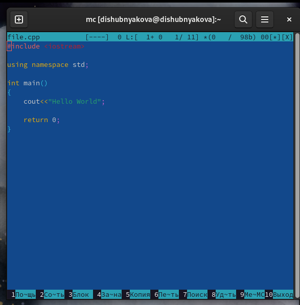
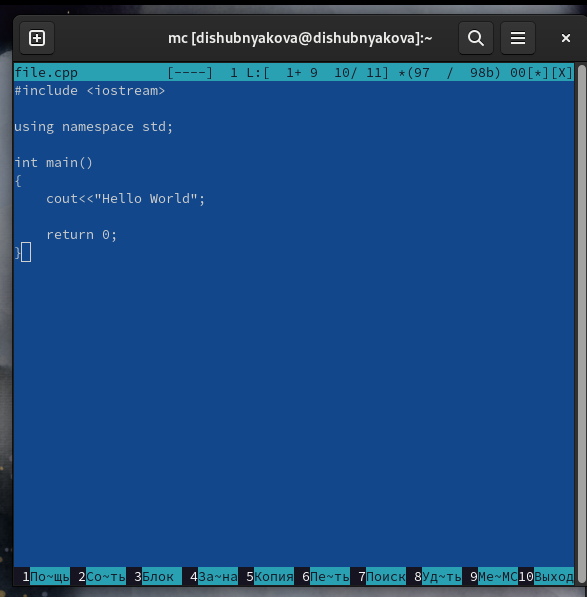

---
## Front matter
lang: ru-RU
title: Лабораторная работа №4
author: |
	Шубнякова Дарья, НКАбд-03-22

## Formatting
toc: false
slide_level: 2
theme: metropolis
header-includes: 
 - \metroset{progressbar=frametitle,sectionpage=progressbar,numbering=fraction}
 - '\makeatletter'
 - '\beamer@ignorenonframefalse'
 - '\makeatother'
aspectratio: 43
section-titles: true
---

## Содержание

1. Цель
2. Теоретическое введение
3. Основные задачи
4. Процесс выполнения
5. Вывод
6. Список литературы

## Цель

Освоение основных возможностей командной оболочки Midnight Commander. Приоб-
ретение навыков практической работы по просмотру каталогов и файлов; манипуляций с ними.

## Теоретическое введение

Командная оболочка — интерфейс взаимодействия пользователя с операционной системой и программным обеспечением посредством команд.
Midnight Commander (или mc) — псевдографическая командная оболочка для UNIX/Linux систем. Для запуска mc необходимо в командной строке набрать mc и нажать Enter. Рабочее пространство mc имеет две панели, отображающие по умолчанию списки файлов двух каталогов.

## Основные задачи

Изучите информацию о mc, вызвав в командной строке man mc.
Запустите из командной строки mc, изучите его структуру и меню.
Выполните несколько операций в mc, используя управляющие клавиши (операции
с панелями; выделение/отмена выделения файлов, копирование/перемещение файлов, получение информации о размере и правах доступа на файлы и/или каталоги и т.п.)

## Основные задачи

**Задание по встроенному редактору mc**
1. Создайте текстовой файл text.txt.
2. Откройте этот файл с помощью встроенного в mc редактора.
3. Вставьте в открытый файл небольшой фрагмент текста, скопированный из любого
другого файла или Интернета.
4. Проделайте с текстом следующие манипуляции, используя горячие клавиши:
        4.1. Удалите строку текста.
        4.2. Выделите фрагмент текста и скопируйте его на новую строку.
        4.3. Выделите фрагмент текста и перенесите его на новую строку.
        4.4. Сохраните файл.

## Основные задачи

        4.5. Отмените последнее действие.
        4.6. Перейдите в конец файла (нажав комбинацию клавиш) и напишите некоторый текст.
        4.7. Перейдите в начало файла (нажав комбинацию клавиш) и напишите некоторый текст.
        4.8. Сохраните и закройте файл.
5. Откройте файл с исходным текстом на некотором языке программирования (например C или Java)
6. Используя меню редактора, включите подсветку синтаксиса, если она не включена, или выключите, если она включена.

## Процесс выполнения

1. Знакомимся с интерфейсом mc.

{width=70%}

## Процесс выполнения

2. Открываем дерево каталогов на правой панели.

{width=70%}

## Процесс выполнения

3.  Открываем информацию на левой панели.

{width=70%}

## Процесс выполнения

4. Используя возможности подменю "Файл", просматриваю файл, созданный в предыдущей лабораторной работе.

{width=70%}

## Процесс выполнения

5. В подменю "Команда" осуществляем поиск в файловой системе с заданными условиями.

{width=70%}

## Процесс выполнения

6. Создаем файл text.txt и открываем его в mc.

{width=70%}

## Процесс выполнения

7. Выделяю и копирую на новую строку, отменяю и перемещаю (F5, F6)

{width=70%}

## Процесс выполнения

8. Открываю файл с кодом на С++.

{width=70%}

## Процесс выполнения

9. Выключаю подсветку синтаксиса с помощью Ctrl+s.

{width=70%}

## Вывод

Научились работать с mc и работать там с текстовыми файлами.

## Список литературы

1.
Dash P. Getting started with oracle vm virtualbox. Packt Publishing Ltd, 2013. 86 p.
2.
Colvin H. Virtualbox: An ultimate guide book on virtualization with virtualbox. CreateSpace Independent Publishing Platform, 2015. 70 p.
3.
van Vugt S. Red hat rhcsa/rhce 7 cert guide : Red hat enterprise linux 7 (ex200 and ex300). Pearson IT Certification, 2016. 1008 p.
4.
Робачевский А., Немнюгин С., Стесик О. Операционная система unix. 2-е изд. Санкт-Петербург: БХВ-Петербург, 2010. 656 p.
5.
Немет Э. et al. Unix и Linux: руководство системного администратора. 4-е изд. Вильямс, 2014. 1312 p.
6.
Колисниченко Д.Н. Самоучитель системного администратора Linux. СПб.: БХВ-Петербург, 2011. 544 p.
7.
Robbins A. Bash pocket reference. O’Reilly Media, 2016. 156 p.

## {.standout}

Спасибо за внимание!

