---
## Front matter
title: "Лабораторная работа №7"
subtitle: "НКАбд-03-22"
author: "Шубнякова Дарья"

## Generic otions
lang: ru-RU
toc-title: "Содержание"

## Bibliography
bibliography: bib/cite.bib
csl: pandoc/csl/gost-r-7-0-5-2008-numeric.csl

## Pdf output format
toc: true # Table of contents
toc-depth: 2
lof: true # List of figures
lot: true # List of tables
fontsize: 12pt
linestretch: 1.5
papersize: a4
documentclass: scrreprt
## I18n polyglossia
polyglossia-lang:
  name: russian
  options:
	- spelling=modern
	- babelshorthands=true
polyglossia-otherlangs:
  name: english
## I18n babel
babel-lang: russian
babel-otherlangs: english
## Fonts
mainfont: PT Serif
romanfont: PT Serif
sansfont: PT Sans
monofont: PT Mono
mainfontoptions: Ligatures=TeX
romanfontoptions: Ligatures=TeX
sansfontoptions: Ligatures=TeX,Scale=MatchLowercase
monofontoptions: Scale=MatchLowercase,Scale=0.9
## Biblatex
biblatex: true
biblio-style: "gost-numeric"
biblatexoptions:
  - parentracker=true
  - backend=biber
  - hyperref=auto
  - language=auto
  - autolang=other*
  - citestyle=gost-numeric
## Pandoc-crossref LaTeX customization
figureTitle: "Рис."
tableTitle: "Таблица"
listingTitle: "Листинг"
lofTitle: "Список иллюстраций"
lotTitle: "Список таблиц"
lolTitle: "Листинги"
## Misc options
indent: true
header-includes:
  - \usepackage{indentfirst}
  - \usepackage{float} # keep figures where there are in the text
  - \floatplacement{figure}{H} # keep figures where there are in the text
---

# Цель работы

Освоение основных возможностей командной оболочки Midnight Commander. Приоб-
ретение навыков практической работы по просмотру каталогов и файлов; манипуляций
с ними.

# Задание

**Задание по mc**
1. Изучите информацию о mc, вызвав в командной строке man mc.
2. Запустите из командной строки mc, изучите его структуру и меню.
3. Выполните несколько операций в mc, используя управляющие клавиши (операции
с панелями; выделение/отмена выделения файлов, копирование/перемещение фай-
лов, получение информации о размере и правах доступа на файлы и/или каталоги
и т.п.)
4. Выполните основные команды меню левой (или правой) панели. Оцените степень
подробности вывода информации о файлах.
5. Используя возможности подменю Файл , выполните:
– просмотр содержимого текстового файла;
– редактирование содержимого текстового файла (без сохранения результатов
редактирования);
– создание каталога;
– копирование в файлов в созданный каталог.
6. С помощью соответствующих средств подменю Команда осуществите:
– поиск в файловой системе файла с заданными условиями (например, файла
с расширением .c или .cpp, содержащего строку main);
– выбор и повторение одной из предыдущих команд;
– переход в домашний каталог;
– анализ файла меню и файла расширений.
7. Вызовите подменю Настройки. Освойте операции, определяющие структуру экрана mc (Full screen, Double Width, Show Hidden Files и т.д.).
**Задание по встроенному редактору mc**
1. Создайте текстовой файл text.txt.
2. Откройте этот файл с помощью встроенного в mc редактора.
3. Вставьте в открытый файл небольшой фрагмент текста, скопированный из любого
другого файла или Интернета.
4. Проделайте с текстом следующие манипуляции, используя горячие клавиши:
        4.1. Удалите строку текста.
        4.2. Выделите фрагмент текста и скопируйте его на новую строку.
        4.3. Выделите фрагмент текста и перенесите его на новую строку.
        4.4. Сохраните файл.
        4.5. Отмените последнее действие.
        4.6. Перейдите в конец файла (нажав комбинацию клавиш) и напишите некоторый текст.
        4.7. Перейдите в начало файла (нажав комбинацию клавиш) и напишите некоторый текст.
        4.8. Сохраните и закройте файл.
5. Откройте файл с исходным текстом на некотором языке программирования (напри-
мер C или Java)
6. Используя меню редактора, включите подсветку синтаксиса, если она не включена,
или выключите, если она включена.

# Теоретическое введение

Командная оболочка — интерфейс взаимодействия пользователя с операционной систе-
мой и программным обеспечением посредством команд.
Midnight Commander (или mc) — псевдографическая командная оболочка для UNIX/Linux
систем. Для запуска mc необходимо в командной строке набрать mc и нажать Enter .
Рабочее пространство mc имеет две панели, отображающие по умолчанию списки
файлов двух каталогов.

# Выполнение лабораторной работы

По команде получаем справку о mc.

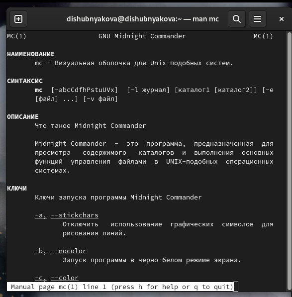{width=70%}

Знакомимся с интерфейсом mc.

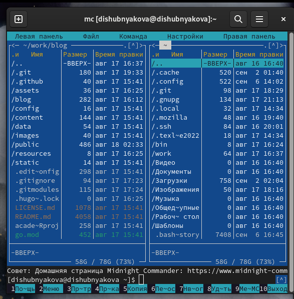{width=70%}

Получаем информацию о правах доступа одного файла.

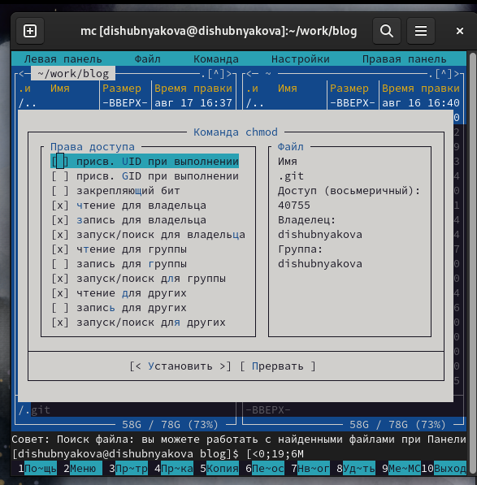{width=70%}

Открываем дерево каталогов на правой панели.

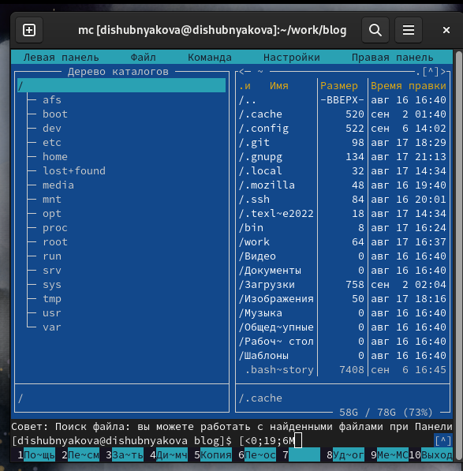{width=70%}

Открываем информацию на левой панели.

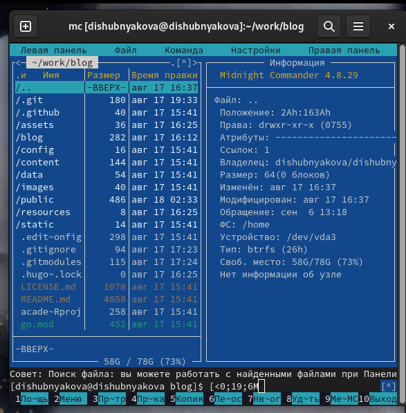{width=70%}

Используя возможности подменю "Файл", просматриваю файл, созданный в предыдущей лабораторной работе.

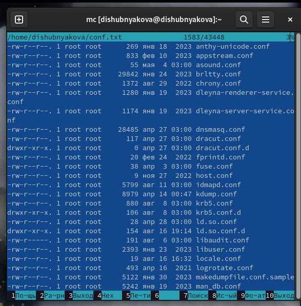{width=70%}

Редактирование содержимого текстового файла.

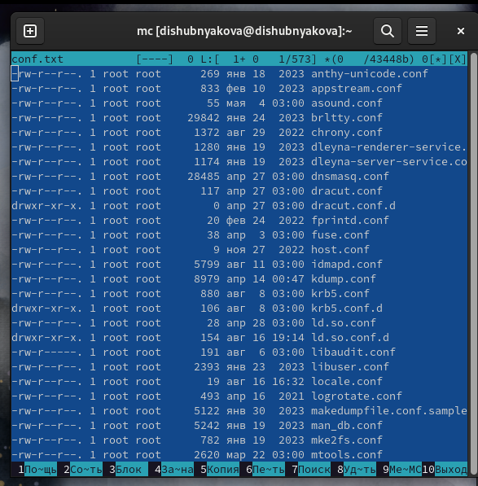{width=70%}

Создаем каталог example.

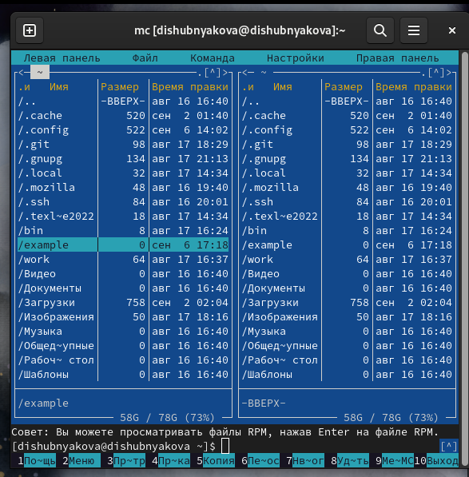{width=70%}

Копируем файл предыдущей лабораторной работы conf.txt в созданный каталог.

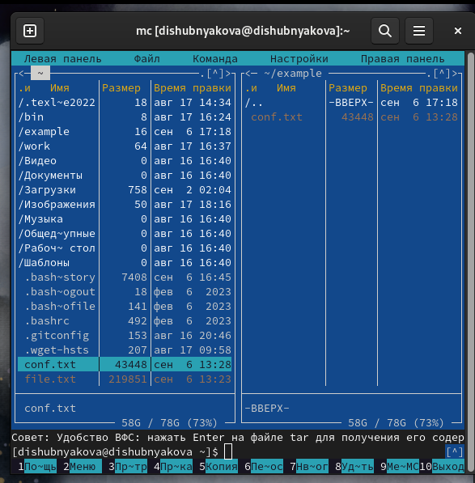{width=70%}

В подменю "Команда" осуществляем поиск в файловой системе с заданными условиями.

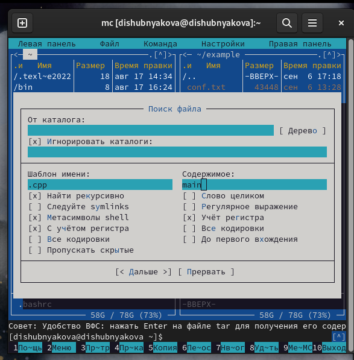{width=70%}

История -- выбор одной из предыдущих команд.

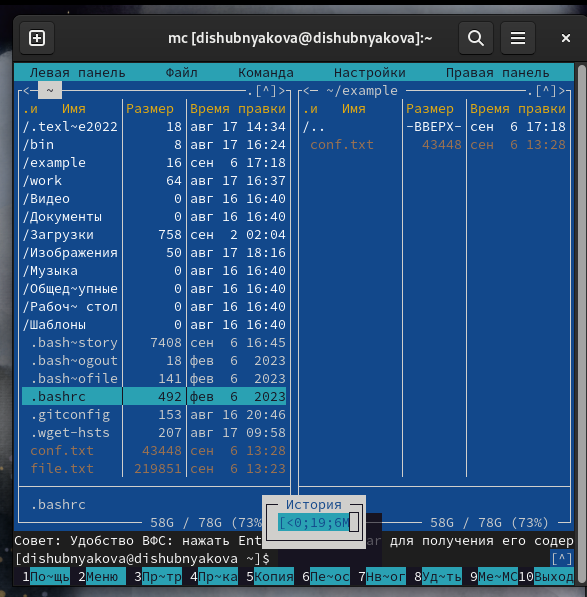{width=70%}

Создание каталога быстрого доступа с адресом в домашней папке для быстрого перехода в будущем.

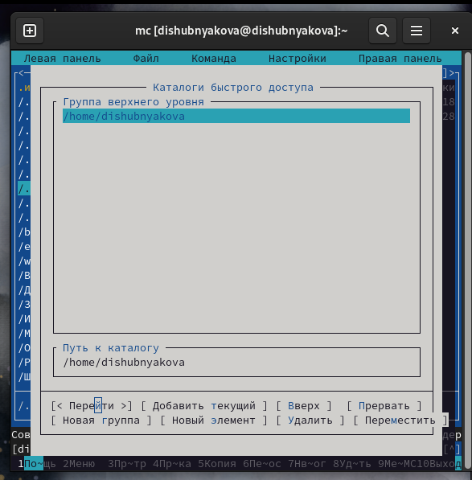{width=70%}

Изучение файла меню и файла расширений.

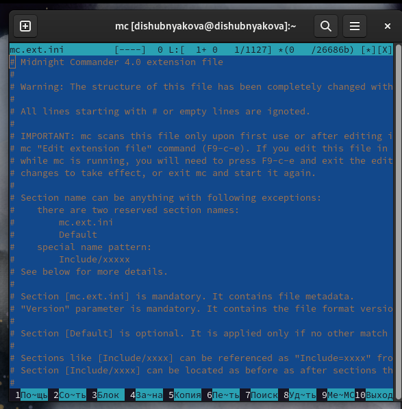{width=70%}

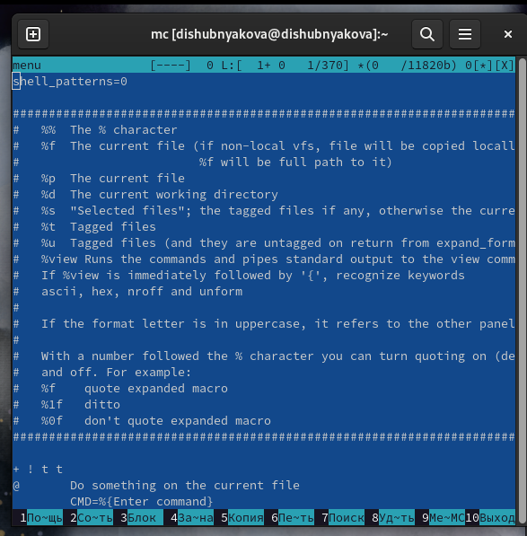{width=70%}

Создаем файл text.txt и открываем его в mc.

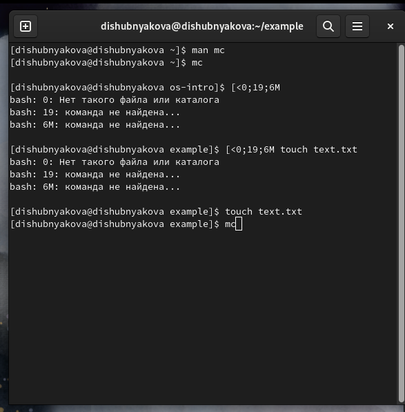{width=70%}

Пишу текст самостоятельно, т.к. мне так и не удалось подобрать на Mac клавишу аналогичную Ins на клавиатурах Windows. 

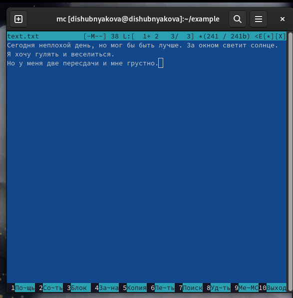{width=70%}

Удаляю строку с помощью Ctrl+y.

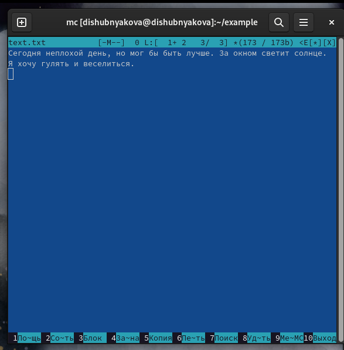{width=70%}

Выделяю и копирую на новую строку, отменяю и перемещаю (F5, F6)

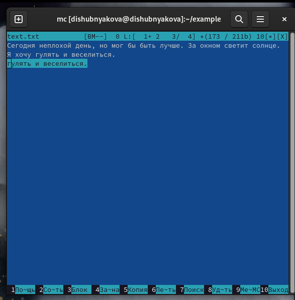{width=70%}

Сохраняю файл, отменяю действие с помощью Ctrl+u. В связи с отсутствием клавиш Home и End не получилось переместиться в начало и в конец файла, т.к. я так и не подобрала нужных клавиш, а в Интернете найти информацию не удалось. Сохраняю снова и закрываю файл.

Открываю файл с кодом на С++.

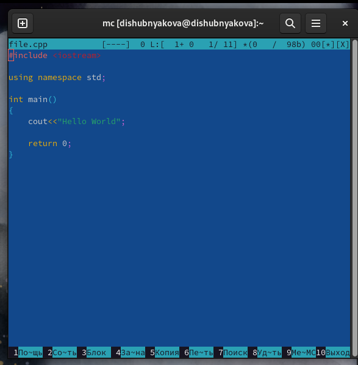{width=70%}

Выключаю подсветку синтаксиса с помощью Ctrl+s.

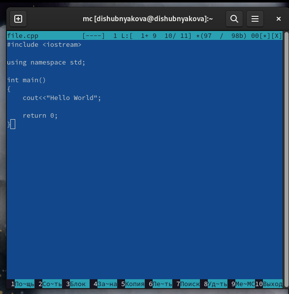{width=70%}

# Выводы

Научились работать с mc.
1. Панели могут дополнительно быть переведены в один из двух режимов: Информация или Дерево. В режиме Информация на панель выводятся сведения о файле и текущей файловой системе, расположенных на активной панели. В режиме Дерево (рис. 7.3) на одной из панелей выводится структура дерева каталогов.
2. В разделе Командная строка оболочки (Shell) перечисляются команды и комбинации клавиш, которые используются для ввода и редактирования команд в командной строке оболочки. Большая часть этих команд служит для переноса имен файлов и/или имен каталогов в командную строку (чтобы уменьшить трудоемкость ввода) или для доступа к истории команд. Клавиши редактирования строк ввода используются как при редактировании командной строки, так и других строк ввода, появляющихся в различных запросах программы.
3. В меню каждой (левой или правой) панели можно выбрать Формат списка :

- стандартный — выводит список файлов и каталогов с указанием размера и времени правки;
- ускоренный — позволяет задать число столбцов, на которые разбивается панель при выводе списка имён файлов или каталогов без дополнительной информации;
- расширенный — помимо названия файла или каталога выводит сведения о правах доступа, владельце, группе, размере, времени правки.

4. В меню Файл содержится перечень команд, которые могут быть применены к одному или нескольким файлам или каталогам.

Команды меню Файл :

- Просмотр ( F3 ) — позволяет посмотреть содержимое текущего (или выделенного) файла без возможности редактирования.
- Просмотр вывода команды ( М + ! ) — функция запроса команды с параметрами (аргумент к текущему выбранному файлу).
- Правка ( F4 ) — открывает текущий (или выделенный) файл для его редактирования.
- Копирование ( F5 ) — осуществляет копирование одного или нескольких файлов или каталогов в указанное пользователем во всплывающем окне место.
- Права доступа ( Ctrl-x c ) — позволяет указать (изменить) права доступа к одному или нескольким файлам или каталогам .
- Жёсткая ссылка ( Ctrl-x l ) — позволяет создать жёсткую ссылку к текущему (или выделенному) файлу.
- Символическая ссылка ( Ctrl-x s ) — позволяет создать символическую ссылку к текущему (или выделенному) файлу.
- Владелец/группа ( Ctrl-x o ) — позволяет задать (изменить) владельца и имя группы для одного или нескольких файлов или каталогов.
- Права (расширенные) — позволяет изменить права доступа и владения для одного или нескольких файлов или каталогов.
- Переименование ( F6 ) — позволяет переименовать (или переместить) один или несколько файлов или каталогов.
- Создание каталога ( F7 ) — позволяет создать каталог.
- Удалить ( F8 ) — позволяет удалить один или несколько файлов или каталогов.
- Выход ( F10 ) — завершает работу mc.
5. В меню Команда содержатся более общие команды для работы с mc. Команды меню Команда :

- Дерево каталогов — отображает структуру каталогов системы.
- Поиск файла — выполняет поиск файлов по заданным параметрам.
- Переставить панели — меняет местами левую и правую панели.
- Сравнить каталоги ( Ctrl-x d ) — сравнивает содержимое двух каталогов.
- Размеры каталогов — отображает размер и время изменения каталога (по умолчанию в mc размер каталога корректно не отображается).
- История командной строки — выводит на экран список ранее выполненных в оболочке команд.
- Каталоги быстрого доступа ( Ctrl-\ ) — пр вызове выполняется быстрая смена текущего каталога на один из заданного списка.
- Восстановление файлов — позволяет восстановить файлы на файловых системах ext2 и ext3.
- Редактировать файл расширений — позволяет задать с помощью определённого синтаксиса действия при запуске файлов с определённым расширением (например, какое программного обеспечение запускать для открытия или редактирования файлов с расширением doc или docx).
- Редактировать файл меню — позволяет отредактировать контекстное меню пользователя, вызываемое по клавише F2 .
- Редактировать файл расцветки имён — позволяет подобрать оптимальную для пользователя расцветку имён файлов в зависимости от их типа.
6. Меню Настройки содержит ряд дополнительных опций по внешнему виду и функциональности mc. Меню Настройки содержит: 
- Конфигурация — позволяет скорректировать настройки работы с панелями. 
- Внешний вид и Настройки панелей — определяет элементы (строка меню, командная строка, подсказки и прочее), отображаемые при вызове mc, а также геометрию расположения панелей и цветовыделение. 
- Биты символов — задаёт формат обработки информации локальным терминалом. 
- Подтверждение — позволяет установить или убрать вывод окна с запросом подтверждения действий при операциях удаления и перезаписи файлов, а также при выходе из программы. 
- Распознание клавиш — диалоговое окно используется для тестирования функциональных клавиш, клавиш управления курсором и прочее. 
- Виртуальные ФС –– настройки виртуальной файловой системы: тайм-аут, пароль и прочее.
7. F1 Вызов контекстно-зависимой подсказки; F2 Вызов пользовательского меню с возможностью создания и/или дополнения дополнительных функций; F3 Просмотр содержимого файла, на который указывает подсветка в активной панели (без возможности редактирования); F4 Вызов встроенного в mc редактора для изменения содержания файла, на который указывает подсветка в активной панели; F5 Копирование одного или нескольких файлов, отмеченных в первой (активной) панели, в каталог, отображаемый на второй панели; F6 Перенос одного или нескольких файлов, отмеченных в первой (активной) панели, в каталог, отображаемый на второй панели; F7 Создание подкаталога в каталоге, отображаемом в активной панели; F8 Удаление одного или нескольких файлов (каталогов), отмеченных в первой (активной) панели файлов; F9 Вызов меню mc; F10 Выход из mc.
8. Ctrl-y удалить строку; Ctrl-u отмена последней операции; Ins вставка/замена; F7 поиск (можно использовать регулярные выражения); -F7 повтор последней операции поиска; F4 замена; F3 первое нажатие — начало выделения, второе — окончание выделения; F5 копировать выделенный фрагмент; F6 переместить выделенный фрагмент; F8 удалить выделенный фрагмент; F2 записать изменения в файл; F10 выйти из редактора.
9. Можно сохранить часто используемые команды панелизации под отдельными информативными именами, чтобы иметь возможность их быстро вызвать по этим именам. Для этого нужно набрать команду в строке ввода (строка "Команда") и нажать кнопку Добавить. После этого потребуется ввести имя, по которому мы будем вызывать команду. В следующий раз вам достаточно будет выбрать нужное имя из списка, а не вводить всю команду заново.
10. Панель в mc отображает список файлов текущего каталога. Абсолютный путь к этому каталогу отображается в заголовке панели. У активной панели заголовок и одна из её строк подсвечиваются. Управление панелями осуществляется с помощью определённых комбинаций клавиш или пунктов меню mc.

# Список литературы{.unnumbered}

1.
Dash P. Getting started with oracle vm virtualbox. Packt Publishing Ltd, 2013. 86 p.
2.
Colvin H. Virtualbox: An ultimate guide book on virtualization with virtualbox. CreateSpace Independent Publishing Platform, 2015. 70 p.
3.
van Vugt S. Red hat rhcsa/rhce 7 cert guide : Red hat enterprise linux 7 (ex200 and ex300). Pearson IT Certification, 2016. 1008 p.
4.
Робачевский А., Немнюгин С., Стесик О. Операционная система unix. 2-е изд. Санкт-Петербург: БХВ-Петербург, 2010. 656 p.
5.
Немет Э. et al. Unix и Linux: руководство системного администратора. 4-е изд. Вильямс, 2014. 1312 p.
6.
Колисниченко Д.Н. Самоучитель системного администратора Linux. СПб.: БХВ-Петербург, 2011. 544 p.
7.
Robbins A. Bash pocket reference. O’Reilly Media, 2016. 156 p.

::: {#refs}
:::
