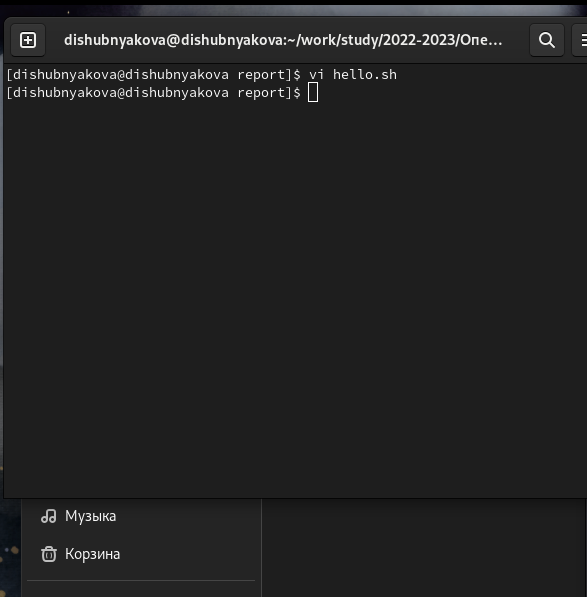
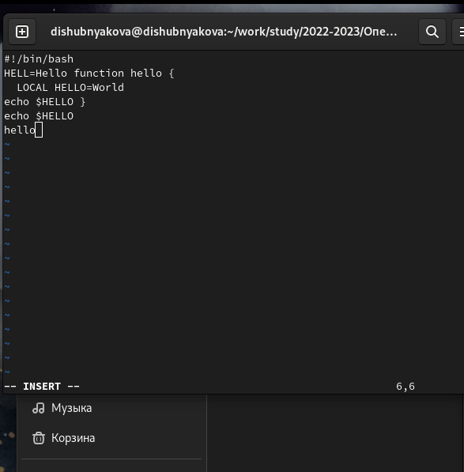
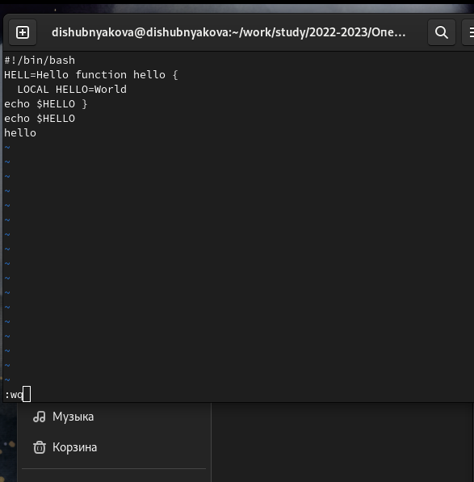
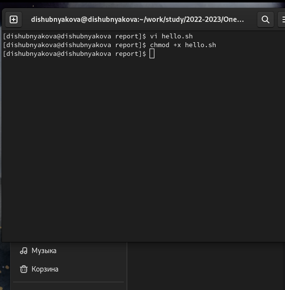
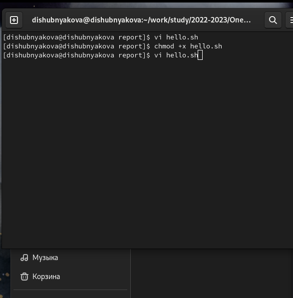
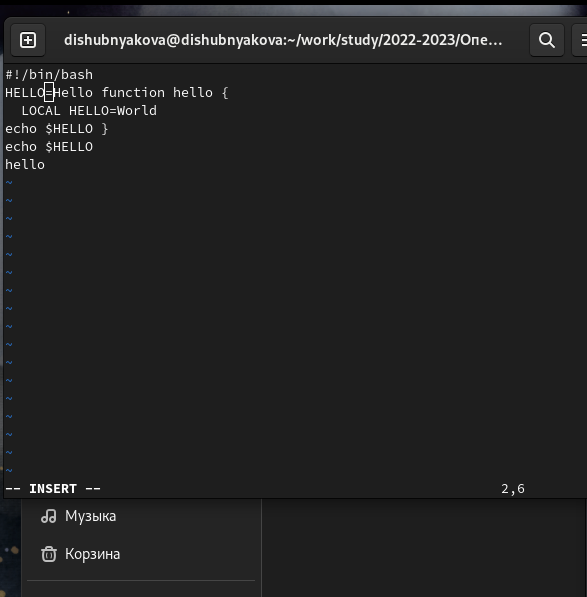
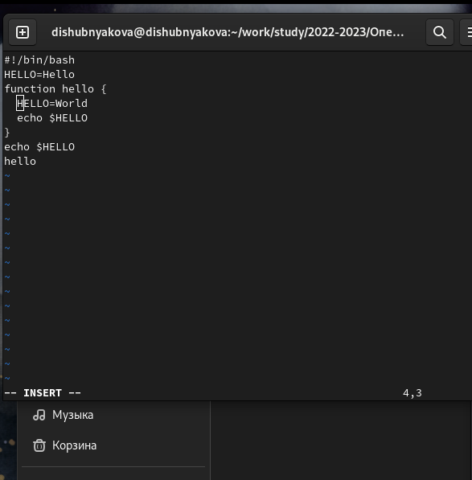
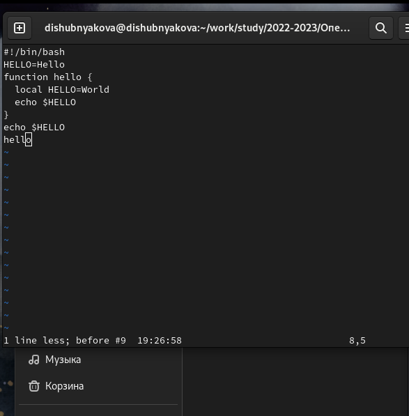
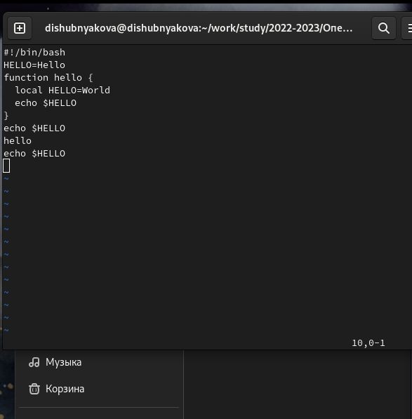
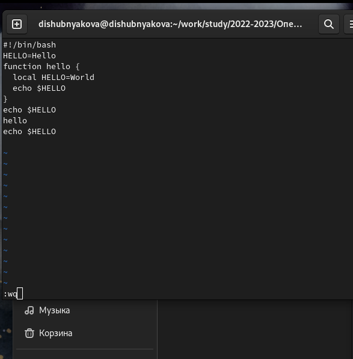

---
## Front matter
lang: ru-RU
title: Лабораторная работа №8
author: |
	Шубнякова Дарья, НКАбд-03-22

## Formatting
toc: false
slide_level: 2
theme: metropolis
header-includes: 
 - \metroset{progressbar=frametitle,sectionpage=progressbar,numbering=fraction}
 - '\makeatletter'
 - '\beamer@ignorenonframefalse'
 - '\makeatother'
aspectratio: 43
section-titles: true
---

## Содержание

1. Цель
2. Теоретическое введение
3. Основные задачи
4. Процесс выполнения
5. Вывод
6. Список литературы

## Цель

Познакомиться с операционной системой Linux. Получить практические навыки работы с редактором vi, установленным по умолчанию практически во всех дистрибутивах.

## Теоретическое введение

В большинстве дистрибутивов Linux в качестве текстового редактора по умолчанию устанавливается интерактивный экранный редактор vi (Visual display editor).
Редактор vi имеет три режима работы:
– командный режим — предназначен для ввода команд редактирования и навигации по редактируемому файлу;
– режим вставки — предназначен для ввода содержания редактируемого файла;
– режим последней (или командной) строки — используется для записи изменений в файл и выхода из редактора.
Для вызова редактора vi необходимо указать команду vi и имя редактируемого файла: vi <имя_файла>
При этом в случае отсутствия файла с указанным именем будет создан такой файл.

## Основные задачи

**Задание 1**
1. Создайте каталог с именем ~/work/os/lab06.
2. Перейдите во вновь созданный каталог.
3. Вызовите vi и создайте файл hello.sh
4. Нажмите клавишу i и введите текст.
5. Нажмите клавишу Esc для перехода в командный режим после завершения ввода
текста.
6. Нажмите : для перехода в режим последней строки и внизу вашего экрана появится приглашение в виде двоеточия.

## Основные задачи

7. Нажмите w (записать) и q (выйти), а затем нажмите клавишу Enter для сохранения вашего текста и завершения работы.
8. Сделайте файл исполняемым.
**Задание 2**
1. Вызовите vi на редактирование файла.
2. Установите курсор в конец слова HELL второй строки.
3. Перейдите в режим вставки и замените на HELLO. Нажмите Esc для возврата в командный режим.
4. Установите курсор на четвертую строку и сотрите слово LOCAL.

## Основные задачи

5. Перейдите в режим вставки и наберите следующий текст: local, нажмите Esc для возврата в командный режим.
6. Установите курсор на последней строке файла. Вставьте после неё строку, содержащую следующий текст: echo $HELLO.
7. Нажмите Esc для перехода в командный режим.
8. Удалите последнюю строку.
9. Введите команду отмены изменений u для отмены последней команды.
10. Введите символ : для перехода в режим последней строки. Запишите произведённые изменения и выйдите из vi.

## Процесс выполнения

1. Вызываем vi и создаем файл hello.sh. Для того, чтобы результат проделанной работы можно было увидеть создаю это в каталоге, который подключен к репозиторию и где будет находится данный отчет.

{width=70%}

## Процесс выполнения

2. Нажимаем кнопку i, чтобы вставить необходимый текст и переходим в командный режим с помощью кнопки Esc.

{width=70%}

## Процесс выполнения

3.  В командном режиме вводим команду :wq и сохраняем созданный файл.

{width=70%}

## Процесс выполнения

4. В терминале делаем созданный файл исполняемым.

{width=70%}

## Процесс выполнения

5. Открываем созданный файл в редакторе vi.

{width=70%}

## Процесс выполнения

6. Устанавливаем курсор в конце слова HELL и меняем его на HELLO.

{width=70%}

## Процесс выполнения

7. Стираем слово LOCAL.

{width=70%}

## Процесс выполнения

8. Меняем его на local.

{width=70%}

## Процесс выполнения

9. Вставляем в конец нужную строку.

{width=70%}

## Процесс выполнения

10. Переходим в командный режим и удаляем ее.

{width=70%}

## Процесс выполнения

11. Вводим команду :u, чтобы отменить последнее действие удаления строки.

{width=70%}

## Процесс выполнения

12. Снова сохраняем файл и выходим командой :wq.

{width=70%}

## Вывод

Научились работать с текстовым редактором vi.

Ввод данных с помощью режима вставки -> Редактирование файла с помощью командного режима -> Сохранение файла с помощью последней строки.

## Список литературы

1.
Dash P. Getting started with oracle vm virtualbox. Packt Publishing Ltd, 2013. 86 p.
2.
Colvin H. Virtualbox: An ultimate guide book on virtualization with virtualbox. CreateSpace Independent Publishing Platform, 2015. 70 p.
3.
van Vugt S. Red hat rhcsa/rhce 7 cert guide : Red hat enterprise linux 7 (ex200 and ex300). Pearson IT Certification, 2016. 1008 p.
4.
Робачевский А., Немнюгин С., Стесик О. Операционная система unix. 2-е изд. Санкт-Петербург: БХВ-Петербург, 2010. 656 p.
5.
Немет Э. et al. Unix и Linux: руководство системного администратора. 4-е изд. Вильямс, 2014. 1312 p.
6.
Колисниченко Д.Н. Самоучитель системного администратора Linux. СПб.: БХВ-Петербург, 2011. 544 p.
7.
Robbins A. Bash pocket reference. O’Reilly Media, 2016. 156 p.

## {.standout}

Спасибо за внимание!

