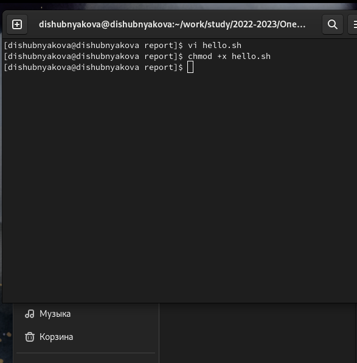
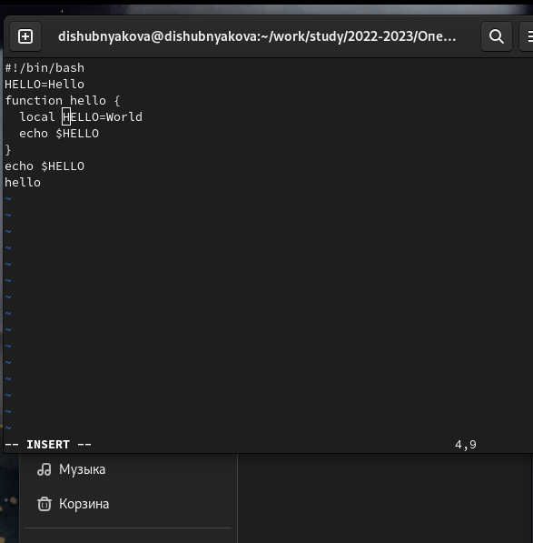

---
## Front matter
title: "Лабораторная работа №8"
subtitle: "НКАбд-03-22"
author: "Шубнякова Дарья"

## Generic otions
lang: ru-RU
toc-title: "Содержание"

## Bibliography
bibliography: bib/cite.bib
csl: pandoc/csl/gost-r-7-0-5-2008-numeric.csl

## Pdf output format
toc: true # Table of contents
toc-depth: 2
lof: true # List of figures
lot: true # List of tables
fontsize: 12pt
linestretch: 1.5
papersize: a4
documentclass: scrreprt
## I18n polyglossia
polyglossia-lang:
  name: russian
  options:
	- spelling=modern
	- babelshorthands=true
polyglossia-otherlangs:
  name: english
## I18n babel
babel-lang: russian
babel-otherlangs: english
## Fonts
mainfont: PT Serif
romanfont: PT Serif
sansfont: PT Sans
monofont: PT Mono
mainfontoptions: Ligatures=TeX
romanfontoptions: Ligatures=TeX
sansfontoptions: Ligatures=TeX,Scale=MatchLowercase
monofontoptions: Scale=MatchLowercase,Scale=0.9
## Biblatex
biblatex: true
biblio-style: "gost-numeric"
biblatexoptions:
  - parentracker=true
  - backend=biber
  - hyperref=auto
  - language=auto
  - autolang=other*
  - citestyle=gost-numeric
## Pandoc-crossref LaTeX customization
figureTitle: "Рис."
tableTitle: "Таблица"
listingTitle: "Листинг"
lofTitle: "Список иллюстраций"
lotTitle: "Список таблиц"
lolTitle: "Листинги"
## Misc options
indent: true
header-includes:
  - \usepackage{indentfirst}
  - \usepackage{float} # keep figures where there are in the text
  - \floatplacement{figure}{H} # keep figures where there are in the text
---

# Цель работы

Познакомиться с операционной системой Linux. Получить практические навыки работы с редактором vi, установленным по умолчанию практически во всех дистрибутивах.

# Задание

**Задание 1**
1. Создайте каталог с именем ~/work/os/lab06.
2. Перейдите во вновь созданный каталог.
3. Вызовите vi и создайте файл hello.sh
4. Нажмите клавишу i и введите текст.
5. Нажмите клавишу Esc для перехода в командный режим после завершения ввода
текста.
6. Нажмите : для перехода в режим последней строки и внизу вашего экрана появится
приглашение в виде двоеточия.
7. Нажмите w (записать) и q (выйти), а затем нажмите клавишу Enter для сохранения
вашего текста и завершения работы.
8. Сделайте файл исполняемым.
**Задание 2**
1. Вызовите vi на редактирование файла.
2. Установите курсор в конец слова HELL второй строки.
3. Перейдите в режим вставки и замените на HELLO. Нажмите Esc для возврата в команд-
ный режим.
4. Установите курсор на четвертую строку и сотрите слово LOCAL.
5. Перейдите в режим вставки и наберите следующий текст: local, нажмите Esc для
возврата в командный режим.
6. Установите курсор на последней строке файла. Вставьте после неё строку, содержащую следующий текст: echo $HELLO.
7. Нажмите Esc для перехода в командный режим.
8. Удалите последнюю строку.
9. Введите команду отмены изменений u для отмены последней команды.
10. Введите символ : для перехода в режим последней строки. Запишите произведённые изменения и выйдите из vi.

# Теоретическое введение

В большинстве дистрибутивов Linux в качестве текстового редактора по умолчанию
устанавливается интерактивный экранный редактор vi (Visual display editor).
Редактор vi имеет три режима работы:
– командный режим — предназначен для ввода команд редактирования и навигации по
редактируемому файлу;
– режим вставки — предназначен для ввода содержания редактируемого файла;
– режим последней (или командной) строки — используется для записи изменений в файл
и выхода из редактора.
Для вызова редактора vi необходимо указать команду vi и имя редактируемого файла:
vi <имя_файла>
При этом в случае отсутствия файла с указанным именем будет создан такой файл.
Переход в командный режим осуществляется нажатием клавиши Esc . Для выхода из
редактора vi необходимо перейти в режим последней строки: находясь в командном
режиме, нажать Shift-; (по сути символ : — двоеточие), затем:
– набрать символы wq, если перед выходом из редактора требуется записать изменения
в файл;
– набрать символ q (или q!), если требуется выйти из редактора без сохранения.

# Выполнение лабораторной работы

Вызываем vi и создаем файл hello.sh. Для того, чтобы результат проделанной работы можно было увидеть создаю это в каталоге, который подключен к репозиторию и где будет находится данный отчет.

{width=70%}

Нажимаем кнопку i, чтобы вставить необходимый текст и переходим в командный режим с помощью кнопки Esc.

{width=70%}

В командном режиме вводим команду :wq и сохраняем созданный файл.

{width=70%}

В терминале делаем созданный файл исполняемым.

{width=70%}

Открываем созданный файл в редакторе vi.

{width=70%}

Устанавливаем курсор в конце слова HELL и меняем его на HELLO.

{width=70%}

Стираем слово LOCAL.

{width=70%}

Меняем его на local.

{width=70%}

Вставляем в конец нужную строку.

{width=70%}

Переходим в командный режим и удаляем ее.

{width=70%}

Вводим команду :u, чтобы отменить последнее действие удаления строки.

{width=70%}

Снова сохраняем файл и выходим командой :wq.

{width=70%}

# Выводы

Научились работать с текстовым редактором vi.
1. 
- командный режим — предназначен для ввода команд редактирования и навигации по редактируемому файлу;
- режим вставки — предназначен для ввода содержания редактируемого файла;
- режим последней (или командной) строки — используется для записи изменений в файл и выхода из редактора.
2. Можно нажимать символ q (или q!), если требуется выйти из редактора без сохранения.
3. 
- 0 (ноль) — переход в начало строки;
- $ — переход в конец строки;
- G — переход в конец файла;
- n G — переход на строку с номером n.
4. Редактор vi предполагает, что слово - это строка символов, которая может включать в себя буквы, цифры и символы подчеркивания.
5. С помощью G.
6. 
- Вставка текста – а — вставить текст после курсора; – А — вставить текст в конец строки; – i — вставить текст перед курсором; – n i — вставить текст n раз; – I — вставить текст в начало строки.
- Вставка строки – о — вставить строку под курсором; – О — вставить строку над курсором.
- Удаление текста – x — удалить один символ в буфер; – d w — удалить одно слово в буфер; – d $ — удалить в буфер текст от курсора до конца строки; – d 0 — удалить в буфер текст от начала строки до позиции курсора; – d d — удалить в буфер одну строку; – n d d — удалить в буфер n строк.
- Отмена и повтор произведённых изменений – u — отменить последнее изменение; – . — повторить последнее изменение.
- Копирование текста в буфер – Y — скопировать строку в буфер; – n Y — скопировать n строк в буфер; – y w — скопировать слово в буфер.
- Вставка текста из буфера – p — вставить текст из буфера после курсора; – P — вставить текст из буфера перед курсором.
- Замена текста – c w — заменить слово; – n c w — заменить n слов; – c $ — заменить текст от курсора до конца строки; – r — заменить слово; – R — заменить текст.
- Поиск текста – / текст — произвести поиск вперёд по тексту указанной строки символов текст; – ? текст — произвести поиск назад по тексту указанной строки символов текст.
7. Перейти в режим вставки, команда ni -- вставить символ n раз.
8. С помощью u — отменить последнее изменение.
9. Режим последней строки — используется для записи изменений в файл и выхода из редактора.
10. $ — переход в конец строки.
11. Опции редактора vi позволяют настроить рабочую среду. Для задания опций используется команда set (в режиме последней строки): – : set all — вывести полный список опций; – : set nu — вывести номера строк; – : set list — вывести невидимые символы; – : set ic — не учитывать при поиске, является ли символ прописным или строчным.
12. В редакторе vi есть два основных режима: командный режим и режим вставки. По умолчанию работа начинается в командном режиме. В режиме вставки клавиатура используется для набора текста. Для выхода в командный режим используется клавиша Esc или комбинация Ctrl + c.
13. Ввод данных с помощью режима вставки -> Редактирование файла с помощью командного режима -> Сохранение файла с помощью последней строки.

# Список литературы{.unnumbered}

1.
Dash P. Getting started with oracle vm virtualbox. Packt Publishing Ltd, 2013. 86 p.
2.
Colvin H. Virtualbox: An ultimate guide book on virtualization with virtualbox. CreateSpace Independent Publishing Platform, 2015. 70 p.
3.
van Vugt S. Red hat rhcsa/rhce 7 cert guide : Red hat enterprise linux 7 (ex200 and ex300). Pearson IT Certification, 2016. 1008 p.
4.
Робачевский А., Немнюгин С., Стесик О. Операционная система unix. 2-е изд. Санкт-Петербург: БХВ-Петербург, 2010. 656 p.
5.
Немет Э. et al. Unix и Linux: руководство системного администратора. 4-е изд. Вильямс, 2014. 1312 p.
6.
Колисниченко Д.Н. Самоучитель системного администратора Linux. СПб.: БХВ-Петербург, 2011. 544 p.
7.
Robbins A. Bash pocket reference. O’Reilly Media, 2016. 156 p.

::: {#refs}
:::
