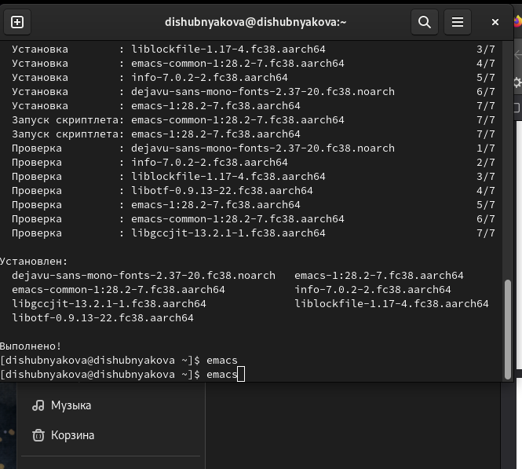
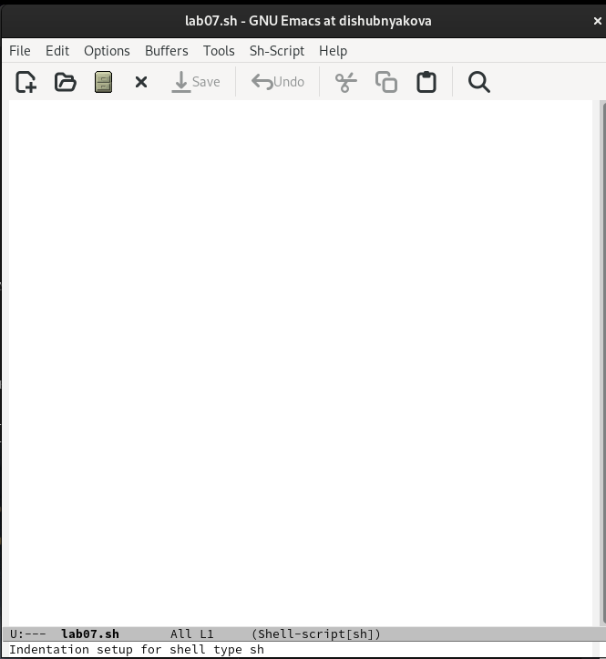
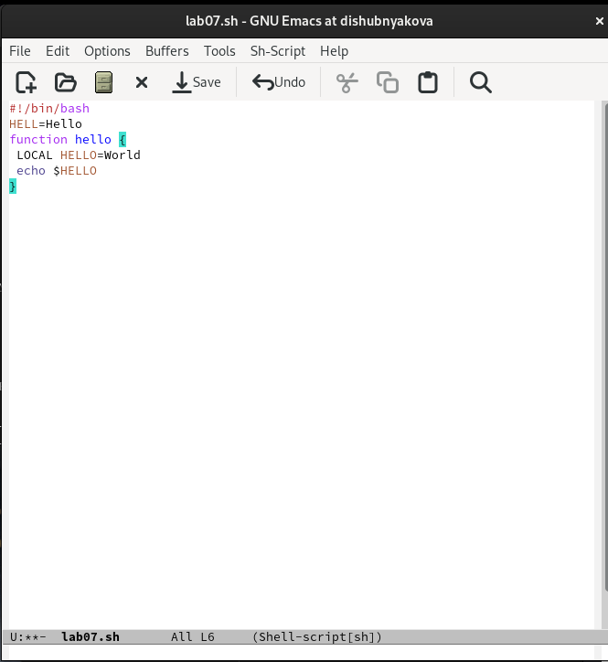
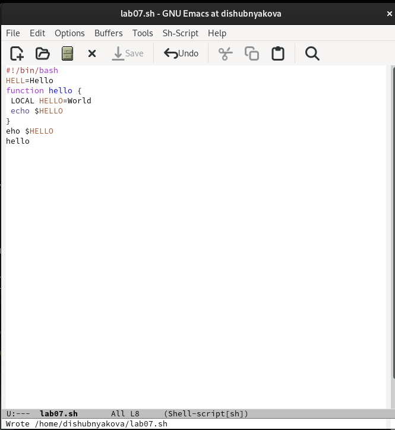
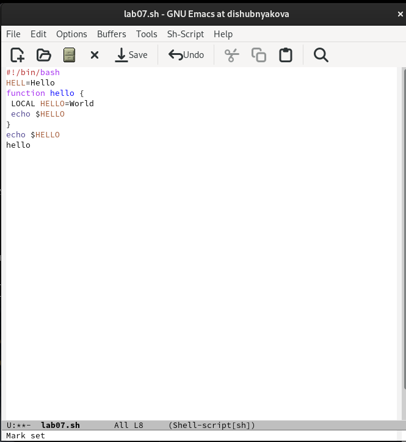
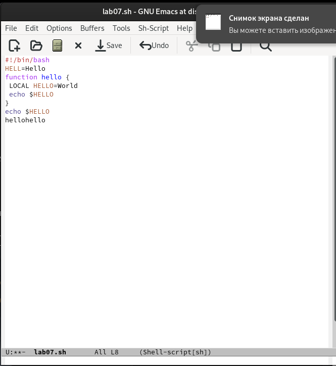
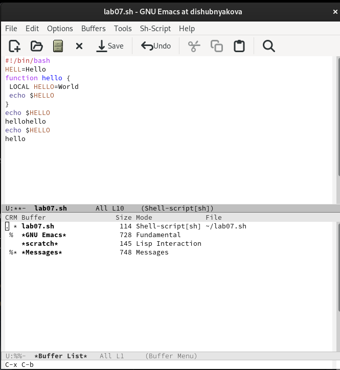
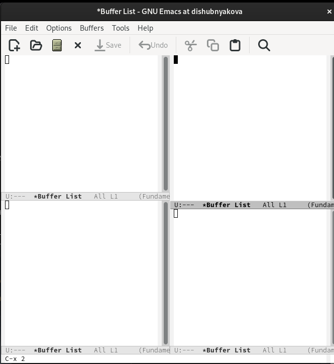
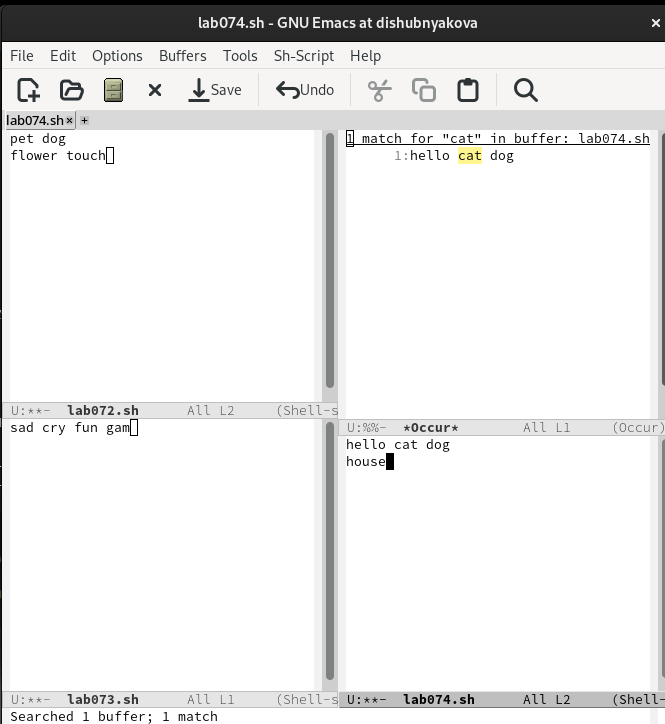

---
## Front matter
lang: ru-RU
title: Лабораторная работа №9
author: |
	Шубнякова Дарья, НКАбд-03-22

## Formatting
toc: false
slide_level: 2
theme: metropolis
header-includes: 
 - \metroset{progressbar=frametitle,sectionpage=progressbar,numbering=fraction}
 - '\makeatletter'
 - '\beamer@ignorenonframefalse'
 - '\makeatother'
aspectratio: 43
section-titles: true
---

## Содержание

1. Цель
2. Теоретическое введение
3. Основные задачи
4. Процесс выполнения
5. Вывод
6. Список литературы

## Цель

Познакомиться с операционной системой Linux. Получить практические навыки работы с редактором Emacs.

## Теоретическое введение

Emacs представляет собой мощный экранный редактор текста, написанный на языке
высокого уровня Elisp.
**Основные термины Emacs**
*Определение 1.* Буфер — объект, представляющий какой-либо текст.
Буфер может содержать что угодно, например, результаты компиляции программы
или встроенные подсказки. Практически всё взаимодействие с пользователем, в том числе интерактивное, происходит посредством буферов.
*Определение 2.* Фрейм соответствует окну в обычном понимании этого слова. Каждый фрейм содержит область вывода и одно или несколько окон Emacs.

## Основные задачи

1. Открыть emacs.
2. Создать файл lab07.sh с помощью комбинации Ctrl-x Ctrl-f (C-x C-f).
3. Наберите текст.
4. Сохранить файл с помощью комбинации Ctrl-x Ctrl-s (C-x C-s).
5. Проделать с текстом стандартные процедуры редактирования, каждое действие должно осуществляться комбинацией клавиш.

## Основные задачи

6. Научитесь использовать команды по перемещению курсора.
7. Управление буферами.
8. Управление окнами.
9. Режим поиска.

## Процесс выполнения

1. Заходим в emacs, предварительно установив его.

{width=70%}

## Процесс выполнения

2. Знакомимся с редактором и создаем файл lab07.sh с помощью комбинации клавиш C-x C-f.

{width=70%}

## Процесс выполнения

3.  Набираем необходимый текст.

{width=70%}

## Процесс выполнения

4. Сохраняем файл комбинацией C-x C-s

{width=70%}

## Процесс выполнения

5. Вырезаем командой С-k полностью последнюю строку. Вставляем ее обратно в конец файла командой C-y. Продолжаем выполнять стандартные процедуры редактирования.

{width=70%}

## Процесс выполнения

6. Учимся использовать команды по перемещению курсора. Перемещаем курсор в начало (С-а) и в конец строки (С-е).

{width=70%}

## Процесс выполнения

7. Выводим список активных буферов на экран. (С-x C-b) Перемещаемся между буферами.

{width=70%}

## Процесс выполнения

8. Поделим фрейм на 4 части: делим фрейм на два окна по вертикали (C-x 3),
а затем каждое из этих окон на две части по горизонтали (C-x 2)

{width=70%}

## Процесс выполнения

9. Работаем с режимом поиска. Отличие поиска M-s o от обычного режима (C-s) в том, что тут появляется отдельное окно с текстом из файла с выделенными словами, которые нужно было найти.

{width=70%}

## Вывод

Научились работать с текстовым редактором Emacs.

Мне, однозначно,  больше понравилось работать в текстовом редакторе vi. Простой интерфейс, как в терминале. Удобные три режима работы, нет кучи окон и все комбинации клавиш работают на Mac.

## Список литературы

1.
Dash P. Getting started with oracle vm virtualbox. Packt Publishing Ltd, 2013. 86 p.
2.
Colvin H. Virtualbox: An ultimate guide book on virtualization with virtualbox. CreateSpace Independent Publishing Platform, 2015. 70 p.
3.
van Vugt S. Red hat rhcsa/rhce 7 cert guide : Red hat enterprise linux 7 (ex200 and ex300). Pearson IT Certification, 2016. 1008 p.
4.
Робачевский А., Немнюгин С., Стесик О. Операционная система unix. 2-е изд. Санкт-Петербург: БХВ-Петербург, 2010. 656 p.
5.
Немет Э. et al. Unix и Linux: руководство системного администратора. 4-е изд. Вильямс, 2014. 1312 p.
6.
Колисниченко Д.Н. Самоучитель системного администратора Linux. СПб.: БХВ-Петербург, 2011. 544 p.
7.
Robbins A. Bash pocket reference. O’Reilly Media, 2016. 156 p.

## {.standout}

Спасибо за внимание!

