---
## Front matter
title: "Лабораторная работа №9"
subtitle: "НКАбд-03-22"
author: "Шубнякова Дарья"

## Generic otions
lang: ru-RU
toc-title: "Содержание"

## Bibliography
bibliography: bib/cite.bib
csl: pandoc/csl/gost-r-7-0-5-2008-numeric.csl

## Pdf output format
toc: true # Table of contents
toc-depth: 2
lof: true # List of figures
lot: true # List of tables
fontsize: 12pt
linestretch: 1.5
papersize: a4
documentclass: scrreprt
## I18n polyglossia
polyglossia-lang:
  name: russian
  options:
	- spelling=modern
	- babelshorthands=true
polyglossia-otherlangs:
  name: english
## I18n babel
babel-lang: russian
babel-otherlangs: english
## Fonts
mainfont: PT Serif
romanfont: PT Serif
sansfont: PT Sans
monofont: PT Mono
mainfontoptions: Ligatures=TeX
romanfontoptions: Ligatures=TeX
sansfontoptions: Ligatures=TeX,Scale=MatchLowercase
monofontoptions: Scale=MatchLowercase,Scale=0.9
## Biblatex
biblatex: true
biblio-style: "gost-numeric"
biblatexoptions:
  - parentracker=true
  - backend=biber
  - hyperref=auto
  - language=auto
  - autolang=other*
  - citestyle=gost-numeric
## Pandoc-crossref LaTeX customization
figureTitle: "Рис."
tableTitle: "Таблица"
listingTitle: "Листинг"
lofTitle: "Список иллюстраций"
lotTitle: "Список таблиц"
lolTitle: "Листинги"
## Misc options
indent: true
header-includes:
  - \usepackage{indentfirst}
  - \usepackage{float} # keep figures where there are in the text
  - \floatplacement{figure}{H} # keep figures where there are in the text
---

# Цель работы

Познакомиться с операционной системой Linux. Получить практические навыки рабо-
ты с редактором Emacs.

# Задание

1. Открыть emacs.
2. Создать файл lab07.sh с помощью комбинации Ctrl-x Ctrl-f (C-x C-f).
3. Наберите текст.
4. Сохранить файл с помощью комбинации Ctrl-x Ctrl-s (C-x C-s).
5. Проделать с текстом стандартные процедуры редактирования, каждое действие должно осуществляться комбинацией клавиш.
        5.1. Вырезать одной командой целую строку (С-k).
        5.2. Вставить эту строку в конец файла (C-y).
        5.3. Выделить область текста (C-space).
        5.4. Скопировать область в буфер обмена (M-w).
        5.5. Вставить область в конец файла.
        5.6. Вновь выделить эту область и на этот раз вырезать её (C-w).
        5.7. Отмените последнее действие (C-/).
6. Научитесь использовать команды по перемещению курсора.
        6.1. Переместите курсор в начало строки (C-a).
        6.2. Переместите курсор в конец строки (C-e).
        6.3. Переместите курсор в начало буфера (M-<).
        6.4. Переместите курсор в конец буфера (M->).
7. Управление буферами.
        7.1. Вывести список активных буферов на экран (C-x C-b).
        7.2. Переместитесь во вновь открытое окно (C-x) o со списком открытых буферов и переключитесь на другой буфер.
        7.3. Закройте это окно (C-x 0).
        7.4. Теперь вновь переключайтесь между буферами, но уже без вывода их списка на экран (C-x b).
8. Управление окнами.
        8.1. Поделите фрейм на 4 части: разделите фрейм на два окна по вертикали (C-x 3), а затем каждое из этих окон на две части по горизонтали (C-x 2).
        8.2. В каждом из четырёх созданных окон откройте новый буфер (файл) и введите несколько строк текста.
9. Режим поиска
        9.1. Переключитесь в режим поиска (C-s) и найдите несколько слов, присутствующих в тексте.
        9.2. Переключайтесь между результатами поиска, нажимая C-s.
        9.3. Выйдите из режима поиска, нажав C-g.
        9.4. Перейдите в режим поиска и замены (M-%), введите текст, который следует найти и заменить, нажмите Enter , затем введите текст для замены. После того как будут подсвечены результаты поиска, нажмите ! для подтверждения замены.
        9.5. Испробуйте другой режим поиска, нажав M-s o. Объясните, чем он отличается от обычного режима?

# Теоретическое введение

Emacs представляет собой мощный экранный редактор текста, написанный на языке
высокого уровня Elisp.

**Основные термины Emacs**
*Определение 1.* Буфер — объект, представляющий какой-либо текст.
Буфер может содержать что угодно, например, результаты компиляции программы
или встроенные подсказки. Практически всё взаимодействие с пользователем, в том
числе интерактивное, происходит посредством буферов.
*Определение 2.* Фрейм соответствует окну в обычном понимании этого слова. Каждый
фрейм содержит область вывода и одно или несколько окон Emacs.
*Определение 3.* Окно — прямоугольная область фрейма, отображающая один из буферов.
Каждое окно имеет свою строку состояния, в которой выводится следующая информация: название буфера, его основной режим, изменялся ли текст буфера и как далеко вниз по буферу расположен курсор. Каждый буфер находится только в одном из возможных основных режимов. Существующие основные режимы включают режим Fundamental (наименее специализированный), режим Text, режим Lisp, режим С, режим Texinfo и другие. Под второстепенными режимами понимается список режимов, которые включены в данный момент в буфере выбранного окна.
*Определение 4.* Область вывода — одна или несколько строк внизу фрейма, в которой
Emacs выводит различные сообщения, а также запрашивает подтверждения и дополни-
тельную информацию от пользователя.
*Определение 5.* Минибуфер используется для ввода дополнительной информации и все-
гда отображается в области вывода.
*Определение 6.* Точка вставки — место вставки (удаления) данных в буфере.
*Определение 7.* Режим — пакет расширений, изменяющий поведение буфера Emacs при
редактировании и просмотре текста (например, для редактирования исходного текста
программ на языках С или Perl).

# Выполнение лабораторной работы

Заходим в emacs, предварительно установив его.

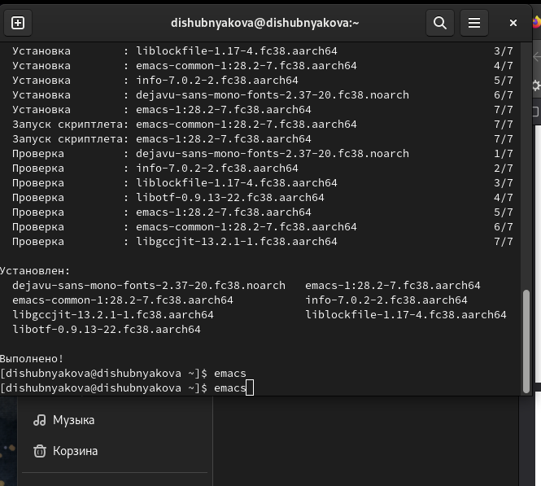{width=70%}

Знакомимся с редактором и создаем файл lab07.sh с помощью комбинации клавиш C-x C-f.

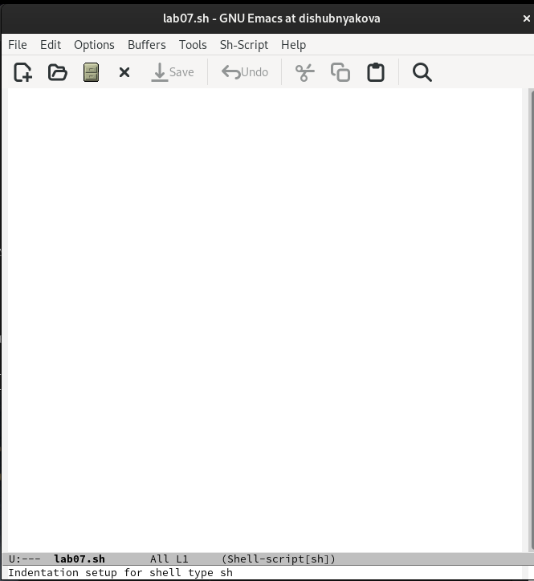{width=70%}

Набираем необходимый текст.

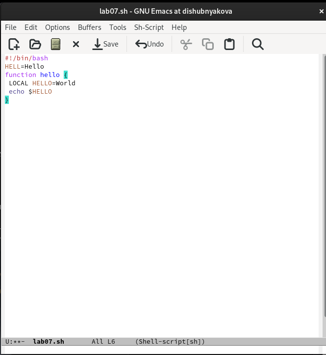{width=70%}

Сохраняем файл комбинацией C-x C-s

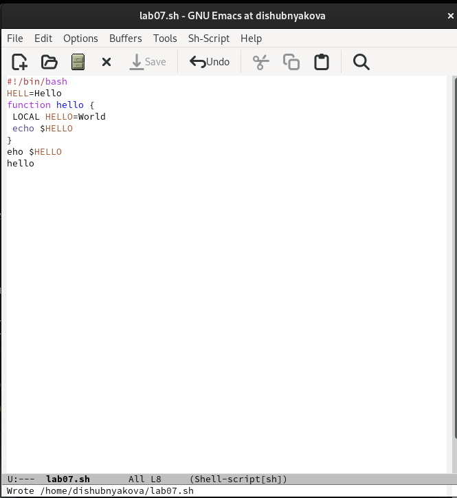{width=70%}

Вырезаем командой С-k полностью последнюю строку.

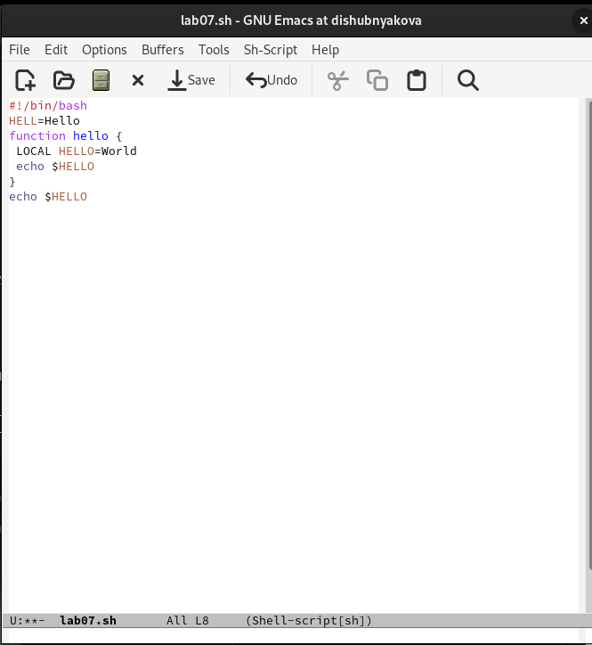{width=70%}

Вставляем ее обратно в конец файла командой C-y.

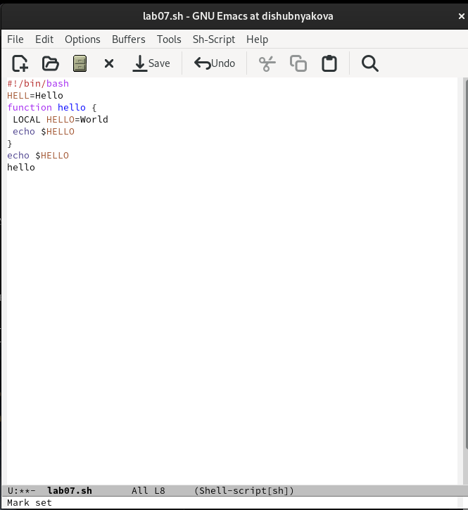{width=70%}

Выделяем область текста (C-space), копируем ее в буфер обмена (M-w).

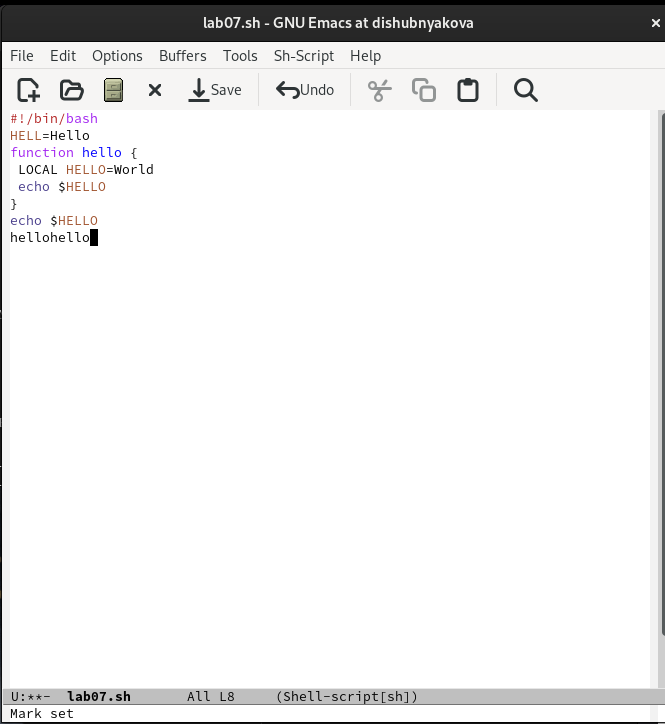{width=70%}

Вставляем область в конец файла.

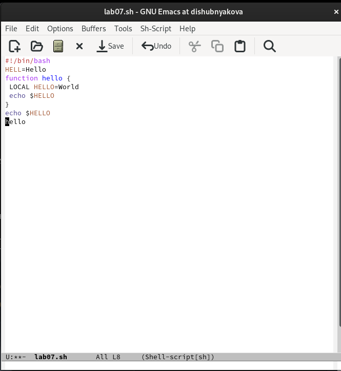{width=70%}

Вновь выделяем эту область и вырезаем ее (С-w).

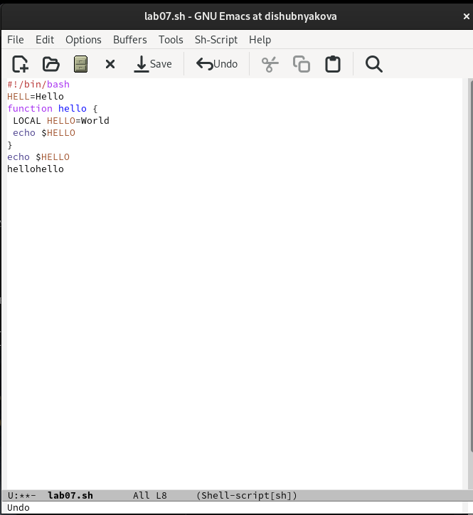{width=70%}

Отменяем последнее действие (С-/).

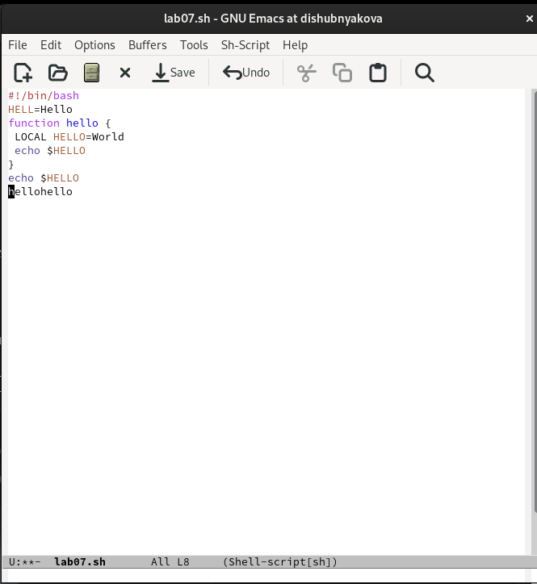{width=70%}

Перемещаем курсор в начало (С-а) и в конец строки (С-е).

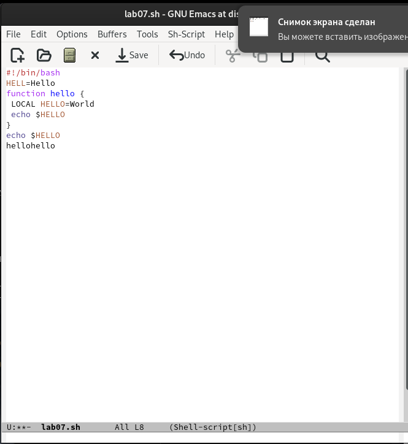{width=70%}

Перемещаем курсор в начало (М-<) и в конец (M->) буфера обмена.

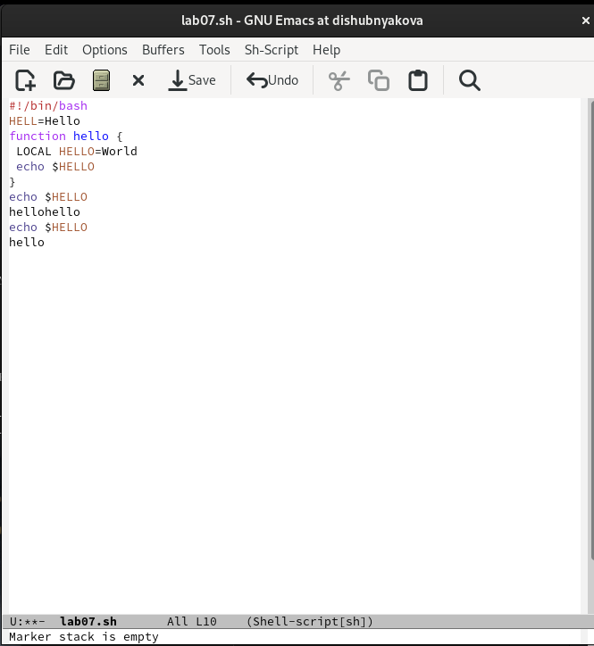{width=70%}

Выводим список активных буферов на экран. (С-x C-b)

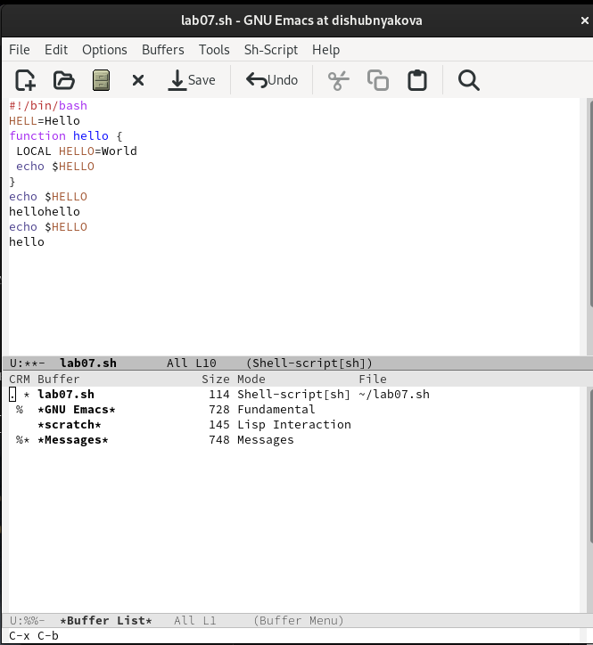{width=70%}

Переключаемся между буферами.

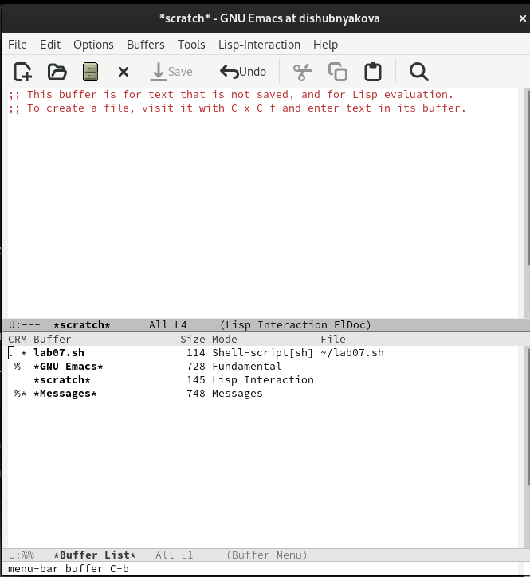{width=70%}

Поделим фрейм на 4 части: делим фрейм на два окна по вертикали (C-x 3),
а затем каждое из этих окон на две части по горизонтали (C-x 2)

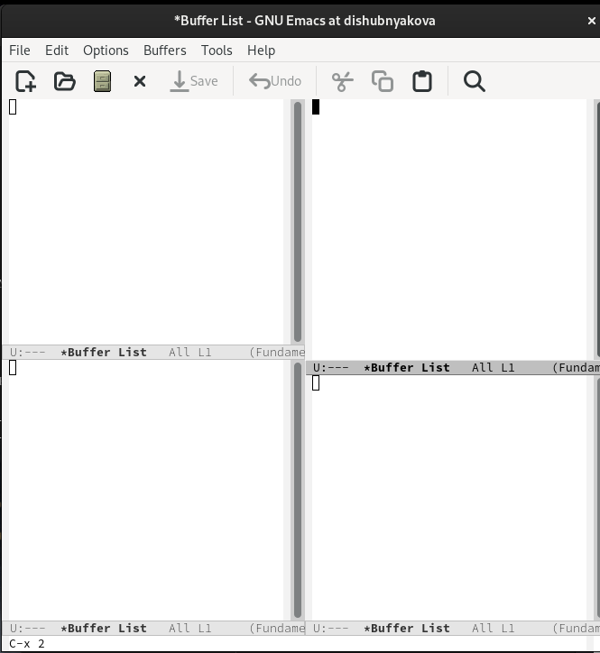{width=70%}

Создаем во всех буферах файлы и пишем в них пару строк.

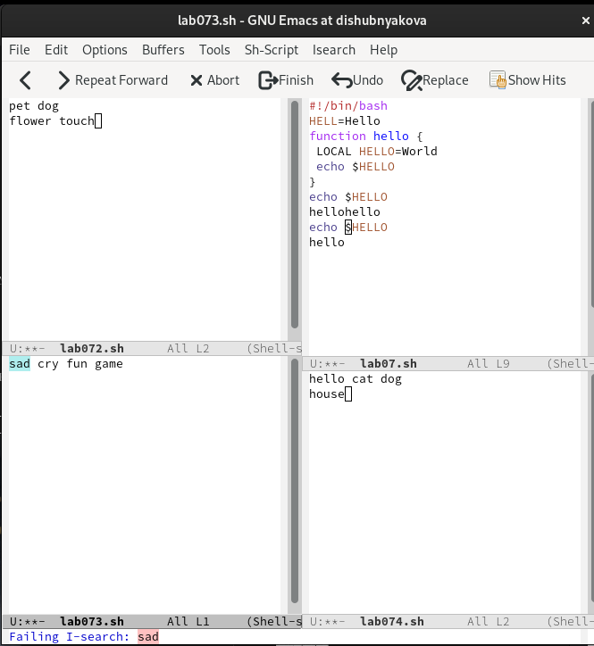{width=70%}

Работаем с режимом поиска. Отличие поиска M-s o от обычного режима (C-s) в том, что тут появляется отдельное окно с текстом из файла с выделенными словами, которые нужно было найти.

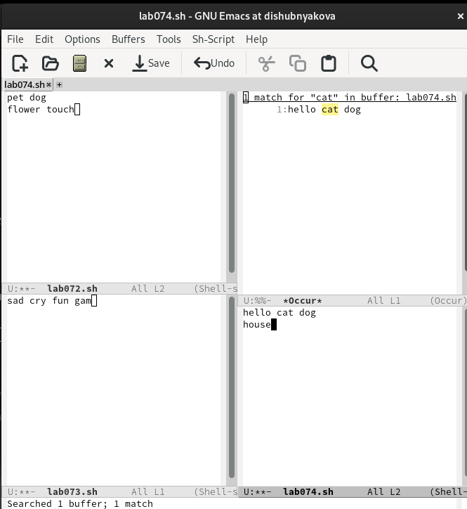{width=70%}

# Выводы

Научились работать с текстовым редактором Emacs.
1. Emacs — один из наиболее мощных и широко распространённых редакторов, используемых в мире UNIX. Написан на языке высокого уровня Lisp.
2. Большое разнообразие сложных комбинаций клавиш, которые необходимы для редактирования файла и в принципе для работа с Emacs.
3. Буфер - это объект в виде текста. Окно - это прямоугольная область, в которой отображен буфер.
4. Да, можно.
5. Emacs использует буферы с именами, начинающимися с пробела, для внутренних целей. Отчасти он обращается с буферами с такими именами особенным образом -- например, по умолчанию в них не записывается информация для отмены изменений.
6. Ctrl + c, а потом | и Ctrl + c Ctrl + |
7. С помощью команды Ctrl + x 3 (по вертикали) и Ctrl + x 2 (по горизонтали).
8. Настройки emacs хранятся в файле . emacs, который хранится в домашней директории пользователя. Кроме этого файла есть ещё папка . emacs.
9. Выполняет функцию стереть, можно переназначить.
10. Однозначно, vi. Простой интерфейс, как в терминале. Удобные три режима работы, нет кучи окон и все комбинации клавиш работают на Mac.

# Список литературы{.unnumbered}

1.
Dash P. Getting started with oracle vm virtualbox. Packt Publishing Ltd, 2013. 86 p.
2.
Colvin H. Virtualbox: An ultimate guide book on virtualization with virtualbox. CreateSpace Independent Publishing Platform, 2015. 70 p.
3.
van Vugt S. Red hat rhcsa/rhce 7 cert guide : Red hat enterprise linux 7 (ex200 and ex300). Pearson IT Certification, 2016. 1008 p.
4.
Робачевский А., Немнюгин С., Стесик О. Операционная система unix. 2-е изд. Санкт-Петербург: БХВ-Петербург, 2010. 656 p.
5.
Немет Э. et al. Unix и Linux: руководство системного администратора. 4-е изд. Вильямс, 2014. 1312 p.
6.
Колисниченко Д.Н. Самоучитель системного администратора Linux. СПб.: БХВ-Петербург, 2011. 544 p.
7.
Robbins A. Bash pocket reference. O’Reilly Media, 2016. 156 p.

::: {#refs}
:::
