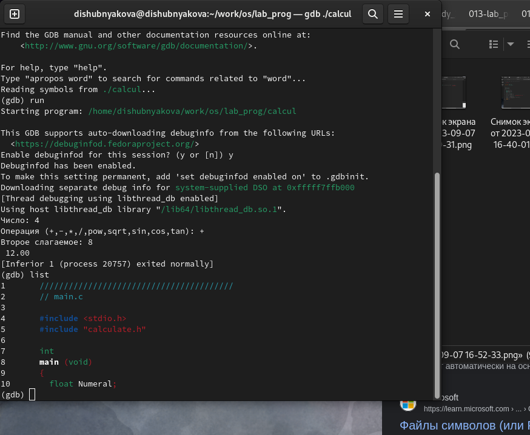

---
## Front matter
lang: ru-RU
title: Лабораторная работа №13
author: |
	Шубнякова Дарья, НКАбд-03-22

## Formatting
toc: false
slide_level: 2
theme: metropolis
header-includes: 
 - \metroset{progressbar=frametitle,sectionpage=progressbar,numbering=fraction}
 - '\makeatletter'
 - '\beamer@ignorenonframefalse'
 - '\makeatother'
aspectratio: 43
section-titles: true
---

## Содержание

1. Цель
2. Теоретическое введение
3. Основные задачи
4. Процесс выполнения
5. Вывод
6. Список литературы

## Цель

Приобрести простейшие навыки разработки, анализа, тестирования и отладки при- ложений в ОС типа UNIX/Linux на примере создания на языке программирования С калькулятора с простейшими функциями.

## Теоретическое введение

Процесс разработки программного обеспечения обычно разделяется на следующие этапы:

- планирование, включающее сбор и анализ требований к функционалу и другим характеристикам разрабатываемого приложения;

- проектирование, включающее в себя разработку базовых алгоритмов и спецификаций,

- определение языка программирования;

- непосредственная разработка приложения;

## Теоретическое введение

- кодирование — по сути создание исходного текста программы (возможно в нескольких вариантах);

- анализ разработанного кода;

- сборка, компиляция и разработка исполняемого модуля;

- тестирование и отладка, сохранение произведённых изменений;

- документирование.

## Основные задачи

1. В домашнем каталоге создайте подкаталог ~/work/os/lab_prog. 
2. Создайте в нём файлы: calculate.h, calculate.c, main.c.
Это будет примитивнейший калькулятор, способный складывать, вычитать, умножать и делить, возводить число в степень, брать квадратный корень, вычислять sin, cos, tan. При запуске он будет запрашивать первое число, операцию, второе число. После этого программа выведет результат и остановится.
3. Выполните компиляцию программы посредством gcc.

## Основные задачи

4. При необходимости исправьте синтаксические ошибки.
5. Создайте Makefile со следующим содержанием.
6. С помощью gdb выполните отладку программы calcul (перед использованием gdb
исправьте Makefile).
7. С помощью утилиты splint попробуйте проанализировать коды файлов calculate.c и main.c.

## Процесс выполнения

1. Создаем подкаталог lab_prog в рабочем каталоге. 

{width=70%}

## Процесс выполнения

2. Создаем три необходимых для дальнейшей работы файла: calculate.h, calculate.c, main.c.

{width=70%}

## Процесс выполнения

3.  Копируем реализацию функций калькулятора в calculate.c.

{width=70%}

## Процесс выполнения

4. Создаем интерфейсный файл calculate.h, описывающий формат вызова функции-калькулятора.

{width=70%}

## Процесс выполнения

5. Создаем основной файл main.c, реализующий интерфейс пользователя к калькулятору.

{width=70%}

## Процесс выполнения

6. Выполняем компиляцию программы посредством gcc.

{width=70%}

## Процесс выполнения

7. Создаем и редактируем Makefile.

{width=70%}

## Процесс выполнения

8. Запускаем отладчик GDB, загрузив в него программу для отладки

{width=70%}

## Процесс выполнения

9. Запускаем программу и проверяем ее работу.

{width=70%}

## Процесс выполнения

10. Используем команду list для просмотра определенных строк различных файлов. 
Смотрим, чему равно на этом этапе значение переменной Numeral. Сравниваем с результатом вывода на экран после использования команды. Убираем точки останова и возвращаемся к рабочей программе.

{width=50%}

## Вывод

Обрели простейшие навыки разработки, анализа, тестирования и отладки приложений в ОС типа UNIX/Linux на примере создания калькулятора на С с простейшими функциями.

## Список литературы

1.
Dash P. Getting started with oracle vm virtualbox. Packt Publishing Ltd, 2013. 86 p.
2.
Colvin H. Virtualbox: An ultimate guide book on virtualization with virtualbox. CreateSpace Independent Publishing Platform, 2015. 70 p.
3.
van Vugt S. Red hat rhcsa/rhce 7 cert guide : Red hat enterprise linux 7 (ex200 and ex300). Pearson IT Certification, 2016. 1008 p.
4.
Робачевский А., Немнюгин С., Стесик О. Операционная система unix. 2-е изд. Санкт-Петербург: БХВ-Петербург, 2010. 656 p.
5.
Немет Э. et al. Unix и Linux: руководство системного администратора. 4-е изд. Вильямс, 2014. 1312 p.
6.
Колисниченко Д.Н. Самоучитель системного администратора Linux. СПб.: БХВ-Петербург, 2011. 544 p.
7.
Robbins A. Bash pocket reference. O’Reilly Media, 2016. 156 p.

## {.standout}

Спасибо за внимание!

