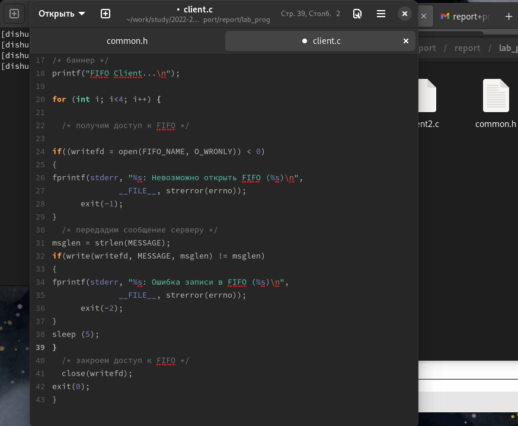
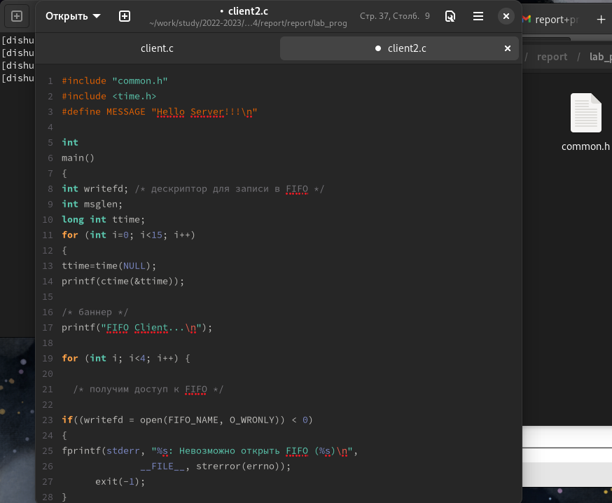
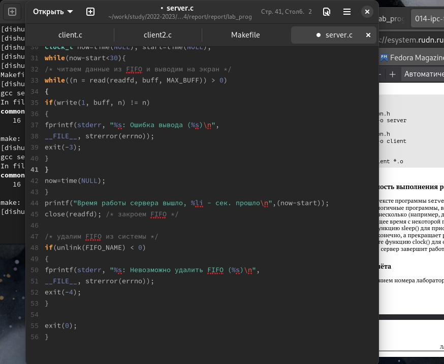
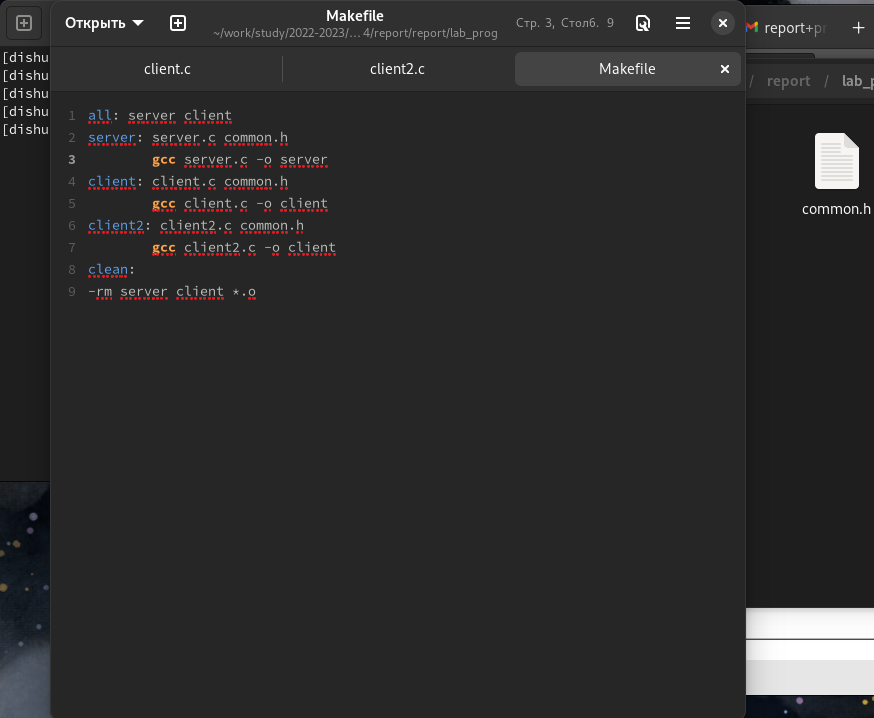
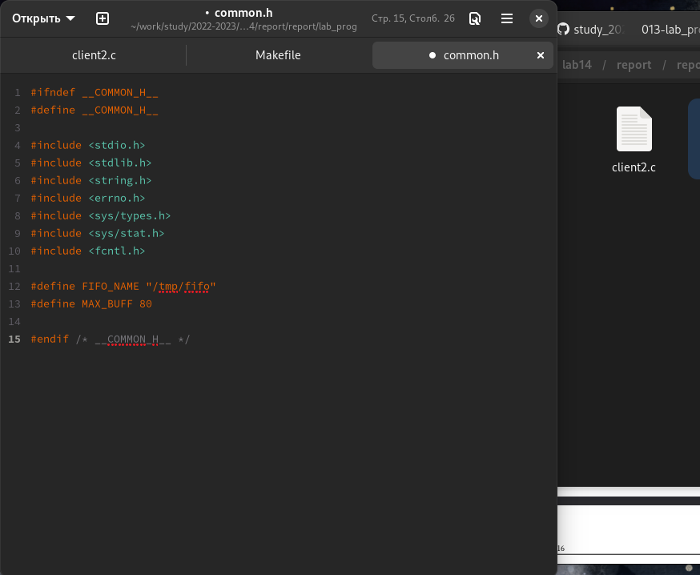
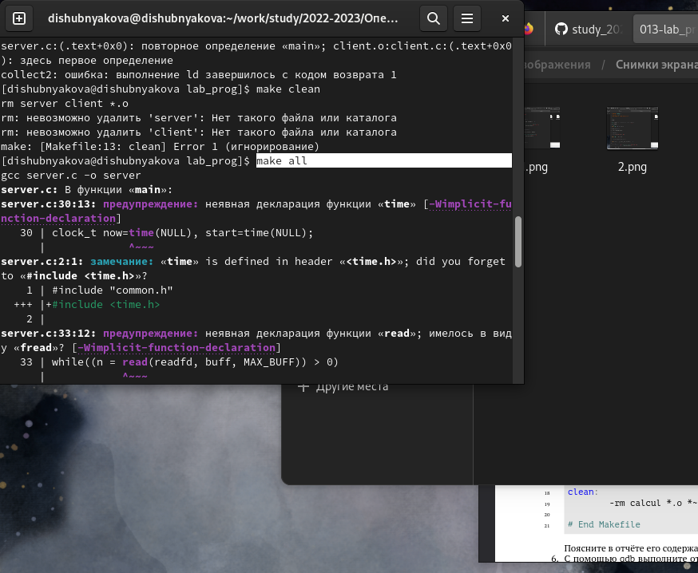
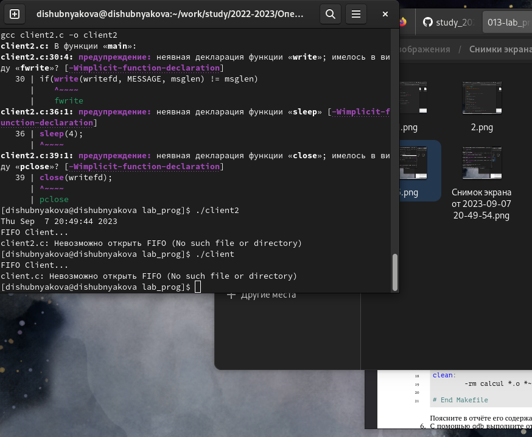
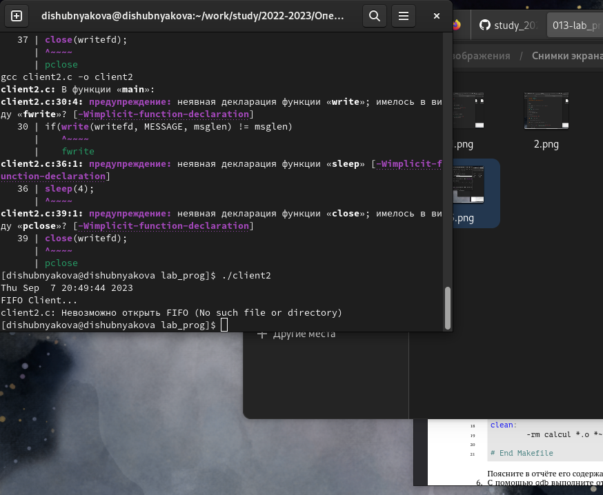
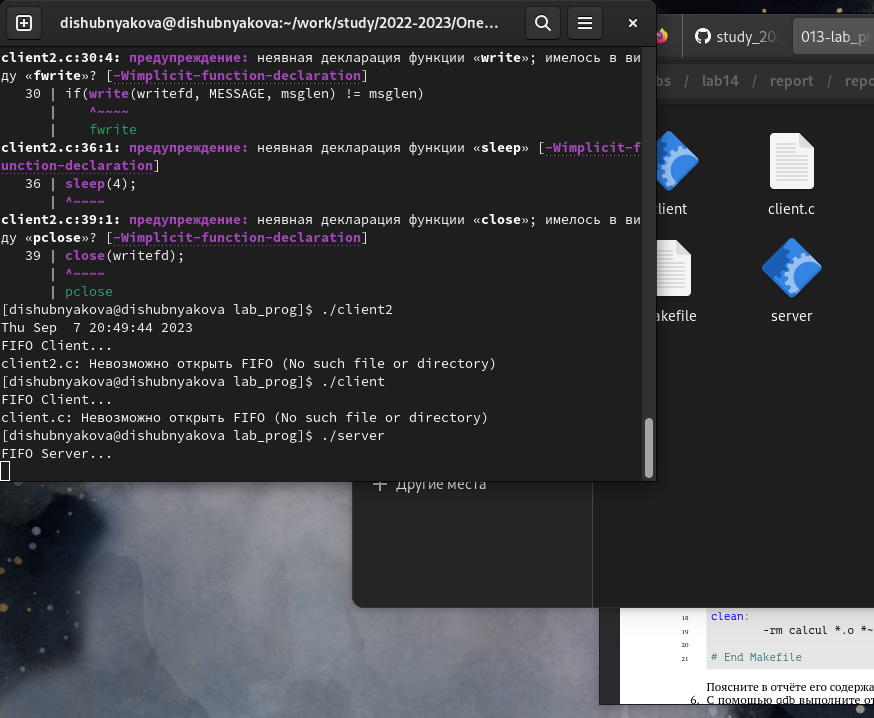

---
## Front matter
lang: ru-RU
title: Лабораторная работа №14
author: |
	Шубнякова Дарья, НКАбд-03-22

## Formatting
toc: false
slide_level: 2
theme: metropolis
header-includes: 
 - \metroset{progressbar=frametitle,sectionpage=progressbar,numbering=fraction}
 - '\makeatletter'
 - '\beamer@ignorenonframefalse'
 - '\makeatother'
aspectratio: 43
section-titles: true
---

## Содержание

1. Цель
2. Теоретическое введение
3. Основные задачи
4. Процесс выполнения
5. Вывод
6. Список литературы

## Цель

Приобретение практических навыков работы с именованными каналами.

## Теоретическое введение

Одним из видов взаимодействия между процессами в операционных системах является обмен сообщениями. Под сообщением понимается последовательность байтов, передаваемая от одного процесса другому.
В операционных системах типа UNIX есть 3 вида межпроцессорных взаимодействий: общеюниксные (именованные каналы, сигналы), System V Interface Definition (SVID — разделяемая память, очередь сообщений, семафоры) и BSD (сокеты).

## Основные задачи

Изучите приведённые в тексте программы server.c и client.c. Взяв данные примеры за образец, напишите аналогичные программы, внеся следующие изменения:
1. Работает не 1 клиент, а несколько (например, два).
2. Клиенты передают текущее время с некоторой периодичностью (например, раз в пять
секунд). Используйте функцию sleep() для приостановки работы клиента.

## Основные задачи

3. Сервер работает не бесконечно, а прекращает работу через некоторое время (например,  30 сек). Используйте функцию clock() для определения времени работы сервера.
Что будет в случае, если сервер завершит работу, не закрыв канал?

## Процесс выполнения

1. Переделываем файл client.c.

{width=70%}

## Процесс выполнения

2. Создаем файл client2.c.

{width=70%}

## Процесс выполнения

3.  Редактируем файл server.c.

{width=70%}

## Процесс выполнения

4. Создаем Makefile на базе шаблона.

{width=70%}

## Процесс выполнения

5. Копируем файл common.h

{width=70%}

## Процесс выполнения

6. Производим команду make all.

{width=70%}

## Процесс выполнения

7. Смотрим, как работает client.c.

{width=70%}

## Процесс выполнения

8. Смотрим, как работает client2.c.

{width=70%}

## Процесс выполнения

9. Спустя некоторое время сервер завершил работу.

{width=70%}

## Вывод

Приобрели практические навыки по работе с именованными каналами.

## Список литературы

1.
Dash P. Getting started with oracle vm virtualbox. Packt Publishing Ltd, 2013. 86 p.
2.
Colvin H. Virtualbox: An ultimate guide book on virtualization with virtualbox. CreateSpace Independent Publishing Platform, 2015. 70 p.
3.
van Vugt S. Red hat rhcsa/rhce 7 cert guide : Red hat enterprise linux 7 (ex200 and ex300). Pearson IT Certification, 2016. 1008 p.
4.
Робачевский А., Немнюгин С., Стесик О. Операционная система unix. 2-е изд. Санкт-Петербург: БХВ-Петербург, 2010. 656 p.
5.
Немет Э. et al. Unix и Linux: руководство системного администратора. 4-е изд. Вильямс, 2014. 1312 p.
6.
Колисниченко Д.Н. Самоучитель системного администратора Linux. СПб.: БХВ-Петербург, 2011. 544 p.
7.
Robbins A. Bash pocket reference. O’Reilly Media, 2016. 156 p.

## {.standout}

Спасибо за внимание!

