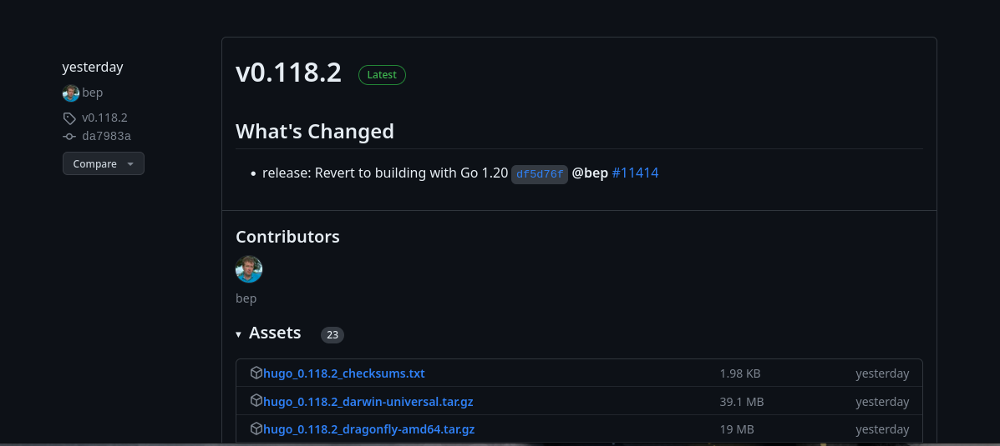
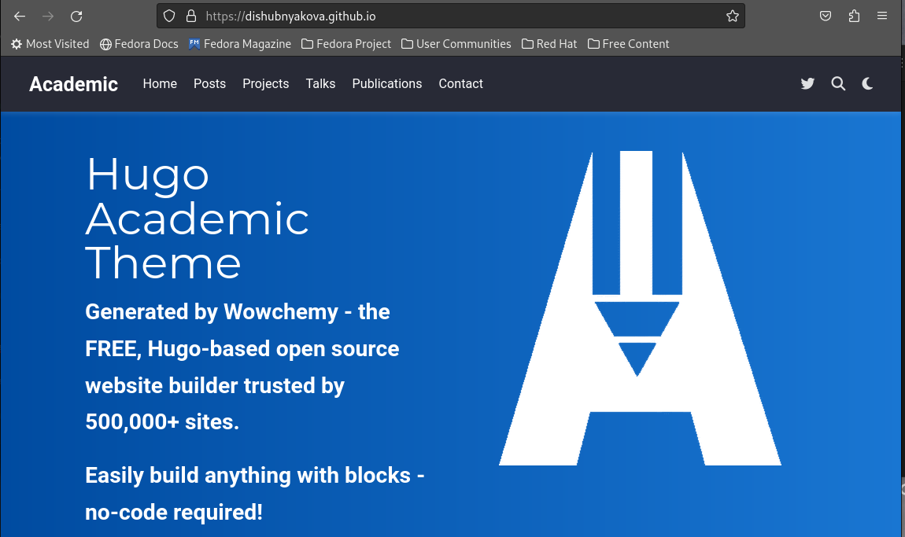
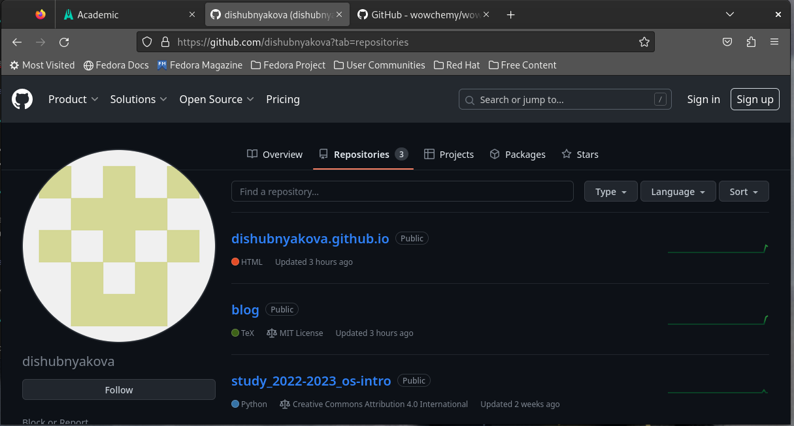
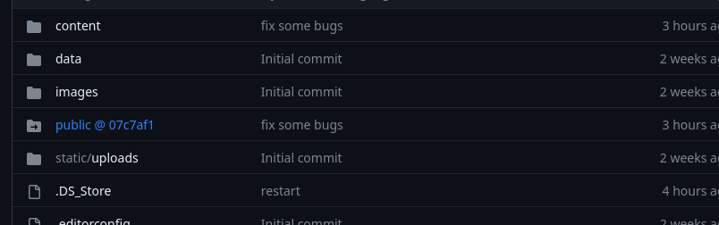

---
## Front matter
lang: ru-RU
title: Первый этап индивидуального проекта. Создание сайта.
author: |
	Шубнякова Дарья, НКАбд-03-22

## Formatting
toc: false
slide_level: 2
theme: metropolis
header-includes: 
 - \metroset{progressbar=frametitle,sectionpage=progressbar,numbering=fraction}
 - '\makeatletter'
 - '\beamer@ignorenonframefalse'
 - '\makeatother'
aspectratio: 43
section-titles: true
---

## Цель работы

Создать сайт на Hugo.

## Задание

1. Установить необходимое программное обеспечение.
2. Скачать шаблон темы сайта.
3. Разместить его на хостинге git.
4. Установить параметр для URLs сайта.
5. Разместить заготовку сайта на Github pages.

## Теоретическое введение

Сайт – это совокупность веб-страниц, объединённых под общим доменом и связанных ссылками, тематикой и дизайнерским оформлением. Мы будем создавать статический сайт, для этого нам понадобится Hugo.
Hugo — генератор статических страниц для интернета.

## Выполнение работы

1. Установим необходимое програмное обеспечение. Скачаем необходимый релиз Hugo через терминал.

{width=70%}

## Выполнение работы

2. В качестве шаблона индивидуального сайта используется шаблон Hugo Academic Theme. Переходим по ссылке и создаем репозиторий blog.

{width=70%}

## Выполнение работы

3. Выполним команду hugo server (создадутся необходимые файлы). Нам предоставят ссылку. Переходя по ней, открывается наш сайт, но это только локальный хост. 

## Выполнение работы

4. Необходимо создать еще один репозиторий dishubnyakova.github.io, чтобы наш сайт можно было открывать с любого компьютера. 

{width=70%}

Клонируем наш новый репозиторий. Создаем ветку main. Создаем файл README.md. Добавляем в наш репозиторий. 

## Выполнение работы

5. Подключаем наш репозиторий к папке public. 

{width=70%}

## Выполнение работы

6. Cделали заготовку для сайта. 

{width=70%}

## Выводы

Научились создавать статические сайты с помощью Hugo.

## {.standout}
Спасибо за внимание!
