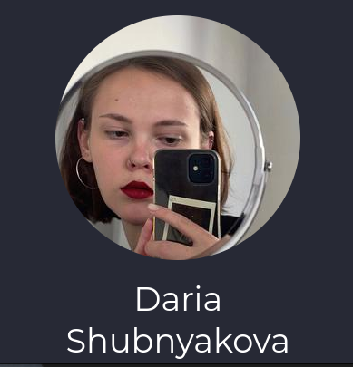
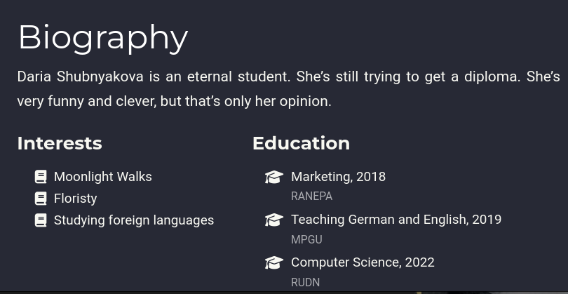
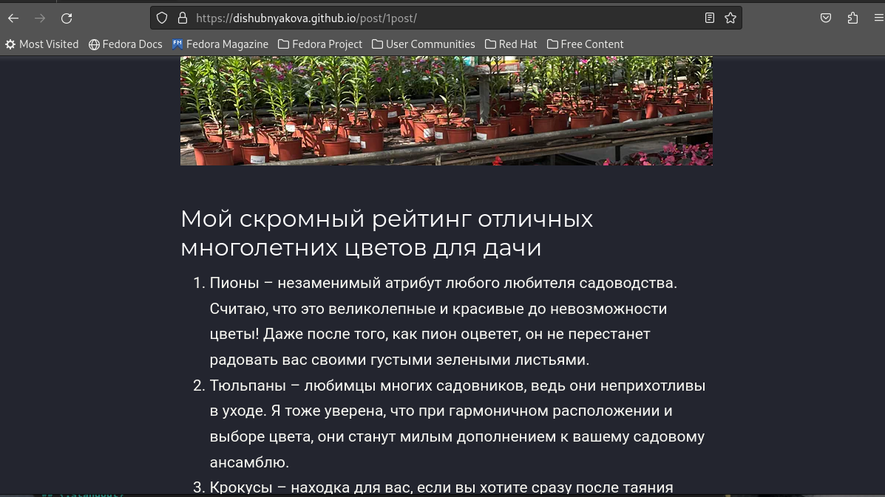
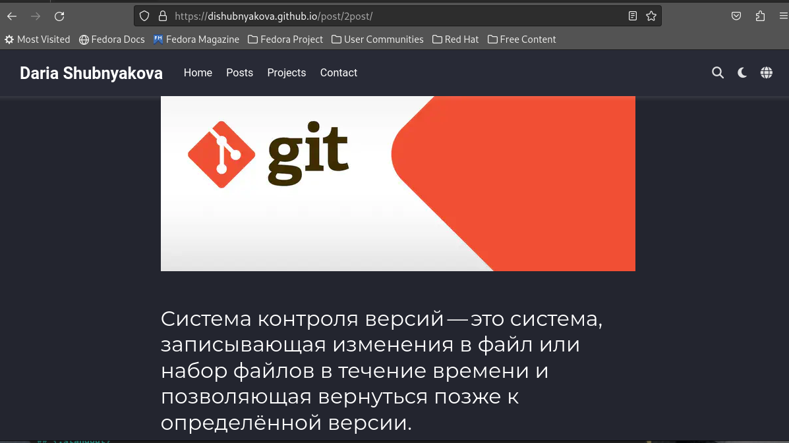

---
## Front matter
lang: ru-RU
title: Второй этап индивидуального проекта.
author: |
	Шубнякова Дарья; НКАбд-03-22
institute: |
	\inst{1}RUDN University, Moscow, Russian Federation

## Formatting
toc: false
slide_level: 2
theme: metropolis
header-includes: 
 - \metroset{progressbar=frametitle,sectionpage=progressbar,numbering=fraction}
 - '\makeatletter'
 - '\beamer@ignorenonframefalse'
 - '\makeatother'
aspectratio: 43
section-titles: true
---

## Цель работы

Продолжить работу со своим сайтом. Отредактировать его в соответствии с требованиями второго этапа. Добавить данные о себе на сайт.

## Задание

1. Разместить фотографию владельца сайта.
2. Разместить краткое описание владельца сайта (Biography).
3. Добавить информацию об интересах (Interests).
4. Добавить информацию от образовании (Education).
5. Сделать пост по прошедшей неделе.
6. Добавить пост на тему по выбору:
Управление версиями. Git.
Непрерывная интеграция и непрерывное развертывание (CI/CD).

## Теоретическое введение

Сайт – это совокупность веб-страниц, объединённых под общим доменом и связанных ссылками, тематикой и дизайнерским оформлением. Мы будем создавать статический сайт, для этого нам понадобится Hugo.
Hugo — генератор статических страниц для интернета.

Мы продолжаем работу с Hugo. Будем учиться редактировать данные о себе и писать посты. 

## Выполнение индивидуального проекта

1. Разместим свою фотографию на сайте.

{width=40%}

## Выполнение индивидуального проекта

2. Разместим краткое описание владельца сайта (Biography).
3. Добавим информацию об интересах (Interests).
4. Добавим информацию от образовании (Education).

{width=70%}

## Выполнение индивидуального проекта

С помощью команды hugo загружаем обновления на локальный хост. Затем с помощью команд git add ., git commit -am '', git push загружаем информацию на публичный сайт.

## Выполнение индивидуального проекта

5. Добавим пост на тему по выбору. Я выбрала тему: Управление версиями. Git. 

{width=70%}

## Выполнение индивидуального проекта

6. Сделаем пост по одному из наших дней.

{width=70%}

## Выводы

В процессе выполнения второго этапа индивидуального проекта я научилась редактировать данные о себе, а также писать посты и добавлять их на сайт.

## {.standout}

Спасибо за внимание!

