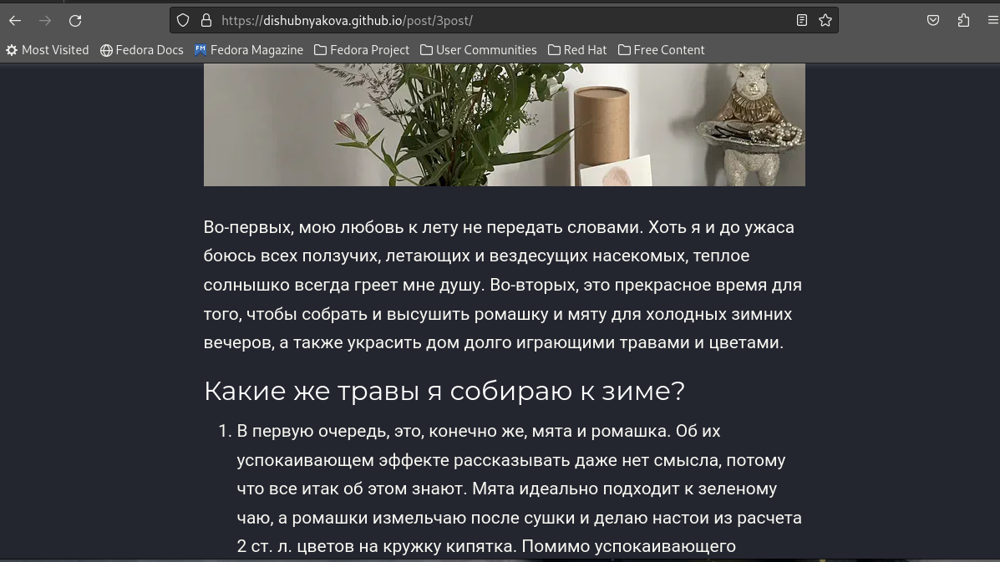

---
## Front matter
lang: ru-RU
title: Третий этап индивидуального проекта
author: |
	Шубнякова Дарья; НКАбд-03-22
institute: |
	\inst{1}RUDN University, Moscow, Russian Federation

## Formatting
toc: false
slide_level: 2
theme: metropolis
header-includes: 
 - \metroset{progressbar=frametitle,sectionpage=progressbar,numbering=fraction}
 - '\makeatletter'
 - '\beamer@ignorenonframefalse'
 - '\makeatother'
aspectratio: 43
section-titles: true
---

## Цель работы

Продолжить редактирование личного сайта. Добавить к сайту достижения.

## Задание

1. Добавить информацию о навыках (Skills).
2. Добавить информацию об опыте (Experience).
3. Добавить информацию о достижениях (Accomplishments).
4. Сделать пост по прошедшей неделе.
5. Добавить пост на тему по выбору:
- Легковесные языки разметки.
- Языки разметки. LaTeX.
- Язык разметки Markdown.

## Теоретическое введение

Сайт – это совокупность веб-страниц, объединённых под общим доменом и связанных ссылками, тематикой и дизайнерским оформлением. Мы создали статический сайт с помощью Hugo.
Hugo — генератор статических страниц для интернета.

На этом этапе проекта мы научимся добавлять на сайт наши достижения, навыки и опыт. А также я напишу пост про язык разметки Markdown.

## Выполнение проекта

1. Добавить информацию о навыках (Skills). 

{width=70%}

## Выполнение проекта

2. Добавить информацию об опыте (Experience). 

{width=70%}

## Выполнение проекта

3. Добавить информацию о достижениях (Accomplishments).

{width=70%}

## Выполнение проекта

4. Сделать пост по прошедшей неделе. 

{width=70%}

## Выполнение проекта

5. Добавим пост на тему "Язык разметки Markdown".

{width=70%}

## Выводы

В процессе выполнения третьего этапа индивидуального проекта я продолжила редактирование сайта, научилась добавлять на сайт свои достижения, опыт и навыки, а также продолжила писать посты.

## {.standout}

Спасибо за внимание!
