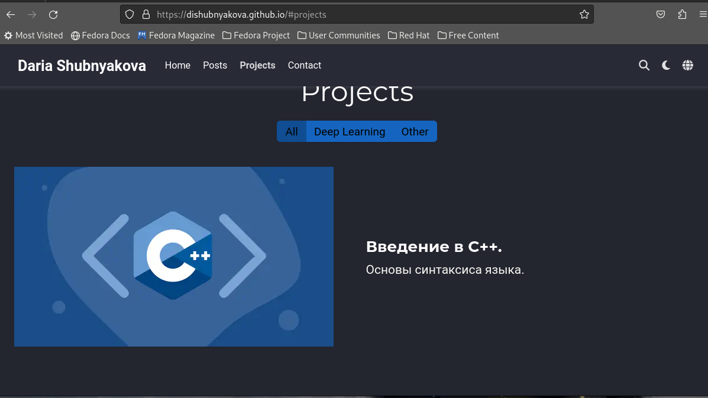
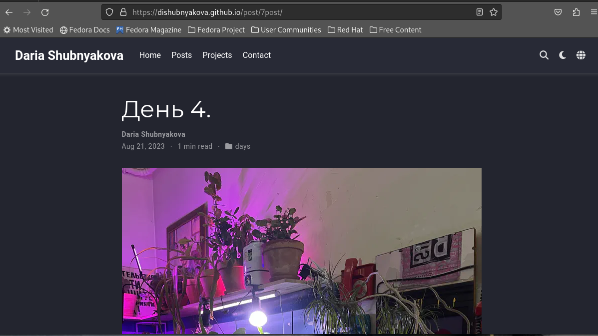
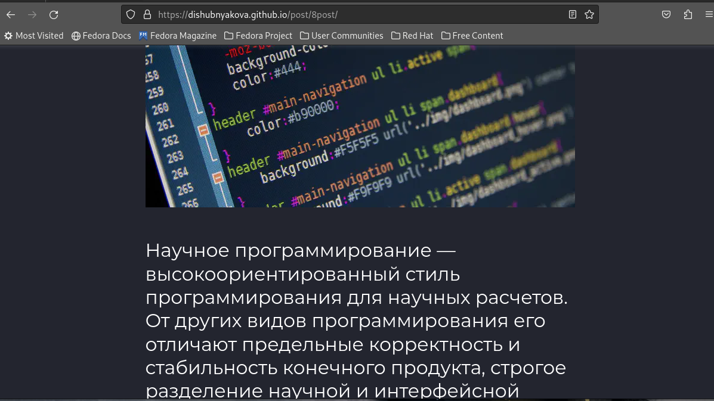

---
## Front matter
lang: ru-RU
title: Пятый этап индивидуального проекта
author: |
	Шубнякова Дарья; НКАбд-03-22
institute: |
	\inst{1}RUDN University, Moscow, Russian Federation

## Formatting
toc: false
slide_level: 2
theme: metropolis
header-includes: 
 - \metroset{progressbar=frametitle,sectionpage=progressbar,numbering=fraction}
 - '\makeatletter'
 - '\beamer@ignorenonframefalse'
 - '\makeatother'
aspectratio: 43
section-titles: true
---

## Цель работы

Добавить к сайту все остальные элементы.

## Задание

1. Сделать записи для персональных проектов.
2. Сделать пост по прошедшей неделе.
3. Добавить пост на тему по выбору.

- Языки научного программирования.

## Теоретическое введение

Сайт – это совокупность веб-страниц, объединённых под общим доменом и связанных ссылками, тематикой и дизайнерским оформлением. Мы создали статический сайт с помощью Hugo.
Hugo — генератор статических страниц для интернета.

На этом этапе проекта я напишу пост про языки научного программирования.  Научный язык программирования - это язык, который разработан и оптимизирован для использования математических формул и матриц.

## Выполнение работы

1. Сделаем записи для персональных проектов.

{width=70% }

## Выполнение работы

Так же в ходе работы я удалила блоки, которые нам не нужно заполнять и они только отвлекают.

## Выполнение работы

2. Сделаем пост об одном из дней.

{width=70% }

## Выполнение работы

3. Добавим пост на тему языки научного программирования.

{width=70% }

## Выводы

В процессе выполнения этого этапа индивидуального проекта я продолжила редактирование своего научного сайта. Научилась добавлять записи для персональных проектов.

## Список литературы

1.Что такое сайт (простыми словами)l [Электронный ресурс]. URL: https://uguide.ru/chto-takoe-sajt-prostymi-slovami.

## {.standout}

Спасибо за внимание!
