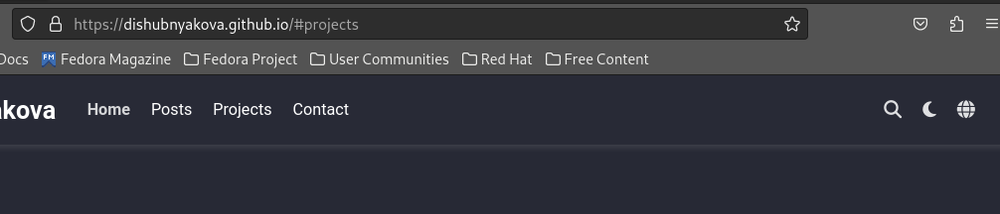
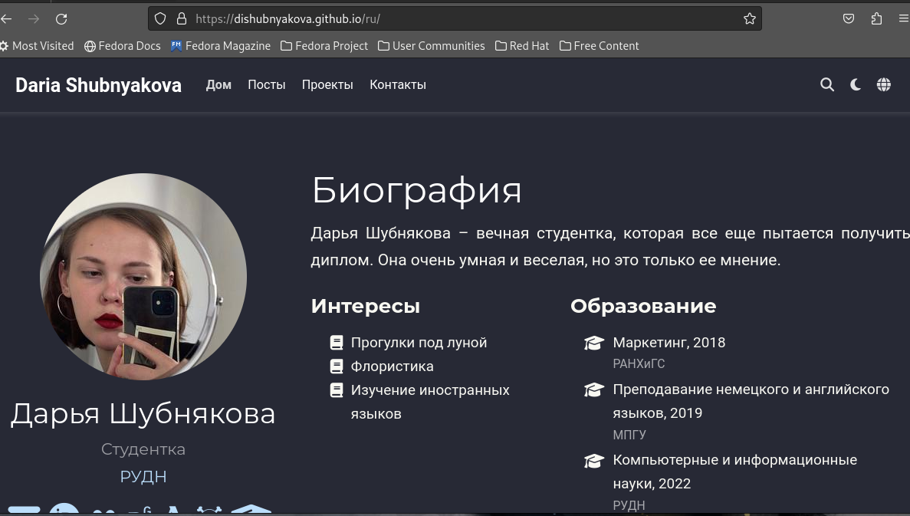
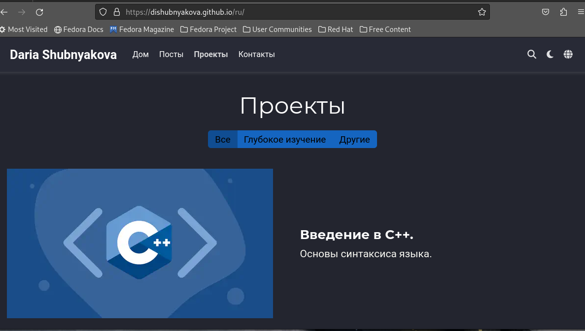
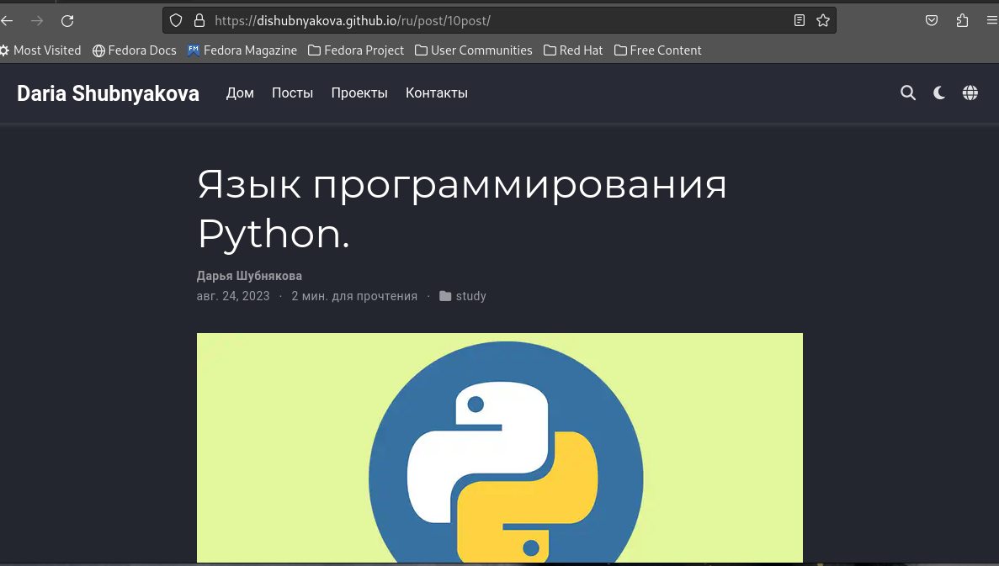
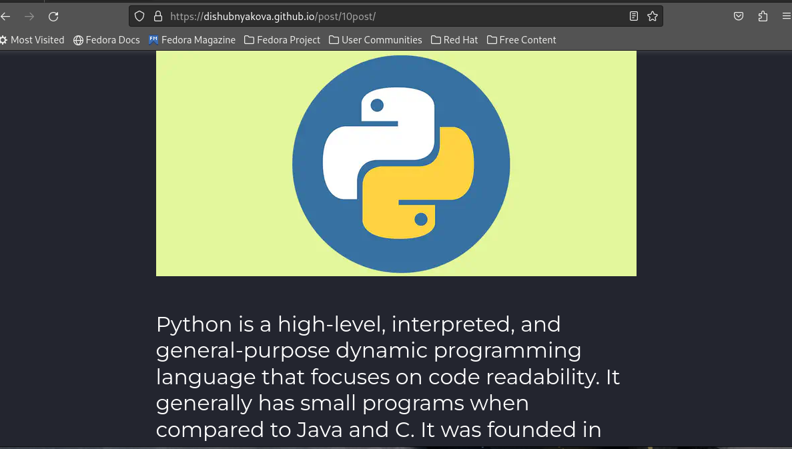
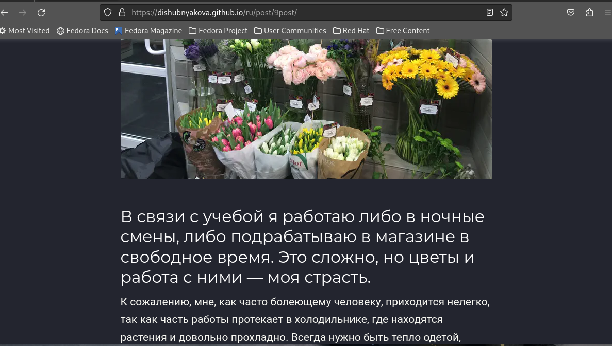

---
## Front matter
lang: ru-RU
title: Шестой этап индивидуального проекта
author: |
	Шубнякова Дарья; НКАбд-03-22
institute: |
	\inst{1}RUDN University, Moscow, Russian Federation

## Formatting
toc: false
slide_level: 2
theme: metropolis
header-includes: 
 - \metroset{progressbar=frametitle,sectionpage=progressbar,numbering=fraction}
 - '\makeatletter'
 - '\beamer@ignorenonframefalse'
 - '\makeatother'
aspectratio: 43
section-titles: true
---

## Цель работы

Завершение редактирования сайта. Размещение двуязычного сайта на Github.

## Задание

1. Сделать поддержку английского и русского языков.
2. Разместить элементы сайта на обоих языках.
3. Разместить контент на обоих языках.
4. Сделать пост по прошедшей неделе.
5. Добавить пост на тему по выбору (на двух языках).

## Теоретическое введение

Сайт – это совокупность веб-страниц, объединённых под общим доменом и связанных ссылками, тематикой и дизайнерским оформлением. Мы создали статический сайт с помощью Hugo.
Hugo — генератор статических страниц для интернета.
Делаем поддержку русского языка на нашем сайте.

## Выполнение лабораторной работы

1. Сделать поддержку английского и русского языков. 

{width=90% }

## Выполнение лабораторной работы

2. Разместить элементы сайта на обоих языках.

{width=80% }

## Выполнение лабораторной работы

3. Разместить контент на обоих языках.

{width=80% }

## Выполнение лабораторной работы

4. Добавить пост на тему по выбору (на двух языках).

{width=80% }

## Выполнение лабораторной работы

На английской версии сайта этот же пост.

{width=80% }

## Выполнение лабораторной работы

5. Сделать пост по прошедшей неделе.

{width=80% }

## Выводы

В процессе выполнения этого этапа индивидуального проекта я разместила двуязычный сайт на Github.

## Список литературы

1. Что такое сайт (простыми словами)l [Электронный ресурс]. URL: https://uguide.ru/chto-takoe-sajt-prostymi-slovami.

## {.standout}

Спасибо за внимание!
